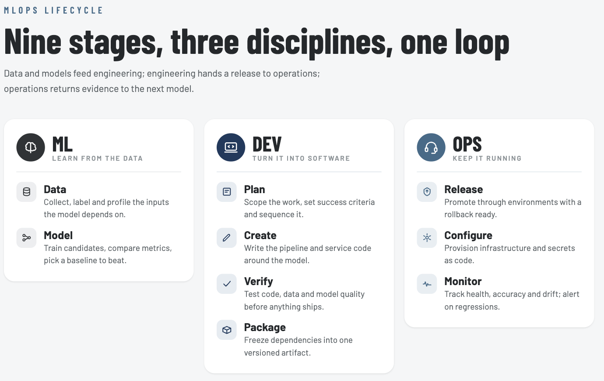

<p align="center">
    <h1 align="center">MLOps and AI Systems Engineering</h1>
    <p align="center">Course material for course 1413211011.</p>
</p>

<p align="center">
  
</p>

## Quick Links

| Resource | Link |
|---|---|
| Course materials | *TBD* |
| Video lectures | [YouTube playlist](https://www.youtube.com/playlist?list=PL3MmuxUbc_hIUISrluw_A7wDSmfOhErJK) |
| Documentation | *TBD* |
| Course platform (deadlines, homework) | Atlas-OIS |
| Communication channel | Atlas-OIS |
| Announcements | Atlas-OIS |
| FAQ | *TBD* |

## Course information

* Course responsible
    * Assistant Professor <a href="https://www.atlas.edu.tr/akademik-kadro/ali-gunes" target="_blank" rel="noopener noreferrer">Ali Gunes</a>, ali.gunes@atlas.edu.tr
* 5 ECTS (European Credit Transfer System), corresponding to 140 hours of work
* 12 week period in Fall
* Grade: Pass/Fail
* Type of assessment: midterm, final, and project report
* Project Group Size: 2
* Recommended prerequisites:
    * General understanding of machine learning (datasets, probability, classifiers, overfitting,
      underfitting, etc.)
    * Basic knowledge of deep learning (backpropagation, convolutional neural networks, autoencoders,
      etc.)
    * Docker and command line basics
    * At least 1 year of general programming experience

## ❔ Learning objectives

**General course objective**

This course exists to take a student who already knows how to *build* a machine learning model and
teach them how to *run* one — organizing, versioning, automating, scaling, monitoring, and deploying
it as a system other people can actually rely on, whether in a research or a production setting. The
emphasis throughout is hands-on: every module pairs its concepts with a real tool (Git, Docker,
Kubernetes, Azure, Feast, Weights & Biases, and more) rather than staying at the level of theory.

This includes:

* Structure and version-control an ML codebase so it stays maintainable and easy to collaborate on
* Understand reproducibility, and package experiments and applications into reproducible containers
* Apply continuous integration and continuous machine learning (CI/CML) to automate the path from a
  code change to a validated, deployable model
* Debug, track, and visualize experiments, and monitor a deployed model's behavior and infrastructure
  over time
* Use a cloud-based platform to scale training and serving beyond a single machine
* Build and query a feature store for consistent online/offline feature serving
* Understand the operational concerns specific to large language models and generative AI
* Deploy machine learning models, both locally and in the cloud
* Conduct a project in collaboration with fellow students, applying every framework taught in the
  course end to end
* Have fun along the way — most of MLOps is genuinely learned by watching something fail first :)

## 🔥 Where to start

We recommend going through the material on this repository's **[GitHub Pages
site](https://aligunesgit.github.io/MlOps/)** rather than reading raw markdown here — it renders the
same content through Material for MkDocs, with proper navigation, search, and diagram rendering.

Specifically, start at the [Introduction page](https://aligunesgit.github.io/MlOps/pages/before/) for a
soft introduction to MLOps and how this course is organized, then follow the
[Time plan](https://aligunesgit.github.io/MlOps/pages/timeplan/) week by week.

## 💻 Course setup

Start by creating one parent folder on your machine to hold everything for this course:

```
mlops-course/   # call this whatever you like
    └── ...
```

Inside it, clone this repository:

```bash
git clone https://github.com/aligunesgit/MlOps.git
```

No Git installed yet? Grab the ZIP from this page's "Code" button and unzip it into that same folder
for now — Module 3 covers Git itself in depth. This repository does get updated during the semester, so
get in the habit of running `git pull` from time to time to pick up the latest changes. See the
[Setup section](https://aligunesgit.github.io/MlOps/pages/before/#setup) of the Introduction page for
the full account/tool checklist.

## 📢 Communication

This course uses **Atlas-OIS** for official announcements, deadlines, and course materials — check it
at least once a day during the semester so you don't miss an update. For a question about a specific
module or the group project, email the course instructor directly rather than waiting for the next
session — there's a good chance someone else has the exact same question, so don't hesitate to ask
early.

## 📂 Course organization

Every module below is required — unlike some MLOps courses, there's no optional/core split, since the
group project in Sprint A and Sprint B builds directly on tools introduced in each one. The course is
organized into 10 content modules (M1-M10) and 2 project sprint weeks (Sprint A, Sprint B). Each module
has its own folder with a `README.md` and `exercise_files/`.

| Week | Module | Topic |
|------|--------|-------|
| 1  | [M1](m1_mlops_introduction/README.md)  | MLOps Introduction |
| 2  | [M2](m2_ml_and_mlops_stages/README.md)  | Overview of ML and MLOps Stages |
| 3  | [M3](m3_git_essentials/README.md)  | Git Essentials for MLOps Practitioners |
| 4  | [M4](m4_cicd_strategies/README.md)  | CI/CD Strategies for AWS, Azure, GCP, and GitHub Actions |
| 5  | [M5](m5_docker_and_kubernetes/README.md)  | Docker & Kubernetes Overview |
| 6  | [Sprint A](sprint_a_project/README.md) | Project Sprint A |
| 7  | [M6](m6_feature_store/README.md)  | Feature Store |
| 8  | [M7](m7_cloud_mlops_deep_dive/README.md)  | Deep Dive into MLOps Cloud Services |
| 9  | [M8](m8_llmops/README.md)  | MLOps for LLMs (LLMOps) |
| 10 | [M9](m9_model_monitoring/README.md)  | Understanding Model Monitoring |
| 11 | [M10](m10_automl_tools/README.md) | Introduction to AutoML Tools |
| 12 | [Sprint B](sprint_b_final_project/README.md) | Project Sprint B (final) |

## 🏗️ Recommended folder structure

Keeping this repository and your own group project in separate folders, each with its own virtual
environment, avoids dependency conflicts between the two. Inside the parent folder from the Course
setup section above:

```
mlops-course/                        # call this whatever you like
    ├── MlOps/                       # this repository
    │   ├── .git/
    │   ├── .venv/
    │   ├── uv.lock
    │   ├── pyproject.toml
    │   ├── m1_mlops_introduction/exercise_files/
    │   ├── m2_ml_and_mlops_stages/exercise_files/
    │   └── ...                      # one exercise_files/ per module
    ├── group-project/                # your own repo, created in Sprint A (Week 6)
    │   ├── .git/
    │   ├── .venv/
    │   ├── uv.lock
    │   ├── pyproject.toml
    │   └── ...                      # carried through to submission in Sprint B (Week 12)
    └── ...                           # any other personal notes
```

* `MlOps/` is this repository — every module's hands-on exercises live inside its own
  `exercise_files/` folder, so there's no separate exercises folder to maintain outside of it.
* `group-project/` is a completely separate repository that you and your teammates create yourselves
  in Sprint A (see Module 3 for the Git workflow) and carry through to submission in Sprint B. Keeping
  it separate means its `pyproject.toml`/`uv.lock` and virtual environment never conflict with this
  repository's.

Avoid spaces in folder names — command-line tools handle them poorly. If you need example code or
exercise files from this repository for your group project, just copy the relevant file over.

## Course books

The following books are suggested reading for the course:

* Emmanuel Ameisen — *Building Machine Learning Powered Applications: Going from Idea to Product*
  (O'Reilly)
* Todd M. Chen, Niall Richard Murphy, and Kasey Parisa — *Reliable Machine Learning: Applying SRE
  Principles to ML in Production* (O'Reilly)
* Ben Wilson — *Machine Learning Engineering in Action* (O'Reilly)
* Martin Kleppmann — *Designing Data-Intensive Applications: The Big Ideas Behind Reliable, Scalable,
  and Maintainable Systems* (O'Reilly)

## 📓 References

Additional reading resources (in no particular order):

* [Ref 1](https://neptune.ai/blog/mlops-what-it-is-why-it-matters-and-how-to-implement-it-from-a-data-scientist-perspective)
  Introduction blog post for those who have never heard of MLOps and want a quick overview.
* [Ref 2](https://cloud.google.com/architecture/mlops-continuous-delivery-and-automation-pipelines-in-machine-learning)
  Google's own document on the different levels of MLOps maturity.
* [Ref 3](https://learn.microsoft.com/en-us/azure/architecture/ai-ml/guide/mlops-maturity-model)
  Microsoft's parallel take on MLOps maturity, with a finer-grained level breakdown.
* [Ref 4](https://papers.nips.cc/paper/2015/file/86df7dcfd896fcaf2674f757a2463eba-Paper.pdf)
  The classic paper on hidden technical debt in machine learning systems.
* [Ref 5](https://arxiv.org/abs/2209.09125)
  An interview study uncovering many of the pain points ML engineers run into doing MLOps in practice.

Other courses with content similar to this one:

* [Made With ML](https://madewithml.com/). A great free course on combining ML with software
  engineering foundations, in addition to MLOps specifically.
* [Full Stack Deep Learning](https://fullstackdeeplearning.com/). Another course going through the
  whole developer pipeline from trained model to production system.
* [MLOps Zoomcamp](https://github.com/DataTalksClub/mlops-zoomcamp). A free, self-paced MLOps course
  covering many of the same topics as this one.
