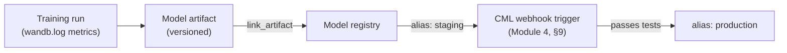

# Module 10 — Introduction to AutoML Tools

Week 11

## Learning objectives

* Know the landscape of experiment-tracking and AutoML/MLOps platforms beyond what earlier modules
  covered
* Be able to run experiment tracking and hyperparameter sweeps with Weights & Biases
* Be able to run a hyperparameter search with Optuna
* Understand the difference between point-solution tools (W&B, Optuna) and full-lifecycle AutoML
  platforms (H2O MLOps, Valohai, Domino, Iguazio)

---

## 1. Point solutions vs. full-lifecycle platforms

The tools this module surveys split into the same two families Module 2, §11 already introduced for
MLOps architectures in general, just at the tool-selection level instead of the platform level:

* **Point solutions** — a single, focused capability (track experiments, search hyperparameters) that
  a team bolts onto whatever pipeline they already have. §2-§3 cover the two most widely adopted:
  **Weights & Biases** for experiment tracking, and **Optuna** for hyperparameter search.
* **Full-lifecycle platforms** — a product that tries to own the whole loop from §2's tracking through
  training, deployment, and monitoring in one system, the same "buy the whole stack" trade-off Module
  2, §11 described for cloud-native MLOps architectures. §4 surveys five of these.

Neither family is objectively better — a team already happy with its own CI/CD (Module 4) and cloud
platform (Module 7) usually only needs the point solutions; a team without that infrastructure already
built gets more value from a platform that bundles it.

## 2. Experiment tracking with Weights & Biases

Logging loss/accuracy to a plain file and plotting it with matplotlib works for a single script run
alone, but breaks down the moment more than one run needs comparing, or more than one person is
running experiments. **Weights & Biases (W&B)** — free for personal/academic use, alongside
open-source-first alternatives like MLflow, Neptune, or Comet — is one standard answer:

```bash
pip install wandb
wandb login   # paste the API key from wandb.ai
```

```python
import wandb

wandb.init(project="my_project", entity="my_entity", job_type="train", config=hyperparams)
wandb.log({"train_loss": loss, "train_acc": acc})
wandb.log({"input_images": wandb.Image(batch)})  # images, histograms, matplotlib figures too
```

* `project` groups every run from one experiment line together, shared across a team.
* `entity` is the owning user/team.
* `job_type` distinguishes different scripts logging to the same project (`"train"` vs. `"evaluate"`)
  for dashboard filtering.

**The reproducibility payoff** is what makes this more than a nicer plot: every run's page
automatically records the exact git commit, the exact launch command, and a full dependency snapshot —
reproducing a run becomes clone → checkout that commit → install from the snapshot → re-run the logged
command, closing the loop on Module 1, §3's "reproducibility is multidimensional" problem in practice.

**Model registry.** A trained model gets logged as a versioned, immutable **artifact**, then linked
into a **model registry** with an **alias** (`latest`, `staging`, `production`) marking where it sits
in the promotion path:



```python
run.link_artifact(artifact=artifact, target_path="model-registry/my-model", aliases=["staging"])
```

This alias mechanism is exactly what Module 4, §9's Continuous Machine Learning material hooks into: a
`repository_dispatch` webhook fires when an alias changes to `staging`, runs performance tests, and
only flips it to `production` once they pass.

## 3. Hyperparameter search: W&B Sweeps and Optuna

Both tools answer the same question — which hyperparameter combination performs best — with different
levels of infrastructure.

**W&B Sweeps** run directly inside the tracking setup from §2:

```yaml
# sweep.yaml
program: train.py
method: bayes   # or random, grid
metric:
  goal: minimize
  name: validation_loss
parameters:
  learning_rate: { min: 0.0001, max: 0.1, distribution: log_uniform }
  batch_size: { values: [16, 32, 64] }
run_cap: 10
```

```bash
wandb sweep configs/sweep.yaml   # prints a sweep_id
wandb agent <sweep_id>           # run in multiple terminals to parallelize the search
```

The sweep dashboard adds parallel-coordinates plots (spotting hyperparameter tendencies across runs)
and importance/correlation plots (which hyperparameters actually mattered) on top of the regular
run-comparison view.

**Optuna** is the standalone alternative, built around three concepts — a **trial** (one hyperparameter
combination), a **study** (a collection of trials), and an **objective** (the function scoring a
trial):

```python
import optuna

def objective(trial):
    lr = trial.suggest_float("lr", 1e-6, 1e0, log=True)
    batch_size = trial.suggest_categorical("batch_size", [16, 32, 64])
    # ...train and evaluate...
    return validation_loss  # Optuna minimizes by default

study = optuna.create_study(pruner=optuna.pruners.MedianPruner())
study.optimize(objective, n_trials=100)
```

Optuna defaults to sample-efficient Bayesian optimization rather than exhaustive grid search, and its
**pruning** (`MedianPruner` above) stops clearly-unpromising trials early to save compute — a trade-off
worth naming explicitly: pruning can discard a trial that would have improved later (e.g. one with a
learning-rate warmup that looks temporarily worse early on), so anything affecting training dynamics
over time makes pruning riskier to rely on blindly. For a search too large to run on one machine,
`optuna.create_study(storage=...)` against a shared database lets many worker processes pull from the
same study in parallel.

In practice, teams already using W&B for tracking tend to reach for its built-in Sweeps first, and
bring in Optuna specifically when they need pruning or a search strategy Sweeps doesn't offer.

## 4. The full-lifecycle AutoML/MLOps platform landscape

Each of the following tries to own more of the lifecycle than a point solution does, trading setup
simplicity for narrower scope, the same way Module 2, §11 framed cloud-native vs. open-source MLOps
architectures generally:

| Platform | Type | Positioning |
|---|---|---|
| **H2O MLOps** | Full-lifecycle platform | Pairs H2O's AutoML model training (Driverless AI) with a deployment/monitoring platform — automates architecture/hyperparameter search *and* the path to production |
| **Valohai** | Full-lifecycle platform | MLOps orchestration with a strong pipeline-versioning focus, deployable on any cloud rather than locked to one |
| **Domino Data Lab** | Full-lifecycle platform | Enterprise data science platform, strongest on governance and compliance for regulated industries |
| **neptune.ai** | Point solution | An experiment tracker positioned as a lighter-weight, lower-cost alternative to W&B — same job as §2, smaller footprint |
| **Iguazio** | Full-lifecycle platform | Built around the open-source **MLRun** project (already named in Module 2, §12's tool ecosystem), combining a real-time feature store (Module 6) with model serving in one platform |

The practical takeaway mirrors §1: `neptune.ai` sits with W&B and Optuna as a tool you add to an
existing pipeline, while H2O MLOps, Valohai, Domino, and Iguazio are each betting a team would rather
adopt one platform's opinions about the whole lifecycle than assemble Modules 3-9 by hand.

---

## Summary

Weights & Biases and Optuna (§2-§3) are the point-solution answer to "track my experiments" and "search
my hyperparameters efficiently," and both integrate cleanly into a pipeline built from everything in
Modules 3-9. H2O MLOps, Valohai, Domino, and Iguazio (§4) are the opposite bet: adopt one platform that
already bundles most of those modules together. Knowing which family a tool belongs to — and that
neither family is inherently the right answer — is the actual skill this module builds; the specific
tool names will keep changing.

## Further reading

* See the [Course books](../README.md#course-books) for deeper dives on applied ML engineering and
  production reliability.

## References

Foundational sources this module's content draws on:

* SkafteNicki, Nicki, et al. [`dtu_mlops`](https://github.com/SkafteNicki/dtu_mlops),
  `s4_debugging_and_logging/logging.md` (W&B half) and `s10_extra/hyperparameters.md` (Optuna). DTU
  course 02476, Apache 2.0 licensed. — primary source material this module's W&B and Optuna sections
  (§2-§3) are adapted from.
* [Weights & Biases documentation](https://docs.wandb.ai/) — source for the model registry/artifact
  alias mechanism in §2.
* [Optuna documentation](https://optuna.readthedocs.io/) — source for the trial/study/objective model
  and pruning behavior in §3.
* Vendor documentation for the platforms in §4 ([H2O MLOps](https://h2o.ai/platform/enterprise-mlops/),
  [Valohai](https://valohai.com/), [Domino Data Lab](https://domino.ai/), [neptune.ai](https://neptune.ai/),
  [Iguazio](https://www.iguazio.com/)) — consulted for accuracy of each platform's positioning in the
  comparison table, not quoted directly.
