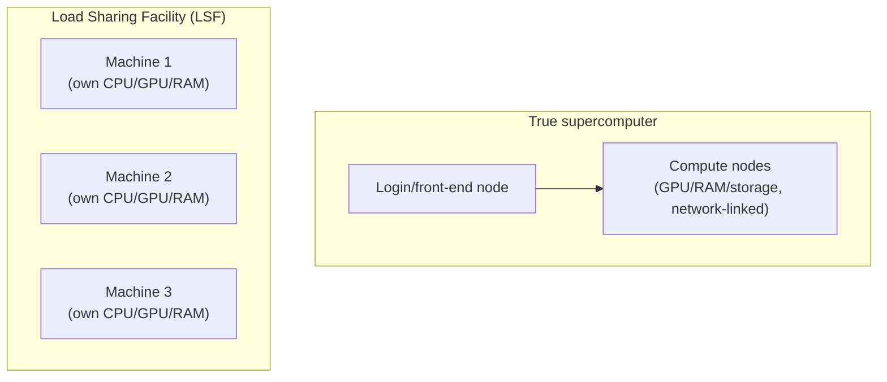

# Module 10: Extra

Week 11

## Learning objectives

* Publish a documentation site for a project, including auto-generated API reference pages
* Run a hyperparameter search with Optuna, and know when to reach for it over a manual sweep
* Understand High Performance Clusters as a cost-effective alternative to the cloud, and when that
  trade-off actually applies

---

## 1. Why documentation matters

A project without documentation has a way of quietly turning into a project nobody reuses: code that
looked useful gets abandoned the moment someone else has to guess how to run it. Documentation covers
three different needs at once, and a project usually needs all three: conceptual explanations (what is
this and why does it exist), API reference material (what does this specific function take and
return), and usage examples (how do I actually call it). This module covers the tooling that makes all
three cheap enough to maintain that they actually get written.

## 2. Static site generators

A **static site generator** turns a folder of Markdown files into a browsable HTML site once, ahead of
time, rather than rendering pages on every request the way a dynamic site does. Several exist (MkDocs,
Sphinx, GitBook, Docusaurus, Doxygen, Jekyll); the two most common for a Python project are:

| Generator | Strengths | Learning curve |
|---|---|---|
| **MkDocs** (with the **Material** theme) | Python-native build, Markdown-only, fast to get running | Low: this course's own site is built exactly this way |
| **Sphinx** | Deep customization, the long-standing standard for large Python projects | Higher: reStructuredText by default, more configuration surface |

MkDocs Material is the better starting point for a project that just needs clean, readable docs without
a steep setup cost, which is why it's the one this module goes hands-on with.

## 3. Setting up MkDocs for your own project

A minimal `mkdocs.yaml` has five parts: site metadata (`site_name`, `site_author`), `docs_dir` pointing
at where the Markdown source lives, `theme` (name: `material`, plus feature toggles), `plugins`
(`search` at minimum), and `nav` defining the page structure. This course's own `mkdocs.yml` at the root
of this repository is a live, working example of exactly this structure, worth opening directly.

```bash
mkdocs serve      # local preview with live reload; --dirty rebuilds only changed files
mkdocs build      # produces a site/ folder of static HTML
```

**Auto-generating API reference pages** is where MkDocs earns its place over hand-writing every
function's documentation twice. The `mkdocstrings` plugin reads a function or class's docstring
directly and renders it as a page:

```python
class MyNeuralNet(torch.nn.Module):
    """Basic neural network class.

    Args:
        in_features: number of input features
        out_features: number of output features
    """
    def __init__(self, in_features: int, out_features: int) -> None:
        ...
```

```markdown
# My API

::: src.models.model.MyNeuralNet
```

The `:::` line is not a typo; it's `mkdocstrings`' own syntax telling MkDocs to pull that class's
docstring and render it in place. Write the docstring once, next to the code it documents, and every
future site rebuild picks up whatever changed, without a second copy to keep in sync.

## 4. Publishing to GitHub Pages

A documentation site is only useful once someone else can actually reach it, which means automating the
build-and-publish step the same way Module 5 automated testing. This repository's own
`.github/workflows/deploy_docs.yaml` is the running example every module in this course has been
pointing back to:

```yaml
name: Deploy docs
on:
  push:
    branches: [main]
permissions:
  contents: write
jobs:
  deploy:
    runs-on: ubuntu-latest
    steps:
      - uses: actions/checkout@v6
        with: { fetch-depth: 0 }
      - uses: astral-sh/setup-uv@v7
      - run: uv sync
      - run: uv run mkdocs gh-deploy --force
```

`permissions: contents: write` is required specifically because this workflow pushes a `gh-pages`
branch back to the repository, not just reads from it. Once that branch exists, GitHub's own
Settings → Pages, set to "Deploy from a branch" → `gh-pages` → `/(root)`, serves it at
`https://<username>.github.io/<repository>/`, exactly the address this course's own site is published
at.

## 5. Project: publish your project's documentation (required)

Add a `docs/` folder to your group project with an `index.md`, wire up `mkdocstrings` to auto-generate
a reference page for at least one module's public functions or classes, and add a `deploy docs`
workflow modeled on §4's. Confirm the published site is reachable at its GitHub Pages URL, not just
locally via `mkdocs serve`.

## 6. Hyperparameter optimization with Optuna

Deep learning models are often sensitive to hyperparameter choice, but an exhaustive grid search is
infeasible once a single training run takes hours. [Optuna](https://optuna.readthedocs.io/) searches
smarter, built around three concepts: a **trial** (one hyperparameter combination), a **study** (a
collection of trials), and an **objective** (the function that scores a trial).

```python
import optuna

def objective(trial):
    lr = trial.suggest_float("lr", 1e-6, 1e0, log=True)
    batch_size = trial.suggest_categorical("batch_size", [16, 32, 64])
    # ...train and evaluate...
    return validation_loss  # Optuna minimizes by default

study = optuna.create_study(pruner=optuna.pruners.MedianPruner())
study.optimize(objective, n_trials=100)
```

Optuna defaults to sample-efficient Bayesian optimization rather than exhaustive grid search (though
`optuna.samplers.GridSampler` is available when the search space is small enough that exhaustive search
is actually feasible). **Pruning**, via `MedianPruner` above, stops a clearly unpromising trial early to
save compute, at the cost of occasionally discarding a trial that would have improved later, for
instance one with a learning-rate warmup that looks temporarily worse early on: anything that changes
training dynamics over time makes pruning riskier to lean on blindly.

For a search too large for one machine, pointing several worker processes at the same
`optuna.create_study(storage=...)` lets them each call `study.optimize(...)` against shared storage,
parallelizing the search itself rather than a single training run. Optuna's own visualization module
then produces parameter-importance and optimization-history plots directly from a completed study,
useful for explaining *which* hyperparameters actually mattered rather than only which combination won.

This is the systematic alternative to the manual sweeps Module 4's Weights & Biases logging already
lets you compare by hand; reach for Optuna once "try a few values and eyeball the dashboard" stops
scaling.

## 7. High Performance Clusters

Cloud compute (Module 6) is not the only way to get more compute than a laptop: most universities
already run their own **High Performance Cluster (HPC)**, and EuroHPC is the EU-wide public alternative
for anyone without institutional access. HPC is worth reaching for specifically when cost matters more
than the cloud's near-infinite, pay-as-you-go scale.

**Tiering** (Europe-specific, but the concept generalizes): Tier-0 centers run at petaflop scale
nationally or across Europe; Tier-1 centers are national supercomputing centers; Tier-2 centers are
regional. Lower tier number means bigger jobs supported.

Two architectural shapes exist:



An LSF (independent machines, each with its own full CPU/GPU/RAM) is fine for single-node jobs; a true
supercomputer's network-linked compute nodes matter once a job needs many devices actually
communicating with each other, which is precisely the distributed training case from Module 9.

A **scheduler** (SLURM, MOAB HPC Suite, PBS Works) is what turns a shared cluster from resource
contention into something usable: without one, everyone's jobs just compete for the same hardware at
once. A typical job flow: SSH or ThinLinc into the cluster, set up a `(mini)conda` environment, write a
job script specifying the queue, the GPU count requested, and the command to run, `module load
cuda/X.Y` to pull in the right CUDA version, submit with `bsub < jobscript.sh`, poll status with
`bstat`/`qstat`, and inspect the resulting `.out`/`.err` files once it finishes.

The specific scheduler command syntax matters less than the underlying idea: HPC access, where it
exists, is a cost lever worth knowing about alongside the cloud, not a replacement for it.

---

## Summary

Documentation (§1-§5) turns code that works on one machine into code someone else can actually pick up,
and this course's own site is the running proof that the MkDocs Material plus GitHub Actions pipeline
from §3-§4 works end to end. Optuna (§6) is the systematic version of the hyperparameter sweeps Module 4
already lets you track by hand, worth reaching for once eyeballing a dashboard stops scaling. HPC (§7)
closes the loop on Module 6: the cloud isn't the only lever for more compute, and knowing when
institutional access beats a cloud bill is itself part of the judgment this course has been building
toward.

## Further reading

* See the [Course books](../README.md#course-books) for deeper dives on applied ML engineering and
  production reliability.

## References

Foundational sources this module's content draws on:

* SkafteNicki, Nicki, et al. [`dtu_mlops`](https://github.com/SkafteNicki/dtu_mlops),
  `s10_extra/documentation.md`, `hyperparameters.md`, and `high_performance_clusters.md`. DTU course
  02476, Apache 2.0 licensed. Primary source material this module's documentation (§1-§5), Optuna
  (§6), and HPC (§7) sections are adapted from.
* [MkDocs Material documentation](https://squidfunk.github.io/mkdocs-material/). Source for the theme
  and site structure in §3.
* [mkdocstrings documentation](https://mkdocstrings.github.io/). Source for the `:::` auto-API-doc
  syntax in §3.
* [Optuna documentation](https://optuna.readthedocs.io/). Source for the trial/study/objective model
  and pruning behavior in §6.
* [SLURM documentation](https://slurm.schedmd.com/documentation.html). Source for the scheduler role
  described generically in §7.
