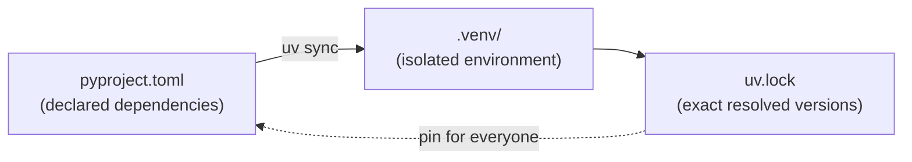
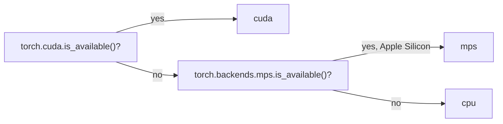

# Module 1: Development Environment

Week 1

## Learning objectives

* Be comfortable navigating and scripting from the command line
* Understand what a package manager solves, and be able to set up a project with `uv`
* Configure an editor (VS Code) for Python development, including AI-assisted completion
* Install PyTorch correctly and implement a basic training/evaluation loop

---

## 1. Why a development environment matters

Every module after this one assumes you can navigate a terminal, manage a Python environment without
version conflicts, edit code in something more capable than a plain text box, and run PyTorch without
burning half a day on an installation problem. None of that is MLOps specifically, but all of it is the
floor everything else in this course stands on, so it gets its own module before anything else starts.

## 2. :material-console: The command line

The command line is a text-based interface for the computer, predating graphical interfaces and still
essential for MLOps work: many tools have no GUI at all, and cloud environments are usually reached
through a terminal in the first place. A command breaks into four parts:

```
[prompt] $ command --option argument
```

* **Prompt**: shows the current directory and a shell symbol (`$`, `>`), often with environment info.
* **Command**: the executable instruction itself, for example `ls` or `cd`.
* **Options/flags**: modifiers starting with `-` or `--` that change behavior.
* **Arguments**: the inputs the command actually operates on.

A small set of commands covers most day-to-day navigation and inspection:

| Command | What it does |
|---|---|
| `cd` / `pwd` | Change directory / print the current one |
| `ls` (`-l` for detail) | List a folder's contents |
| `which` (`where` on Windows) | Locate where a program actually lives |
| `cat` | Print a file's contents |
| `less` | Page through a file's contents |
| `top` | Live system resource usage |
| `wget` | Download a file from a URL |
| `>` | Redirect a command's output into a file |

Editing a file without leaving the terminal (`nano <file>`), then running it (`python <file>.py`), is
worth practicing directly, since it's the same loop used on a remote machine with no editor GUI
available at all.

**Bash scripting** turns a sequence of commands into a reusable file:

```bash
#!/bin/bash
# a for-loop calling the same script 10 times
for i in {1..10}; do
    python script.py
done
```

**Environment variables** hold configuration outside the code itself:

```bash
export MY_VAR=hello   # Linux/macOS; Windows: set MY_VAR=hello
echo $MY_VAR
```

```python
import os
print(os.environ["MY_VAR"])
```

A `.env` file plus `python-dotenv` is the more durable version of the same idea, and is exactly how
this course's own repository loads secrets later on:

```bash
uv add python-dotenv
```

```python
from dotenv import load_dotenv
load_dotenv()
import os
print(os.environ["MY_VAR"])
```

Windows users should run the Bash exercises through WSL; PowerShell is the native alternative.

## 3. Package managers

Installing packages globally with plain `pip` eventually breaks something: two projects that need
different versions of the same library can't both be satisfied by one global install, and the last one
installed silently wins. A **virtual environment** fixes this by giving every project its own isolated
package directory.

Python never settled on one standard tool for this the way Node has npm or Rust has cargo. Conda,
Poetry, Pipenv, PDM, and `uv` all solve the same problem; this course uses **`uv`**, the fastest of the
group and increasingly the community default:



| Command | What it does |
|---|---|
| `uv init` | Scaffolds a new project (`pyproject.toml`, `.venv/`, `README.md`) |
| `uv add <package>` | Adds a runtime dependency |
| `uv add --dev <package>` | Adds a development-only dependency (tests, linters) |
| `uv sync` | Installs exactly what `pyproject.toml`/`uv.lock` specify |
| `uv run <script>` | Runs a script inside the project's environment, no manual activation needed |
| `uv python pin 3.13` | Pins the Python version for this project (`.python-version`) |
| `uv export --format requirements.txt` | Exports a plain `requirements.txt` for tools that still need one |

The `[dependency-groups]` table separates concerns cleanly, for example a `dev` group for `pytest`/`ruff`
that production code never needs:

```toml
[project]
dependencies = ["numpy>=2.0", "scikit-learn==1.2.2"]

[dependency-groups]
dev = ["pytest", "ruff"]
```

Committing `uv.lock` (not just `pyproject.toml`) to Git is what actually guarantees two machines resolve
to the identical set of package versions, not just compatible ones. Conda plus `pip` remains a valid
alternative, particularly where a non-Python dependency (CUDA, a system library) needs managing
alongside Python packages, but for a pure Python project `uv`'s speed and project-based structure make
it the default this course builds on.

## 4. Editors and IDEs

A notebook is excellent for prototyping and visualization, but a project with more than one file needs
a real editor. This course uses **VS Code**, though Spyder (MATLAB-like, beginner-friendly) and PyCharm
(Python-specific, more opinionated) are reasonable alternatives.

Four extensions cover the Python workflow: **Python**, **Pylance** (fast type-aware completions),
**Jupyter** (notebooks inside the editor), and **Python Environments** (switching which `.venv` VS Code
points at, visible in the status bar).

**Converting a notebook to a script** matters the moment a model needs to leave the notebook it was
prototyped in:

```bash
uv add nbconvert
jupyter nbconvert --to=script my_notebook.ipynb
```

**AI-assisted completion** (GitHub Copilot, free through the GitHub Student Developer Pack) suggests
code inline as you type, and `Ctrl+I` opens an inline chat scoped to selected code. It's a genuine
productivity tool, but the responsibility stays with you: a suggested layer size or architecture choice
still needs to make sense for your actual data, and a plausible-looking suggestion is not the same as a
correct one.

## 5. Deep learning software

Three frameworks dominate deep learning: TensorFlow, JAX, and **PyTorch**, the one this course uses
throughout, since it's the framework most published research and competition-winning models are
actually built on.

**Installation size is worth getting right up front.** A naive `pip install torch` pulls a GPU-enabled
build (roughly 6.6 GB); a CPU-only build is closer to 700 MB. Point at the right index explicitly:

```bash
# CPU-only
uv add torch --index https://download.pytorch.org/whl/cpu
# GPU (CUDA 12.6)
uv add torch --index https://download.pytorch.org/whl/cu126
```

**Device management** should never hardcode `"cuda"`, since the same code needs to run on a laptop with
no GPU at all:



```python
DEVICE = torch.device(
    "cuda" if torch.cuda.is_available()
    else "mps" if torch.backends.mps.is_available()
    else "cpu"
)
model = model.to(DEVICE)
```

The three lines every training loop needs, and what breaks if one is missing:

| Line | What it does | If you forget it |
|---|---|---|
| `optimizer.zero_grad()` | Clears gradients from the previous step | Gradients accumulate across steps, exploding |
| `loss.backward()` | Computes gradients for the current batch | No gradients exist; nothing to update |
| `optimizer.step()` | Applies the computed gradients to the weights | Gradients are computed but never applied; the model never learns |

**Saving a model** should save its state, not the object itself, since Python object serialization is
fragile across code changes:

```python
torch.save(model.state_dict(), "model.pt")
model.load_state_dict(torch.load("model.pt"))
```

## 6. Project: corrupted MNIST baseline (required)

Build a small, complete PyTorch project from three files, tying together everything above:

* **`model.py`**: a small CNN (a few `Conv2d` layers, pooling, dropout, a final linear layer to 10
  classes).
* **`data.py`**: load a corrupted-MNIST dataset from `.pt` files, add the channel dimension a CNN
  expects (`unsqueeze(1)`), and return train/test `TensorDataset`s.
* **`main.py`**: a `typer` CLI with `train` (configurable learning rate/batch size/epochs, saves a
  training-loss plot and a model checkpoint) and `evaluate` (loads a checkpoint, prints test accuracy)
  commands.

```bash
uv run main.py train --lr 1e-4
uv run main.py evaluate model.pt
```

Target at least 85% test accuracy. Debugging the `--lr`/`--batch_size`/`--epochs` flags directly from
VS Code, rather than editing the script every time, is worth setting up now with a `.vscode/launch.json`
entry that passes arguments to the debugger:

```json
{
    "version": "0.2.0",
    "configurations": [{
        "name": "Train",
        "type": "debugpy",
        "request": "launch",
        "program": "${file}",
        "args": ["train", "--lr", "1e-4"],
        "console": "integratedTerminal"
    }]
}
```

---

## Summary

A development environment is infrastructure, not busywork: the command line (§2) is how you'll reach
every remote machine this course touches, `uv` (§3) is what keeps every later module's dependencies
from colliding with each other, VS Code (§4) is where the actual code gets written, and a correctly
installed PyTorch (§5) is the one thing every single exercise after this module assumes already works.
Module 2 picks this up directly: the project from §6 is exactly what gets restructured into a proper,
version-controlled package next.

## Further reading

* See the [Course books](../README.md#course-books) for deeper dives on applied ML engineering and
  production reliability.

## References

Foundational sources this module's content draws on:

* SkafteNicki, Nicki, et al. [`dtu_mlops`](https://github.com/SkafteNicki/dtu_mlops),
  `s1_development_environment/` (`command_line.md`, `package_manager.md`, `editor.md`,
  `deep_learning_software.md`). DTU course 02476, Apache 2.0 licensed. Primary source material this
  module's command line, package manager, editor, and PyTorch sections are adapted from.
* [uv documentation](https://docs.astral.sh/uv/). Source for the package manager commands and
  `pyproject.toml` structure in §3.
* [VS Code Python documentation](https://code.visualstudio.com/docs/python/python-tutorial). Source for
  the extension setup and debugger configuration in §4 and §6.
* [PyTorch documentation](https://docs.pytorch.org/). Source for the installation, device management,
  and training loop patterns in §5.
