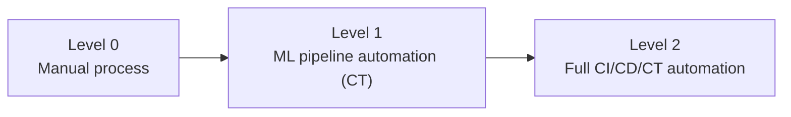
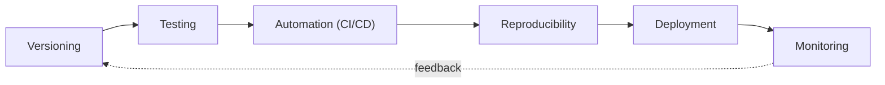

# Module 2 — Overview of ML and MLOps Stages

Week 2

## Learning objectives

* Understand the MLOps maturity model and where a team/org sits on it
* Understand the stages of an MLOps pipeline: versioning, testing, automation, reproducibility,
  deployment, monitoring
* Be able to compare open-source vs. cloud-native MLOps architectures
* Understand the tool ecosystem and the roles involved in MLOps

---

## 1. The MLOps maturity model

Organizations don't wake up one day fully "MLOps-mature" — they move through recognizable levels,
and two framings are widely used in industry:

**Google Cloud's 3-level model** (the more commonly cited version for describing pipeline automation):

| Level | Name | What it looks like |
|---|---|---|
| 0 | Manual process | Every step — data prep, training, validation, deployment — is run by hand from a notebook. No CI/CD, no automated retraining. |
| 1 | ML pipeline automation | Training itself is automated into a repeatable pipeline, enabling continuous training (CT), but deployment of the resulting model is still a manual step. |
| 2 | CI/CD pipeline automation | A robust, automated CI/CD system builds, tests, and deploys both pipeline components and models — the full loop is automated end to end. |

**Microsoft's 5-level model** (covered in Module 1, §11) is a finer-grained version of the same idea,
adding explicit levels for basic DevOps hygiene and for continuous training with human oversight.
Both models agree on the essential point: **maturity is measured by how much of the pipeline is
automated versus manual**, not by how sophisticated any individual model is.

A team's job is not to chase Level 2 for every project — it's to match the level of automation to how
much a project's value depends on speed, reliability, and scale.

## 2. Detailed MLOps stages

Zooming into what actually happens inside a mature MLOps pipeline, six recurring stages show up
across almost every real system, regardless of industry or model type:

The rest of this module walks through each stage, then zooms back out to the architectures and tools
that implement them.

## 3. Versioning: data, code, model, features & containers

Traditional software only needs to version one thing: code. MLOps needs to version **five** things
that all change independently, and a working system needs a story for keeping them in sync:

* **Code** — the usual Git-based version control (Module 3).
* **Data** — the raw and processed datasets used for training, since the same code trained on
  different data produces a different model (tools like DVC, LakeFS).
* **Models** — trained weights/artifacts, tracked with enough metadata to know exactly what code and
  data produced them (model registries — see Module 10).
* **Features** — engineered features need their own versioning once they're shared across multiple
  models, so training and serving don't silently drift apart (Module 6, Feature Store).
* **Containers** — the exact runtime environment (OS, libraries, drivers) a model was trained and is
  served in (Module 5, Docker).

The unifying idea: reproducing *any* result requires knowing the exact combination of all five,
pinned together — not just the code.

## 4. Testing

Testing an ML system needs everything traditional software testing does, plus tests that have no
equivalent in traditional software because the "logic" is learned from data rather than written by a
developer:

* **Unit tests** — the usual code-correctness tests (does the preprocessing function do what it should).
* **Data tests** — schema validation, range checks, and distribution checks on incoming data.
* **Model tests** — behavioral tests on the model itself: does it beat a trivial baseline, does it
  perform acceptably on known edge cases and slices of the data, is it invariant to changes that
  shouldn't matter (e.g. a name swap in a resume-screening model).
* **Integration tests** — does the full pipeline, end to end, actually produce a servable model.

## 5. Automation (CI/CD)

Automation is what turns the stages above from a manual checklist into something that runs on every
change without a human remembering to do it. In MLOps this splits into two related but distinct
loops:

* **CI (Continuous Integration)** — every code change automatically triggers linting, unit tests, and
  a fast validation training run.
* **CD (Continuous Delivery/Deployment)** — a model that passes its quality gates is automatically
  packaged and deployed, often progressively (canary or shadow deployment) rather than all at once.

Module 4 covers this in depth across AWS, GCP, Azure, and GitHub Actions specifically.

## 6. Reproducibility

Reproducibility is the property that lets someone — including future-you — recreate a specific result
exactly. It depends on all of the versioning from §3 being pinned simultaneously: same code, same
data, same feature definitions, same container, and the same configuration/hyperparameters (typically
captured in structured config files rather than hardcoded). Without this, debugging a production
incident ("why did the model behave this way on March 3rd?") becomes close to impossible.

## 7. Deployment

Deployment is the act of making a trained model available to receive real input and return real
predictions. The two dimensions that matter most:

* **How** — as a batch job that scores a dataset periodically, or as a real-time service behind an
  API that responds to individual requests.
* **Where** — locally, on a self-managed cluster, or on a managed cloud service (Module 7 covers AWS
  SageMaker, GCP Vertex AI, and Azure ML specifically).

## 8. Monitoring

Monitoring is what tells you a deployed model needs attention *before* a business metric tells you the
hard way. Two categories matter, and most teams only build the first:

* **Infrastructure monitoring** — latency, throughput, error rate, resource usage (the same telemetry
  any production service needs).
* **Model/data monitoring** — is the input data drifting from what the model was trained on, is the
  model's own confidence/accuracy degrading, are predictions becoming skewed toward one class. This
  category has no equivalent in traditional software monitoring (Module 9).

## 9. Automated ML pipelines vs. CI/CD ML pipelines

These two automation loops are easy to conflate but answer different questions:

| | Automated ML (training) pipeline | CI/CD ML pipeline |
|---|---|---|
| Triggered by | A schedule, or a data/drift signal | A code change (commit, pull request, merge) |
| Question it answers | "Should we retrain, given new data?" | "Is this new code/model change safe to ship?" |
| Output | A new candidate model | A deployed (or rejected) model version |

A mature system runs both loops continuously and connects them: a CI/CD pipeline promotes a model that
an automated training pipeline just produced, only after it clears its quality gates.

## 10. MLOps architectures

Once a team commits to automating the stages above, they have to choose a platform to build that
automation on. Broadly, two families of architecture dominate:

### Open-source tools

| Tool | What it's known for |
|---|---|
| **Kubeflow** | Kubernetes-native ML pipeline orchestration; the "default" open-source choice if you're already running Kubernetes |
| **MLflow** | Experiment tracking, model registry, and packaging — often adopted first because it's lightweight and framework-agnostic |
| **Metaflow** | Pipeline authoring designed for data scientists, originally built at Netflix, strong on human-friendly workflow definition |
| **Kedro** | Opinionated project structure and pipeline framework for reproducible data science code |
| **ZenML** | A pipeline abstraction layer designed to be portable across many backends (local, cloud, Kubeflow, etc.) |
| **MLRun** | An open-source MLOps orchestration framework with a strong focus on feature store integration |
| **CML (Continuous Machine Learning)** | Brings CI/CD-style automation (by iterative.ai, the makers of DVC) specifically to ML pipelines on top of existing CI systems like GitHub Actions |

### Cloud-native tools

| Provider | Platform |
|---|---|
| **AWS** | SageMaker — training, tuning, deployment, and pipelines as a managed service |
| **GCP** | Vertex AI — unified training, feature store, and deployment platform |
| **Azure** | Azure Machine Learning — pipelines, model registry, and managed endpoints |

Module 7 goes hands-on with all three cloud-native platforms.

## 11. Cost-benefit approach: architecture choice and MLOps maturity

Neither family is "better" in the abstract — the right choice depends on where a team sits on the
maturity model from §1:

* **Cloud-native** tools generally win on *time-to-value*: a team can get a working pipeline running
  in days, with less infrastructure to own, at the cost of some vendor lock-in and (at scale) higher
  ongoing spend.
* **Open-source** tools generally win on *control and portability*: no vendor lock-in, and often
  cheaper at large scale, at the cost of needing in-house platform engineering capacity to run and
  maintain them.

A useful rule of thumb: teams early in their MLOps maturity journey (Level 0-1) are usually better
served starting cloud-native, since they don't yet have the platform engineering capacity open-source
tooling assumes. Teams that have already reached Level 2 maturity and are running at real scale often
find the economics flip toward investing in an open-source, self-hosted stack.

## 12. The MLOps tool ecosystem

Pulling §3-§10 together into one map — a representative (not exhaustive) tool for each stage:

| Stage | Representative tools |
|---|---|
| Versioning (code / data / model) | Git, DVC, MLflow Model Registry |
| Testing | pytest, Great Expectations, Deepchecks |
| Automation (CI/CD/CT) | GitHub Actions, GitLab CI, Argo Workflows, CML |
| Reproducibility | Docker, Hydra, Conda/`uv` |
| Deployment | Kubernetes, Seldon Core, BentoML, cloud-managed endpoints |
| Monitoring | Prometheus/Grafana (infra), Evidently AI, WhyLabs (data/model) |

Every one of these tools gets a hands-on treatment somewhere later in this course.

## 13. Roles involved in MLOps

MLOps is a team sport. The same pipeline typically involves several distinct roles, each with
different priorities:

| Role | Primary responsibility |
|---|---|
| **Data Scientist** | Model design, offline experimentation, and evaluation |
| **ML Engineer** | Turning a validated model into productionized, tested, deployable code |
| **Data Engineer** | Building and maintaining the pipelines that produce clean, reliable training data |
| **MLOps / Platform Engineer** | Building and maintaining the shared infrastructure — CI/CD, orchestration, monitoring — that every model rides on |
| **DevOps / SRE** | Infrastructure reliability, incident response, and the non-ML-specific parts of the production stack |
| **Product owner / domain expert** | Defines what "good" looks like for the business problem, and is accountable for the model's real-world impact |

In a small team, one person may wear three of these hats; in a large organization, each is a distinct
job title. Either way, naming the responsibilities explicitly is what prevents a model from being
"someone else's problem" the moment it leaves the notebook.

---

## Summary

An MLOps pipeline is not one thing — it's six recurring stages (versioning, testing, automation,
reproducibility, deployment, monitoring) that a team automates progressively as it matures, built on
top of either an open-source or cloud-native architecture chosen based on where that team's maturity
and scale actually sit. The tool ecosystem and the role split exist to make that automation a shared,
sustainable responsibility rather than a single person's heroics.

## Further reading

* See the [Course books](../README.md#course-books) for deeper dives on applied ML engineering and
  production reliability.

## References

Foundational industry sources this module's content draws on:

* Google Cloud. ["MLOps: Continuous Delivery and Automation Pipelines in Machine Learning."](https://cloud.google.com/architecture/mlops-continuous-delivery-and-automation-pipelines-in-machine-learning)
  Architecture guide. — source for the 3-level maturity model in §1.
* Microsoft. ["MLOps Maturity Model."](https://learn.microsoft.com/en-us/azure/architecture/ai-ml/guide/mlops-maturity-model)
  Azure Architecture Center. — the 5-level model referenced alongside Google's in §1 (see also Module 1, §11).
* Official documentation for the tools named in §10 and §12 (Kubeflow, MLflow, Metaflow, Kedro,
  ZenML, MLRun, CML, and the AWS/GCP/Azure ML platforms) — consulted for accuracy of each tool's
  positioning, not quoted directly.
