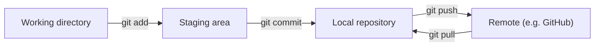

# Module 2: Organisation and Version Control

Week 2

## Learning objectives

* Understand core Git concepts (commits, branches, remotes) and a standard branching strategy
* Be able to scaffold a project from a template so its structure is consistent and shareable
* Apply good coding practice: documentation, style, and type hints
* Be able to version-control a dataset with DVC, the same way Git version-controls code
* Be comfortable building a simple command-line interface for a project

---

## 1. Why organization matters as a project grows

A single script is easy to keep in your head. The moment a project has more than one file, more than
one contributor, or data too large for Git, informal organization stops working: nobody can find
anything, two people's changes collide, and "which version of the data produced this result" becomes
unanswerable. This module covers the five things that keep a growing ML codebase navigable: version
control for code (§2-§3), a consistent project structure (§4), coding style that reads the same across
contributors (§5), a proper way to invoke your own code (§6), and version control for data (§7), since
Git alone was never designed to track anything data-sized.

## 2. Git essentials

**Git** is a distributed version control system: every clone holds the full history, not just a
checkout of the current state, so you can commit and inspect history entirely offline. Its model
reduces to two ideas: a graph of **commits** (each one a full snapshot, identified by a hash) and a
**staging area** sitting between your files and that graph.

<figure markdown>

<figcaption><a href="https://xkcd.com/1597/">xkcd #1597</a>, CC BY-NC 2.5. DTU's own Git module uses
the same comic to make the same point.</figcaption>
</figure>



| Command | What it does |
|---|---|
| `git init` / `git clone <url>` | Starts a new repository, or downloads a full copy of an existing one |
| `git status` / `git log` | Shows what's staged and unstaged right now, or the commit history |
| `git add <file>` | Stages a file's changes for the next commit |
| `git commit -m "<message>"` | Creates a commit from everything staged |
| `git push` / `git pull` | Uploads local commits to the remote, or fetches and merges the remote's new commits |
| `git branch` / `git switch <branch>` | Lists branches, or switches to one (`git switch -c <name>` creates and switches) |
| `git merge <branch>` | Merges the named branch into the current one |

A **branch** is just a movable pointer to a commit, cheap to create since it copies no files, which is
what makes it safe to try something without touching working code.

## 3. A standard branching strategy

Once more than one or two people commit to the same repository, an explicit strategy is what keeps
parallel work from colliding:

| Branch | Branched from | Purpose |
|---|---|---|
| `main` | - | Always deployable |
| `development` | `main` | Long-lived integration branch, ahead of `main` |
| `feature/*` | `development` | One feature, merged back via pull request |
| `bugfix/*` | `development` (or `main` for hotfixes) | Fixes one specific defect |
| `release/*` | `development` | Stabilization window before shipping |

The point is to keep `main` always in a known-good state, and make the path from a laptop to
production an explicit, reviewable sequence of merges rather than direct commits to `main`. A **merge
conflict** happens when two commits touch the same lines; Git marks both versions inline with
`<<<<<<<`/`=======`/`>>>>>>>` markers, and resolving it means editing the file into the version you
actually want, then removing the markers before committing.

## 4. Project structure with Cookiecutter

Two teams following the same project template can understand each other's code faster, because the
layout follows the same rules every time. **Cookiecutter** generates a new project from a template
repository instead of everyone inventing their own layout from scratch:

```bash
pip install cookiecutter
cookiecutter <url-to-template>
```

A minimal Python package structure:

```
src/
    my_project/
        __init__.py
        data.py
        model.py
        train.py
pyproject.toml
```

`pyproject.toml` is the modern standard (PEP 621) for a project's metadata and dependencies, replacing
the older `setup.py`/`setup.cfg` pair, and can hold tool configuration (ruff, mypy) in the same file.
Installing a project in **editable mode** (`pip install -e .`, or `uv sync` for a `uv`-managed project)
means code changes take effect immediately without reinstalling, essential for iterative development.
Project name conventions follow PEP 8: lowercase with underscores (`my_project`, not `MyProject`), and
never starting with a digit.

**Project: scaffold the group project (required):** generate the group project's repository from a
cookiecutter template, install it in editable mode, and confirm `import my_project` works from a
Python shell without any path hacks.

## 5. Good coding practice

Consistency matters more than any specific rule, since the goal is a codebase every teammate can read
the same way:

* **Documentation.** Under-documented code leaves hard things unexplained; over-documented code gets
  skipped because nobody reads walls of comments. As the saying goes, code tells you *how*, comments
  should tell you *why*. [Docstrings](https://peps.python.org/pep-0257/) with standard `Args`/`Returns`
  sections cover the middle ground.
* **Styling.** [PEP 8](https://peps.python.org/pep-0008/) is Python's official style guide.
  [`ruff`](https://github.com/astral-sh/ruff) has replaced the older `flake8`/`black`/`isort` combo as
  a single, fast linter and formatter:

  ```bash
  ruff check .     # lint
  ruff format .    # auto-format
  ```

* **Typing.** Type hints aren't required, but they improve readability and let a static checker catch
  a whole class of bugs before the code ever runs:

  ```python
  def add(x: int, y: int) -> int:
      return x + y
  ```

  [`mypy`](https://mypy.readthedocs.io/) checks that type hints are internally consistent without
  executing the code; [`ty`](https://docs.astral.sh/ty/) is a newer, faster alternative from the same
  team behind `ruff` and `uv`.

## 6. Command-line interfaces

Once a script grows past `python my_script.py`, a proper CLI gives it a documented, discoverable
entry point. Three layers, often used together:

* **Project scripts** in `pyproject.toml` turn a function into a bare command:

  ```toml
  [project.scripts]
  train = "my_project.train:main"
  ```

  ```bash
  uv run train   # runs my_project.train:main directly
  ```

* **`typer`** extends `argparse`-style flags to git-style subcommands:

  ```python
  import typer
  app = typer.Typer()

  @app.command()
  def train(lr: float = 1e-3, batch_size: int = 32):
      ...

  if __name__ == "__main__":
      app()
  ```

* **`invoke`** automates whole project tasks, a Python-native alternative to a Makefile:

  ```python
  from invoke import task

  @task
  def preprocess_data(ctx):
      ctx.run("python src/my_project/data.py")
  ```

  ```bash
  invoke --list
  invoke preprocess-data
  ```

## 7. Data version control with DVC

Git was designed for code: text files, typically under a gigabyte. Machine learning needs to track
datasets that can run into the gigabytes or terabytes, which makes committing data directly to Git
impractical. **DVC (Data Version Control)** extends the same Git workflow to data by storing small
"pointer" metafiles in Git while the actual data lives in a remote (a bucket, or a Google Drive folder
for a zero-setup starting point; Module 6 covers pointing it at a Google Cloud Storage bucket instead):

```bash
pip install dvc dvc-gdrive
dvc init
dvc remote add -d storage gdrive://<folder-id>
git add .dvc/config
```

```bash
dvc add data/                 # tracks the data folder, writes a small metafile
git add data.dvc .gitignore
git commit -m "First dataset version"
git tag -a "v1.0" -m "data v1.0"
dvc push                      # uploads the actual data to the remote
```

Cloning the repository now needs one extra step to get the data back:

```bash
git clone <repository_url>
dvc pull   # downloads the data DVC is tracking, alongside git pull for the code
```

Reverting to a previous data version is symmetric to Git's own history: `git checkout v1.0` followed
by `dvc checkout` restores both the code and the data pointer from that tag. DVC struggles with
datasets made of many small files; compressing into a single archive, or converting to a columnar
format like Parquet, avoids that overhead.

**Project: version a dataset with DVC (required):** initialize DVC in the group project's repository,
add a remote, track the project's dataset, and confirm a fresh clone can recover both the code and the
data with `git clone` followed by `dvc pull`.

---

## Summary

A project survives more than one contributor, and more than one dataset version, only if it has answers
to two questions: what changed in the code, and what changed in the data. Git and a standard branching
strategy (§2-§3) answer the first; DVC (§7) answers the second, using the exact same mental model just
pointed at a remote instead of GitHub. Cookiecutter, coding style, and CLIs (§4-§6) are what keep the
*shape* of the answer consistent across every project a team ever starts, so the next person who opens
the repository already knows where to look.

## Further reading

* See the [Course books](../README.md#course-books) for deeper dives on applied ML engineering and
  production reliability.

## References

Foundational sources this module's content draws on:

* SkafteNicki, Nicki, et al. [`dtu_mlops`](https://github.com/SkafteNicki/dtu_mlops),
  `s2_organisation_and_version_control/` (`git.md`, `code_structure.md`, `good_coding_practice.md`,
  `data_version_control.md`, `cli.md`). DTU course 02476, Apache 2.0 licensed. Primary source material
  this entire module is adapted from.
* [Pro Git](https://git-scm.com/book/en/v2), Chacon, Scott & Straub, Ben. Source for the commit/staging/
  branch model in §2.
* [Cookiecutter documentation](https://cookiecutter.readthedocs.io/). Source for the templating
  workflow in §4.
* [Ruff documentation](https://docs.astral.sh/ruff/) and [mypy documentation](https://mypy.readthedocs.io/).
  Source for the styling and typing tools in §5.
* [DVC documentation](https://dvc.org/doc). Source for the data-versioning workflow in §7.
