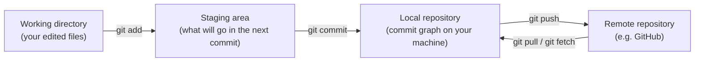
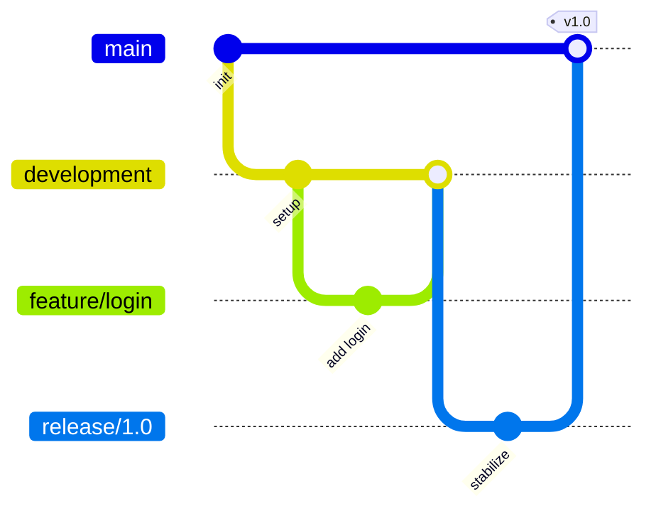

# Module 3 — Git Essentials for MLOps Practitioners

Week 3

## Learning objectives

* Understand core Git concepts: commits, branches, remotes
* Know and apply standard branching strategies used in professional teams
* Be comfortable with the everyday Git command set
* Understand what GitHub Actions is and how a remote repository is organized

---

## 1. Overview of Git

**Git** is a distributed version control system: a way to track *who* changed *what*, *when*, across
a codebase that many people touch at once. "Distributed" is the key word — every clone of a repository
is a full copy of its history, not just a checkout of the current state, so a developer can commit,
branch, and inspect history entirely offline before ever talking to a server.

It is worth separating two things that are easy to conflate: **Git is the tool**; **GitHub is one of
several companies that hosts Git repositories online** and layers collaboration features (pull
requests, code review, Actions) on top. GitLab and Bitbucket are the other widely-used hosts. This
course uses Git + GitHub throughout, but the Git commands themselves work identically no matter who
hosts the remote.

For MLOps specifically, Git is the versioning mechanism for **code** — one of the five things an MLOps
pipeline needs to version, alongside data, models, features, and containers (Module 2, §3). Everything
else in the stack — CI/CD (Module 4), containerized environments (Module 5), model registries
(Module 10) — assumes a Git history it can hook into.

## 2. Git's core model: commits, staging, and branches

Git's mental model reduces to two ideas: a **graph of commits**, and a **staging area** that sits
between your files and that graph.

A **commit** is a snapshot of the entire repository at one point in time, identified by a unique hash.
Because every commit points back to its parent, the full history forms a directed graph — which is
exactly what lets you jump back to any prior state, compare two points in time, or reason about how a
branch diverged from another.

Getting a local change into that graph, and then sharing it, is a three-step move:



* `git add` moves changes into the **staging area**. Nothing is hashed yet, so staged changes can
  still be freely reverted with `git restore --staged`.
* `git commit` turns the staged changes into a permanent node in the local commit graph. This is still
  entirely local — nobody else can see it yet.
* `git push` uploads your local commits to the remote so collaborators (and CI) can see them.
* `git pull` (a `git fetch` followed by a merge) brings the remote's new commits back down to your
  local repository.

A **branch** is nothing more than a movable pointer to a commit. Creating a branch is cheap — it does
not copy any files — which is exactly what makes it safe to try something without touching working
code. §3 covers how teams organize *which* branches they create and why.

## 3. Standard Git branching strategies

A single `main` branch works for a solo project. The moment more than one or two people commit to the
same repository, an explicit branching strategy is what keeps parallel work from colliding. The pattern
that recurs across professional MLOps/DevOps teams uses five branch types, each with a different
lifetime and purpose:

| Branch type | Branched from | Lifetime | Purpose |
|---|---|---|---|
| **`main`** | — | Permanent | Always deployable / production-representative state |
| **Development** | `main` | Long-lived | Integration branch — ahead of `main`, where finished features land first |
| **Feature** | `development` | Short-lived, one per feature | Isolated work on a single feature or story, merged back via pull request |
| **Bugfix / hotfix** | `development` (or `main` for urgent production fixes) | Short-lived | Fixes one specific defect, reviewed and merged quickly |
| **Release** | `development` | Medium-lived, one per release | Stabilization window — only fixes, no new features, cut before shipping |
| **UAT** | `release` | Short-lived | Deployed to a staging environment for stakeholder sign-off before promoting to `main` |



The point of this structure is to keep `main` always in a known-good state, give every unit of work
(a feature, a fix, a release) its own isolated branch, and make the path from "someone's laptop" to
"production" an explicit, reviewable sequence of merges rather than direct commits to `main`.

## 4. Practising important Git commands

Branching strategy only matters if the underlying commands are second nature. The command set that
covers the large majority of day-to-day work:

| Command | What it does |
|---|---|
| `git init` | Turns the current directory into a new, empty Git repository |
| `git clone <url>` | Downloads a full copy of a remote repository, including its history |
| `git status` | Shows what's staged, unstaged, and untracked right now |
| `git add <file>` | Stages a file's changes for the next commit |
| `git commit -m "<message>"` | Creates a commit from everything currently staged |
| `git push` | Uploads local commits to the remote |
| `git pull` | Fetches remote commits and merges them into the current branch |
| `git fetch` | Downloads remote commits *without* merging them — lets you inspect before integrating |
| `git branch` | Lists local branches (add `-a` to include remotes) |
| `git switch <branch>` / `git checkout <branch>` | Changes to an existing branch |
| `git switch -c <branch>` / `git checkout -b <branch>` | Creates a new branch and switches to it |
| `git merge <branch>` | Merges the named branch into the current one |
| `git log` | Shows commit history |
| `git diff` | Shows unstaged changes line by line |
| `git restore <file>` | Discards unstaged changes to a file |
| `git remote -v` | Lists configured remotes and their URLs |
| `git stash` | Temporarily shelves uncommitted changes so you can switch branches cleanly |

`git checkout` is the historical Swiss-army-knife command — it can switch branches, restore files, or
create a branch, depending on its flags. `git switch` and `git restore` split those jobs into two
narrower, less error-prone commands and are the modern recommendation; both are used interchangeably
in the wild, so recognizing `checkout` in older documentation still matters.

A good commit message is a skill in its own right: short, in the imperative mood ("add retry logic",
not "added" or "adds"), and scoped to one logical change — this is what makes `git log` and
`git blame` actually useful six months later.

## 5. Working with a GitHub remote repository

A **remote** is just a named URL that a local repository knows how to talk to. The default remote
created by `git clone` is named `origin`:

```bash
git clone https://github.com/<user>/<repository>.git
git remote -v
# origin  https://github.com/<user>/<repository>.git (fetch)
# origin  https://github.com/<user>/<repository>.git (push)
```

Two details matter in practice:

* **HTTPS vs. SSH.** Cloning over HTTPS is simplest to set up but requires a [personal access
  token](https://github.com/settings/tokens) (or the GitHub CLI) for authentication on push; cloning
  over SSH uses a locally registered key pair instead and avoids re-authenticating every time.
* **Forks and upstream.** Contributing to a repository you don't own works by *forking* it (GitHub
  creates your own writable copy), cloning your fork, and then adding the original repository as a
  second remote — conventionally named `upstream` — so you can pull in its changes without them
  overwriting your fork:

  ```bash
  git remote add upstream <url-to-original-repo>
  git fetch upstream
  git checkout main
  git merge upstream/main
  ```

  Without this second remote, a fork silently drifts out of sync with the project it came from.

**Merge conflicts.** A conflict happens when two commits touch the exact same lines and Git can't pick
a winner automatically. Git marks the file with both versions inline:

```text
<<<<<<< HEAD
this is some content to mess with
=======
totally different content to merge later
>>>>>>> incoming-branch
```

Everything between `<<<<<<<` and `=======` is your local version; everything between `=======` and
`>>>>>>>` is the version being merged in. Resolving it means editing the file into the version you
actually want, deleting all three marker lines, then `git add` and `git commit` (or `git merge
--continue`) to close out the merge.

## 6. GitHub Actions: a first look

**GitHub Actions** is GitHub's built-in automation engine: a YAML file committed under
`.github/workflows/` that defines *triggers* (a push, a pull request, a schedule) and a sequence of
*jobs/steps* that run in response, on GitHub's own runners. Conceptually it is Git history acting as
the input to a CI/CD system — every commit or PR to a watched branch can automatically kick off linting,
tests, a training run, or a deployment, with zero manual intervention.

At Module 3's level, the point is just to recognize the shape of a workflow file and know what it's
for. Module 4 goes hands-on with GitHub Actions specifically, alongside the equivalent CI/CD services on
AWS, GCP, and Azure, including workflows that trigger model retraining and deployment.

## 7. Bonus: sharing a repository with an LLM

Feeding an entire repository to an LLM for code review, refactoring help, or onboarding a new AI-assisted
tool works better when the repository is packed into one AI-friendly file rather than pasted piecemeal.
[Repomix](https://github.com/yamadashy/repomix) does exactly this — it walks a repository and produces a
single, token-counted file in a format built for LLM context windows:

```bash
# pack the current directory
npx repomix

# pack a remote repository directly, without cloning it first
npx repomix --remote https://github.com/<user>/<repository>
```

[uithub.com](https://uithub.com) is a lighter, browser-based alternative for the same job on any public
GitHub repository — no install required.

## 8. Project: Mastering Git — Commands, Branching, and Collaboration

The hands-on deliverable for this module is a small, self-contained repository that exercises the
mechanics above end to end, not just in isolation:

1. Create a repository and push an existing piece of code to it.
2. Adopt the branching model from §3: create a `development` branch, then a `feature/` branch off of
   it for one self-contained change.
3. Open a pull request from the feature branch into `development`, and merge it.
4. Deliberately reproduce a merge conflict (edit the same lines on two branches) and resolve it using
   the workflow in §5.
5. Fork a public repository you don't own, set an `upstream` remote, and open a pull request against
   it — a genuine open-source contribution, however small.

Every step maps directly to a section above: it exists so that the next time a real PR needs review, a
release branch needs cutting, or a merge conflict shows up mid-sprint, none of it is unfamiliar.

---

## Summary

Git turns "who changed what, and when" from a question you hope to remember into one the commit graph
answers for you. The everyday command set (§4) is small; what actually separates a smooth team workflow
from a chaotic one is agreeing on a branching strategy (§3) and a shared discipline around remotes, pull
requests, and conflict resolution (§5) — the same Git history that GitHub Actions (§6) and every CI/CD
pipeline in Module 4 will build on top of.

## Further reading

* See the [Course books](../README.md#course-books) for deeper dives on applied ML engineering and
  production reliability.

## References

Foundational sources this module's content draws on:

* Chacon, Scott & Straub, Ben. ["Pro Git."](https://git-scm.com/book/en/v2) 2nd edition — the
  canonical reference for Git's commit/staging/branch model (§1, §2) and the everyday command set
  (§4).
* SkafteNicki, Nicki, et al. [`dtu_mlops`](https://github.com/SkafteNicki/dtu_mlops),
  `s2_organisation_and_version_control/git.md`. DTU course 02476, Apache 2.0 licensed. — primary source
  material this module's Git walkthrough, remote/fork workflow, and merge-conflict example (§5) are
  adapted from.
* GitHub Docs. ["Configuring a remote repository for a fork."](https://docs.github.com/en/pull-requests/collaborating-with-pull-requests/working-with-forks/configuring-a-remote-repository-for-a-fork)
  — source for the `upstream` remote workflow in §5.
* GitHub Docs. ["Understanding GitHub Actions."](https://docs.github.com/en/actions/learn-github-actions/understanding-github-actions)
  — source for the workflow/trigger model in §6 (Module 4 covers implementation in depth).
* [Repomix](https://github.com/yamadashy/repomix) documentation — source for the bonus AI-assisted
  repository packing tool in §7.
