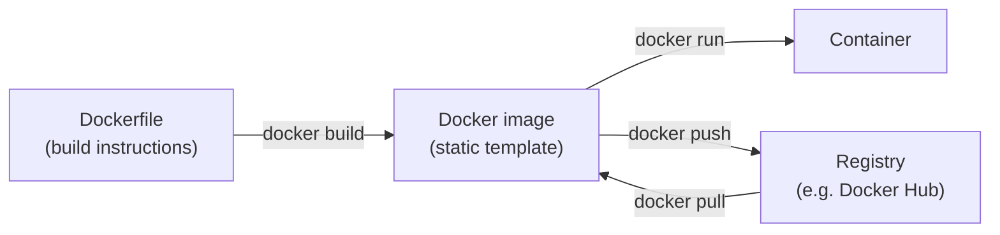

# Module 3: Reproducibility

Week 3

## Learning objectives

* Understand why reproducibility needs more than a pinned `requirements.txt`
* Be able to containerize a training script with Docker
* Be able to replace hardcoded hyperparameters with a versioned configuration file, using Hydra and
  OmegaConf

---

## 1. Why reproducibility needs more than pinned packages

Module 2's version control gets code history right, but reproducing a specific training run needs two
things pinning `uv`/`pip` alone does not give you:

* **The system underneath Python.** The operating system, system libraries, and GPU drivers all affect
  whether a training run behaves identically on your laptop and on a teammate's machine, even with the
  exact same `pyproject.toml`.
* **The exact hyperparameters used.** A learning rate or batch size hardcoded inside a script, or typed
  once on the command line and never written down, is effectively lost the moment the terminal closes.

Docker solves the first problem by packaging the whole runtime environment, not just the Python
packages, into something that runs identically anywhere. Hydra and OmegaConf solve the second by
turning hyperparameters into a versioned file instead of a value living only in your head or your shell
history. This module covers both, since together they are what "reproduce this exact result" actually
requires.

## 2. :material-docker: Docker core concepts

Docker reduces to three ideas, each built from the one before it:



* A **Dockerfile** is a plain-text list of the commands needed to set up and run an application:
  install dependencies, copy code, specify the command that starts it.
* *Building* a Dockerfile produces a **Docker image**, a static, self-contained package with everything
  (OS libraries, dependencies, code) needed to run it.
* *Running* an image produces a **Docker container**, a live, isolated process. The same image can be
  run many times, producing many independent containers.

Images are built from stacked, cached layers: each instruction in a Dockerfile adds one layer, and
Docker only rebuilds the layers that changed. This is why, in practice, a Dockerfile installs
dependencies before copying application code (§3): the slow dependency layer then stays cached across
every rebuild that only touches code.

## 3. The everyday Docker command set

| Command | What it does |
|---|---|
| `docker run <image>` | Starts a new container from an image (`--rm` auto-removes it on exit, `-it` for an interactive shell) |
| `docker ps` / `docker ps -a` | Lists running containers, or all containers including stopped ones |
| `docker images` | Lists locally available images |
| `docker build -f <file> . -t <tag>` | Builds an image from a Dockerfile (the trailing `.` is the build context) |
| `docker exec -it <container> sh` | Opens an interactive shell inside an already-running container |
| `docker cp <container>:<path> <local_path>` | Copies a file out of, or into, a running container |
| `docker rm <container>` / `docker rmi <image>` | Removes a stopped container, or an image |
| `docker pull <image>` / `docker push <image>` | Downloads an image from a registry, or uploads one to it |

Stopped containers pile up disk space over time. `docker run --rm` auto-removes a container the moment
it exits, which is the right default for a short-lived job like training.

## 4. Building a training image

A real project Dockerfile splits into two deliberately ordered halves, dependencies then code, exactly
to exploit the layer caching from §2:

```dockerfile
FROM python:3.12-slim

RUN apt update && \
    apt install --no-install-recommends -y build-essential gcc && \
    apt clean && rm -rf /var/lib/apt/lists/*

# 1. Dependencies first: this layer stays cached across every rebuild that only touches code
COPY uv.lock pyproject.toml README.md ./
RUN uv sync --locked --no-cache --no-install-project

# 2. Code last: the layer that actually changes on every commit
COPY src/ src/
ENTRYPOINT ["uv", "run", "src/train.py"]
```

```bash
docker build -f train.dockerfile . -t train:latest
docker run --rm --name experiment1 train:latest
```

On Apple Silicon, building an image meant for a different CPU architecture (for instance an `amd64`
cloud runner) needs `--platform linux/amd64`, at the cost of a slower emulated build. GPU training
needs the Nvidia Container Toolkit installed on the host and a CUDA-enabled base image, run with
`docker run --gpus all`.

## 5. Sharing images and registries

A built image is only useful to others once it is shared, in one of two ways:

* **Commit the Dockerfile itself** to the repository (it is just a text file) and let others build the
  image locally: simplest, but everyone pays the build cost.
* **Push the built image to a registry**, such as [Docker Hub](https://hub.docker.com/) or a cloud
  provider's own registry (Module 6 covers Google Artifact Registry specifically), so others can
  `docker pull` and run it immediately, no build step required.

## 6. Project: containerize a training script (required)

Write a `train.dockerfile` for a real training script (per §4), build it, run it, and confirm the
trained model artifact can be retrieved afterward, either via `docker cp` or a bind-mounted volume
(`-v $(pwd)/models:/models`). Write a second, smaller Dockerfile for evaluation that mounts the trained
model and test data as volumes at run time rather than baking them into the image.

## 7. The problem with hardcoded hyperparameters

A learning rate typed directly into a script is invisible to version control unless the script itself
changes, and a value passed only on the command line is not written down anywhere once the terminal
closes. Command-line arguments (`argparse`, `typer`) are more configurable than a hardcoded value, but
still do not guarantee that a specific run's exact configuration gets systematically tracked.

## 8. :material-file-cog: Config files with Hydra and OmegaConf

**OmegaConf** is a YAML-based hierarchical configuration library; **Hydra** builds on top of it to wire
a config file directly into a script's entry point. A `config.yaml`:

```yaml
hyperparameters:
  batch_size: 64
  learning_rate: 1e-4
```

```python
from omegaconf import OmegaConf
config = OmegaConf.load("config.yaml")
dl = DataLoader(dataset, batch_size=config.hyperparameters.batch_size)
```

Hydra's decorator wires the same file directly into a script's main function, and every value can then
be overridden from the command line without touching the file:

```python
import hydra

@hydra.main(config_name="config.yaml")
def main(cfg):
    print(cfg.hyperparameters.batch_size, cfg.hyperparameters.learning_rate)

if __name__ == "__main__":
    main()
```

```bash
python train.py hyperparameters.learning_rate=1e-3
```

Hydra automatically writes a timestamped output directory per run, capturing the exact resolved
configuration alongside whatever the script logs to it, which is the mechanism that actually delivers
on this module's reproducibility promise: given that output directory, any run's exact settings are
recoverable later. For a larger project, configs split hierarchically:

```
conf/
    config.yaml
    experiments/
        exp1.yaml
        exp2.yaml
```

```bash
python train.py experiment=exp2
```

Hydra's `instantiate` utility goes one step further, constructing an actual Python object (an optimizer,
a model class) directly from a config block instead of just reading scalar values:

```yaml
optimizer:
  _target_: torch.optim.Adam
  lr: 1e-3
```

```python
optimizer = hydra.utils.instantiate(cfg.optimizer, params=model.parameters())
```

## 9. Project: migrate a training script to Hydra (required)

Take the training script from §6's Docker project, identify every hardcoded hyperparameter (learning
rate, batch size, epoch count, seed), move them into a `config.yaml`, and decorate the script's entry
point with `@hydra.main`. Confirm the same run can be reproduced exactly by pointing at a past run's
saved output directory, and confirm a single hyperparameter can be overridden from the command line
without editing the file.

---

## Summary

Reproducibility fails in two different, equally common ways: the environment underneath the code
drifts, or the configuration used for a specific run is never actually written down anywhere. Docker
(§2-§6) fixes the first by packaging the whole runtime, not just Python packages; Hydra and OmegaConf
(§7-§9) fix the second by making every hyperparameter a versioned, overridable file instead of a value
that only ever lived in a script or a terminal. Module 5 picks this up directly: a CI pipeline that
rebuilds this same Docker image on every push is the automation layer this module's manual `docker
build` becomes part of.

## Further reading

* See the [Course books](../README.md#course-books) for deeper dives on applied ML engineering and
  production reliability.

## References

Foundational sources this module's content draws on:

* SkafteNicki, Nicki, et al. [`dtu_mlops`](https://github.com/SkafteNicki/dtu_mlops),
  `s3_reproducibility/docker.md` and `config_files.md`. DTU course 02476, Apache 2.0 licensed. Primary
  source material this module's Docker and Hydra content is adapted from.
* Docker Docs. ["Docker overview."](https://docs.docker.com/get-started/docker-overview/) Source for
  the image and container model in §2.
* [Hydra documentation](https://hydra.cc/docs/intro/). Source for the config composition, override, and
  `instantiate` behavior in §8.
* [OmegaConf documentation](https://omegaconf.readthedocs.io/). Source for the hierarchical YAML config
  model underneath Hydra in §8.
