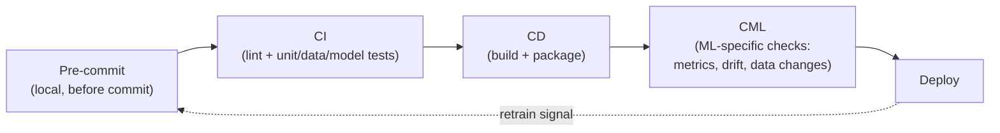
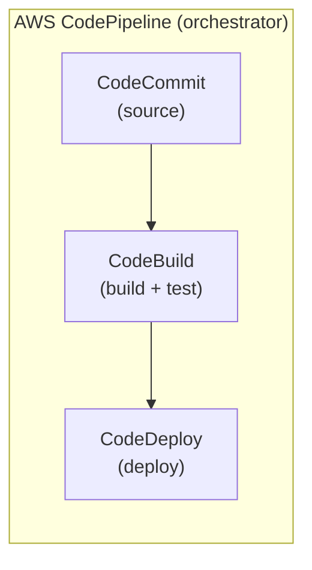
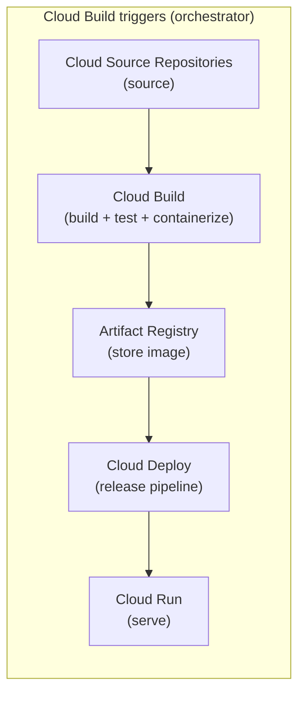
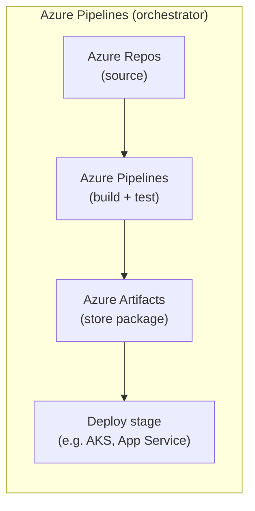

# Module 4: CI/CD Strategies for AWS, Azure, GCP, and GitHub Actions

Week 4

## Learning objectives

* Understand CI and CD and the specific challenges they face in machine learning workflows
* Be able to set up a CI/CD pipeline hands-on with GitHub Actions and Azure DevOps, and recognize the
  equivalent services on AWS and GCP
* Understand infrastructure as code (IaC) and its role in a CI/CD pipeline

---

## 1. Introduction to CI and CD

**Continuous Integration (CI)** is the practice of automatically building and testing a codebase every
time it changes, so a bug introduced by one commit is caught in minutes rather than discovered weeks
later by a user. **Continuous Delivery/Deployment (CD)** picks up where CI leaves off: a change that
passes its checks is automatically packaged and shipped, either to a staging environment (Delivery) or
straight to production (Deployment), depending on how much a team trusts its own automation.

As Martin Fowler put it: *"Continuous Integration doesn't get rid of bugs, but it does make them
dramatically easier to find and remove."* CI/CD does not make a codebase correct; it makes correctness
*checkable on every change*, which is the precondition for moving fast without breaking things.

## 2. CI/CD challenges in machine learning

Classical CI/CD (lint, unit test, build, deploy) was designed for deterministic code. Machine
learning breaks that assumption in a specific way: the same code can produce a different, still
"correct-looking" model depending on the data it was trained on. That single fact cascades into several
ML-specific CI/CD challenges that have no equivalent in traditional software:

* **What do you even test?** A sorting function has one correct output. A model has a *distribution* of
  acceptable outputs: testing means checking behavior (does it beat a baseline, is it invariant to
  irrelevant changes) rather than asserting one exact value.
* **Data testing, not just code testing.** A pipeline can pass every unit test and still ship a broken
  model if the training data silently changed shape, distribution, or label balance.
* **Non-deterministic runs.** Training involves randomness (initialization, shuffling, GPU
  non-determinism), so "did this pass" sometimes means "did this land within an acceptable range," not
  "did this match exactly."
* **Slow feedback loops.** A full training run can take hours, which conflicts with CI's core promise of
  fast feedback; most teams solve this by testing on a small data subset or a few training steps in CI,
  and reserving full training for a separate, longer-running pipeline.
* **The pipeline has more moving parts to version and gate.** Code, data, features, and model all need
  their own quality gate, not just the code (Module 2, §3).

## 3. Steps involved in CI/CD implementation in the ML lifecycle

Put together, a mature ML pipeline chains several automation layers, each catching a different class of
problem, each running earlier and faster than the one after it:



* **Pre-commit hooks** run on your machine, before a commit is even created: the cheapest place to
  catch a problem. A `.pre-commit-config.yaml` wires checks like trailing-whitespace removal, YAML
  validation, and `ruff` linting/formatting into `git commit` itself:

  ```yaml
  repos:
  - repo: https://github.com/pre-commit/pre-commit-hooks
    rev: v3.2.0
    hooks:
    - id: trailing-whitespace
    - id: check-yaml
  - repo: https://github.com/astral-sh/ruff-pre-commit
    rev: v0.4.7
    hooks:
    - id: ruff
      args: ["--fix"]
    - id: ruff-format
  ```

  `pre-commit install` wires it in; `pre-commit run --all-files` checks the whole repo, not just staged
  files. In an emergency, `git commit --no-verify` skips the hooks; it's a habit worth using rarely and
  deliberately, not by default.

* **CI** runs remotely on every push/PR: unit tests, data tests (does the dataset have the expected
  shape and label balance), and model tests (does the model produce the expected output shape on a
  known input). See Module 3's branching model (§3) for how this gates a pull request before merge.

* **CD** builds and packages what CI just validated: typically a container image (Module 5) tagged
  with the commit hash, ready to hand to a deployment step.

* **CML** (§9) is the layer unique to ML: automated checks on the *training run itself*, such as
  whether it converged, whether a tracked metric actually improved, and whether this is the right
  dataset version.

* **Deploy** ships the packaged, gated artifact, and production monitoring (Module 9) closes the loop by
  feeding drift/failure signals back into the next round of development.

## 4. The DevOps tool ecosystem on the cloud

Every major cloud (and GitHub itself) offers its own bundle of source-control, build, and deploy
services that implement the pipeline in §3. The names differ; the roles they play don't:

| Role in the pipeline | AWS | GCP | Azure | GitHub |
|---|---|---|---|---|
| Source | CodeCommit | Cloud Source Repositories | Azure Repos | GitHub (repo) |
| Build / test | CodeBuild | Cloud Build | Azure Pipelines | GitHub Actions |
| Artifact storage | (via CodeBuild output / ECR) | Artifact Registry | Azure Artifacts | GitHub Packages |
| Deploy | CodeDeploy | Cloud Deploy / Cloud Run | Azure Pipelines (release stage) | GitHub Actions (deploy job) |
| Orchestrator | CodePipeline | Cloud Build triggers | Azure Pipelines | GitHub Actions (workflow) |
| Work tracking | N/A | N/A | Azure Boards | GitHub Issues/Projects |

§5-§8 go one level deeper into each column. Which one a team ends up using is often decided by where
the rest of their infrastructure already lives, not by any one service being objectively best: a team
already deep in AWS rarely benefits from bolting on Azure DevOps for CI/CD alone.

**This course's required hands-on projects use GitHub Actions (§5) and Azure DevOps (§8)
specifically**. See the [Setup page](../pages/before.md#setup) for why (Azure for Students is the one
no-credit-card option that covers everything this course needs). §6-§7 still cover AWS and GCP in full,
so you can recognize the equivalent service on whichever cloud a future job actually uses, but they're
conceptual here rather than a required project.

## 5. GitHub Actions

**GitHub Actions** is GitHub's own CI/CD engine, free for 2,000 build-minutes/month on public and many
private repos. A workflow is a YAML file under `.github/workflows/`, with four parts:

* `name`: the workflow's display name
* `on`: the trigger, one of `push`, `pull_request`, `schedule`, `workflow_dispatch`, each scoped to branches
  or paths
* `jobs`: one or more jobs, parallel by default, each with a `runs-on` (the OS/runner) and a list of
  `steps`
* `steps`: the actual commands, either shell commands or reusable third-party **actions**
  (`uses: actions/checkout@v5`)

A minimal test workflow:

```yaml
name: Run tests
on:
  push:
    branches: [main]
  pull_request:
    branches: [main]
jobs:
  test:
    runs-on: ${{ matrix.os }}
    strategy:
      fail-fast: false
      matrix:
        os: ["ubuntu-latest", "windows-latest", "macos-latest"]
        python-version: ["3.11", "3.12"]
    steps:
      - uses: actions/checkout@v5
      - uses: actions/setup-python@v5
        with:
          python-version: ${{ matrix.python-version }}
          cache: "pip"
      - run: pip install -r requirements.txt
      - run: pytest tests/
```

The `matrix` strategy runs every OS × Python-version combination in parallel; `fail-fast: false` keeps
the rest running even if one combination fails, so a single flaky combination doesn't hide results for
the others. **Branch protection rules** (`Settings → Rules → Rulesets`) turn a green workflow run from a
nice-to-have into an enforced gate: require a pull request, require this workflow to pass, require a
reviewer's approval, before a merge into `main` is even possible. **Dependabot** closes the loop on a
different axis, opening PRs automatically when a dependency (or an Action's own pinned version) falls
out of date:

```yaml
# .github/dependabot.yaml
version: 2
updates:
  - package-ecosystem: "pip"
    directory: "/"
    schedule: { interval: "weekly" }
  - package-ecosystem: "github-actions"
    directory: "/"
    schedule: { interval: "weekly" }
```

**GitHub Pages** is the natural deploy target for a workflow that publishes documentation rather than a
running service: a push to `main` triggers a job that builds a static site and publishes it. This
course's own site is deployed exactly this way: a `deploy docs` workflow runs `mkdocs gh-deploy` on
every push to `main`, and a separate `check docs` workflow runs `mkdocs build --strict` on every pull
request, so a broken link or a malformed page is caught in review, not after it's live.

**Project: GitHub Actions DevOps Pipeline (required).** Wire a repository with three workflows: a test workflow
(matrix build + pytest), a lint/format check (`ruff`), and a docs-or-package deploy step gated by
`branches: [main]`, then turn on a branch protection rule that requires the first two to pass before a
PR can merge.

## 6. AWS DevOps

AWS splits a pipeline into four purpose-built services, coordinated by a fifth:



| Service | Role |
|---|---|
| **CodeCommit** | Managed Git-hosted source repository (many teams now point CodePipeline at GitHub instead and use CodeCommit only where full AWS-native hosting is required) |
| **CodeBuild** | Compiles, tests, and packages code inside a managed build environment, defined by a `buildspec.yml` |
| **CodeDeploy** | Automates deployment to EC2, Lambda, or ECS, including gradual rollout strategies (canary, linear) |
| **CodePipeline** | The orchestrator that wires source → build → deploy into one release pipeline, with manual-approval gates where needed |

*Conceptual coverage only: this course's required hands-on pipeline project is the Azure one in §8.*
If you have your own AWS access, the equivalent exercise is the same shape: a CodePipeline that pulls
from a source repo, runs a CodeBuild step executing the test suite, and deploys via CodeDeploy to a
target environment on a successful build.

## 7. GCP DevOps

GCP's equivalent chain adds an explicit artifact-registry step and a serverless deploy target:



| Service | Role |
|---|---|
| **Cloud Source Repositories** | Git-hosted source on GCP (teams frequently use GitHub as source instead, with a Cloud Build trigger pointed at it) |
| **Cloud Build** | Runs a `cloudbuild.yaml` pipeline of build/test steps, typically producing a container image |
| **Artifact Registry** | Stores the built container image (and other package types), versioned and access-controlled |
| **Cloud Deploy** | Manages progressive delivery of a new image across environments (dev → staging → prod) |
| **Cloud Run** | The common deploy target for containerized services: scales to zero, pay-per-request |

*Conceptual coverage only: this course's required hands-on pipeline project is the Azure one in §8.*
If you have your own GCP access, the equivalent exercise is the same shape: a Cloud Build trigger that
builds a container on every push, pushes it to Artifact Registry, and a Cloud Deploy pipeline that
promotes it to Cloud Run.

## 8. Azure DevOps

Azure DevOps is the odd one out in this list: it's a single product suite covering project management
and CI/CD together, not a set of separate point services.

| Component | Role |
|---|---|
| **Azure Boards** | Work-item tracking (backlogs, sprints, Kanban boards), the project-management layer the other three clouds don't bundle in |
| **Azure Repos** | Git-hosted source repositories |
| **Azure Pipelines** | Build and release automation, defined in a YAML pipeline file (`azure-pipelines.yml`) |
| **Azure Test Plans** | Manual and exploratory test-case tracking, layered on top of automated test results |
| **Azure Artifacts** | Package feed for build outputs (npm, NuGet, pip, Maven packages) |



A minimal `azure-pipelines.yml` shape mirrors GitHub Actions closely, which makes moving between the
two conceptually easy once you know one of them:

```yaml
trigger:
  branches:
    include: [main]
pool:
  vmImage: "ubuntu-latest"
steps:
  - task: UsePythonVersion@0
    inputs: { versionSpec: "3.12" }
  - script: pip install -r requirements.txt
  - script: pytest tests/
```

**Infrastructure as Code (IaC) with Azure DevOps.** IaC means defining infrastructure (VMs, networks,
managed services) in machine-readable files instead of clicking through a console; that definition can
then be versioned, reviewed in a PR, and applied by a pipeline like any other artifact. **Terraform**
(HashiCorp) is the most common multi-cloud choice:

```hcl
provider "azurerm" {
  features {}
}

resource "azurerm_resource_group" "example" {
  name     = "example-resources"
  location = "West Europe"
}
```

```bash
terraform init    # initialize the working directory and providers
terraform plan    # preview what would change
terraform apply   # provision/update infrastructure to match the config
```

Wired into Azure Pipelines, a `terraform plan` typically runs on a pull request (so reviewers see the
infrastructure diff before merge) and `terraform apply` runs on merge to `main`: the same
CI-then-CD-gate pattern from §3, applied to infrastructure instead of application code.

**Project: Azure DevOps Pipeline (required).** An `azure-pipelines.yml` that builds and tests on every
PR (gated by Azure Test Plans results), publishes a package to Azure Artifacts, and a release stage
that applies a small Terraform configuration to provision the target environment.

## 9. Continuous Machine Learning (CML)

Everything in §5-§8 is DevOps automation that applies to any software project. **Continuous Machine
Learning (CML)** is the layer specific to ML: automating the questions classical CI/CD can't
answer: *did I train on the right data version, did the model converge, did a tracked metric actually
improve, did I over/underfit.* It sits on top of whichever CI/CD engine a team already uses (most
commonly GitHub Actions) rather than replacing it, and maps onto the top of the MLOps maturity model
from Module 2, §1.

Two patterns cover most real CML setups:

* **Data-triggered workflows**: a workflow that only fires when tracked data changes (e.g. a `.dvc`
  metadata file), pulls the new data version, computes dataset statistics (sample counts, class
  balance), and posts them as a comment directly on the pull request, so a reviewer sees the *data*
  diff, not just the code diff:

  ```yaml
  on:
    pull_request:
      paths:
        - "**/*.dvc"
  ```

* **Model-registry-triggered workflows**: a model registry (e.g. Weights & Biases, MLflow) sends a
  webhook when a new model version is tagged `staging`, firing a `repository_dispatch` event that runs
  performance tests against it and, if it passes, promotes the model to a `production` alias via the
  registry's API.

The last step is exactly where **human oversight matters most**: a fully automated `staging → production`
promotion is appropriate for a low-stakes internal tool, but most teams gate that specific step behind a
human-approved pull request rather than an unattended merge, especially in regulated or safety-critical
domains. Full automation and full autonomy are not the same target.

## 10. Choosing a platform

No platform in §5-§8 is objectively superior: the right one is almost always whichever cloud the rest
of a team's infrastructure already runs on, following the same logic as Module 2, §11's cost-benefit
framing for open-source vs. cloud-native MLOps architectures:

| Consideration | Favors GitHub Actions | Favors a cloud-native suite (AWS/GCP/Azure) |
|---|---|---|
| Where does deploy target live? | Anywhere (cloud-agnostic runners) | Same cloud (avoids cross-cloud auth/networking friction) |
| Team already has Boards/Test Plans needs? | No (needs separate tooling) | Azure DevOps bundles project management in |
| Free-tier build minutes matter? | Generous free tier on public repos | Cloud build minutes are billed per use from the start |
| Deep integration with a managed cloud service (SageMaker, Vertex AI, AKS)? | Possible via CLI/SDK steps | Native, first-class steps |

Most real-world teams end up using GitHub (or another Git host's) Actions for the "does this code work"
loop, and reserve the cloud-native services for deployment steps that need deep integration with a
managed service on that cloud; the two are complementary, not mutually exclusive.

---

## Summary

CI/CD turns "did this change break anything" from a question answered by hope into one answered by an
automated pipeline, and ML adds a layer that classical CI/CD was never built for: data and model
correctness, not just code correctness (§2-§3, §9). The four platforms in §5-§8 implement the same
source → build → deploy shape with different names and different bundling choices: picking one is a
question of existing infrastructure, not raw capability (§10). Module 5 picks up immediately after the
build step here: what actually gets built, packaged, and deployed is a container.

## Further reading

* See the [Course books](../README.md#course-books) for deeper dives on applied ML engineering and
  production reliability.

## References

Foundational sources this module's content draws on:

* Fowler, Martin, & Foemmel, Matthew. ["Continuous Integration."](https://martinfowler.com/articles/continuousIntegration.html)
  martinfowler.com. Source for the CI framing and quote in §1.
* SkafteNicki, Nicki, et al. [`dtu_mlops`](https://github.com/SkafteNicki/dtu_mlops),
  `s5_continuous_integration/` (`unittesting.md`, `github_actions.md`, `pre_commit.md`, `cml.md`) and
  `s10_extra/infrastructure_as_code.md`. DTU course 02476, Apache 2.0 licensed. Primary source
  material this module's testing pyramid (§3), GitHub Actions walkthrough (§5), and CML section (§9)
  are adapted from.
* GitHub Docs. ["Understanding GitHub Actions"](https://docs.github.com/en/actions/learn-github-actions/understanding-github-actions)
  and ["About Dependabot version updates."](https://docs.github.com/en/code-security/dependabot/dependabot-version-updates/about-dependabot-version-updates).
  Source for the workflow anatomy and Dependabot config in §5.
* AWS Documentation. ["What is CI/CD on AWS?"](https://aws.amazon.com/devops/continuous-integration/).
  Source for the CodeCommit/CodeBuild/CodeDeploy/CodePipeline roles in §6.
* Google Cloud Documentation. ["Cloud Build overview"](https://cloud.google.com/build/docs/overview) and
  ["Cloud Deploy overview."](https://cloud.google.com/deploy/docs/overview). Source for the GCP
  pipeline shape in §7.
* Microsoft Learn. ["Azure DevOps documentation."](https://learn.microsoft.com/en-us/azure/devops/).
  Source for the Boards/Repos/Pipelines/Test Plans/Artifacts roles and YAML pipeline shape in §8.
* HashiCorp Developer. ["Terraform: AzureRM provider documentation."](https://registry.terraform.io/providers/hashicorp/azurerm/latest/docs).
  Source for the IaC example in §8.
