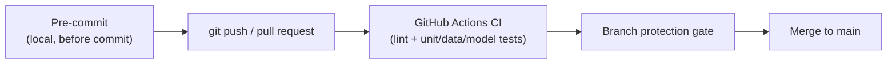

# Module 5: Continuous Integration

Week 5

## Learning objectives

* Write unit tests that cover code, data, and model behavior, not just code correctness
* Automate those tests with GitHub Actions on every push and pull request
* Catch problems before they ever reach CI with pre-commit hooks
* Understand Continuous Machine Learning (CML) as the layer of automation unique to ML pipelines

---

## 1. Why testing an ML codebase is different

Continuous Integration (CI) is the practice of automatically building and testing a codebase every
time it changes, so a bug is caught in minutes rather than discovered weeks later by a user. As Martin
Fowler put it, continuous integration doesn't get rid of bugs, but it does make them dramatically
easier to find and remove: CI doesn't make a codebase correct, it makes correctness *checkable on
every change*.

Unit and integration testing are not unique to MLOps, they're a core DevOps concept. What is unique to
machine learning is that a codebase can pass every one of those tests and still ship a broken model,
because the "logic" is learned from data, not written by a developer. That means testing an ML system
needs data tests and model tests on top of the usual code tests, since a change in the data pipeline
or the training data itself can silently break a model without a single line of code changing.

## 2. Unit testing with pytest

Start by creating a `tests/` folder. Any file except `__init__.py` should start with `test_*.py`, and
any test function should start with `test_*`, or `pytest` won't discover it:

```python
def test_something():         # found and executed by pytest
    ...

def something_to_test():      # NOT found by pytest
    ...
```

A `tests/__init__.py` that resolves paths relative to the project root keeps every test file's file
paths consistent regardless of where `pytest` is invoked from:

```python
import os
_TEST_ROOT = os.path.dirname(__file__)
_PROJECT_ROOT = os.path.dirname(_TEST_ROOT)
_PATH_DATA = os.path.join(_PROJECT_ROOT, "data")
```

Three kinds of tests cover most of an ML codebase:

* **Data tests** (`tests/test_data.py`): does the dataset have the correct length, the correct
  per-sample shape, and are all labels represented?
* **Model tests** (`tests/test_model.py`): given an input of shape *X*, does the model produce output
  of shape *Y*?
* **Training tests** (`tests/test_training.py`): does the training script itself behave correctly,
  for example does it raise the right error on malformed input?

Good code raises errors and warnings in the right places, and `pytest.raises`/`pytest.warns` confirm
they actually fire:

```python
def test_error_on_wrong_shape():
    model = MyModel()
    with pytest.raises(ValueError, match="Expected input to a 4D tensor"):
        model(torch.randn(1, 2, 3))
```

Add descriptive messages to assertions, since `assert len(x) == N` tells you nothing on failure while
`assert len(x) == N, "Dataset did not have the correct number of samples"` tells you exactly what
broke. `pytest.mark.skipif` skips a data-dependent test when the data files aren't present locally:

```python
@pytest.mark.skipif(not os.path.exists(file_path), reason="Data files not found")
def test_something_about_data():
    ...
```

`pytest.mark.parametrize` runs the same test body across multiple input combinations, catching bugs
that only show up at a specific batch size or input shape:

```python
@pytest.mark.parametrize("batch_size", [32, 64])
def test_model(batch_size: int) -> None:
    model = MyModel()
    x = torch.randn(batch_size, 1, 28, 28)
    y = model(x)
    assert y.shape == (batch_size, 10)
```

**Code coverage**, the percentage of the codebase actually exercised when the tests run, is worth
tracking, but 100% coverage does not guarantee a bug-free codebase: it only means every line ran
during a test, not that every edge case was checked.

```bash
pip install coverage
coverage run -m pytest tests/
coverage report -m
```

Exclude the test files themselves from that measurement in `pyproject.toml`:

```toml
[tool.coverage.run]
omit = ["tests/*"]
```

## 3. Automating tests with GitHub Actions

Running tests locally is cumbersome: it needs to happen often to catch bugs early, and high coverage
means many tests that take real time to run. **GitHub Actions** is GitHub's own CI engine, free for
2,000 build-minutes/month on public and many private repos, that runs those tests automatically on
every push. A workflow is a YAML file under `.github/workflows/`, with four parts: `name` (the
workflow's display name), `on` (the trigger, one of `push`, `pull_request`, `schedule`,
`workflow_dispatch`), `jobs` (one or more jobs, parallel by default, each with a `runs-on` and a list
of `steps`), and `steps` (the actual commands, either shell commands or reusable third-party
**actions**).



A basic test workflow:

```yaml
name: Run tests
on:
  push:
    branches: [main]
  pull_request:
    branches: [main]
jobs:
  test:
    runs-on: ubuntu-latest
    steps:
      - uses: actions/checkout@v5
      - uses: actions/setup-python@v5
        with:
          python-version: "3.12"
      - run: pip install -r requirements.txt
      - run: pytest tests/
```

A **build matrix** runs every OS x Python-version combination in parallel, so a bug specific to
Windows or to one Python version doesn't slip through on a single-configuration test run:

```yaml
jobs:
  build:
    runs-on: ${{ matrix.os }}
    strategy:
      fail-fast: false
      matrix:
        os: ["ubuntu-latest", "windows-latest", "macos-latest"]
        python-version: ["3.10", "3.11", "3.12"]
    steps:
      - uses: actions/checkout@v5
      - uses: actions/setup-python@v5
        with:
          python-version: ${{ matrix.python-version }}
```

`fail-fast: false` keeps the rest of the matrix running even if one combination fails, so a single
flaky combination doesn't hide the results for the others. Caching dependency installs speeds up every
subsequent run:

```yaml
      - uses: actions/setup-python@v5
        with:
          python-version: "3.12"
          cache: "pip"
```

**Branch protection rules** (`Settings → Rules → Rulesets`) are what turn a green workflow run from a
nice-to-have into an enforced gate: require a pull request, require this workflow to pass, require a
reviewer's approval, before a merge into `main` is even possible. **Dependabot** closes the loop on a
different axis: it opens PRs automatically when a dependency, or a GitHub Action's own pinned version,
falls out of date:

```yaml
# .github/dependabot.yaml
version: 2
updates:
  - package-ecosystem: "pip"
    directory: "/"
    schedule:
      interval: "weekly"
  - package-ecosystem: "github-actions"
    directory: "/"
    schedule:
      interval: "weekly"
```

**Vocabulary check.** A **workflow** is the YAML file itself. A **runner** is the environment executing
it (GitHub-hosted or self-hosted). A **job** is a series of steps run on the same runner. An **action**
is the smallest unit inside a workflow: jobs consist of multiple actions run sequentially.

## 4. Pre-commit: catching problems before they even reach CI

Pre-commit hooks run on your own machine, before a commit is even created, which is the cheapest place
to catch a problem: formatting, linting, large-file checks, and more, all before the commit ever
reaches CI. A `.pre-commit-config.yaml` wires these checks into `git commit` itself:

```yaml
repos:
- repo: https://github.com/pre-commit/pre-commit-hooks
  rev: v3.2.0
  hooks:
  - id: trailing-whitespace
  - id: end-of-file-fixer
  - id: check-yaml
  - id: check-added-large-files
- repo: https://github.com/astral-sh/ruff-pre-commit
  rev: v0.4.7
  hooks:
    - id: ruff
      args: ["--fix"]
    - id: ruff-format
    - id: ruff
```

```bash
pip install pre-commit
pre-commit sample-config > .pre-commit-config.yaml
pre-commit install               # wires the hooks into git commit
pre-commit run --all-files       # checks every file, not just staged ones
```

Skipping the hooks in an emergency is `git commit -m <message> --no-verify`, a habit worth using rarely
and deliberately, not by default; disabling them entirely is `pre-commit uninstall`. A more advanced
setup wires a scheduled `pre-commit autoupdate` workflow that opens a PR bumping the hook versions, and
a `pre-commit/action` step in CI that auto-commits any fixes the hooks make.

## 5. Continuous Machine Learning (CML)

Everything in §2-§4 is DevOps automation that applies to any software project. **Continuous Machine
Learning (CML)** is the layer specific to ML, automating the questions classical CI can't answer: did I
train on the correct data, did the model converge, did a tracked metric actually improve, did I
over- or underfit. It sits on top of the CI/CD engine a team already uses (GitHub Actions here) rather
than replacing it, and represents the top of the MLOps maturity ladder: level 0 is ad hoc ML with no
version control or testing, level 1 adds basic DevOps practices, level 2 adds standardized reproducible
training with model versioning, level 3 adds automated model testing and production monitoring, and
level 4 is full CML with automated training, evaluation, deployment, and retraining.

Two patterns cover most real CML setups. **Data-triggered workflows** fire only when tracked data
changes, for example a `.dvc` metafile (Module 2, §5), pull the new data version, compute dataset
statistics such as sample counts and class balance, and post them as a comment directly on the pull
request, so a reviewer sees the *data* diff, not just the code diff:

```yaml
on:
  pull_request:
    branches: [main]
    paths:
      - "**/*.dvc"
      - ".dvc/**"
```

**Model-registry-triggered workflows** fire from a webhook, for example Weights & Biases (Module 4,
§3) sending a `repository_dispatch` event when a new model version is tagged `staging`, which runs
performance tests against it and, if it passes, promotes the model to a `production` alias via the
registry's API. The last step is exactly where human oversight matters most: a fully automated
`staging → production` promotion is fine for a low-stakes internal tool, but most teams gate that
specific step behind a human-approved pull request rather than an unattended merge, especially in
regulated or safety-critical domains. Even at maturity level 4, full automation and full autonomy are
not the same target.

## 6. Project: CI/CD pipeline (required)

Wire your group project's repository with three workflows: a test workflow (matrix build across at
least two Python versions, running `pytest`), a lint/format check (`ruff`), and a `pre-commit`
hook setup that catches the same formatting issues locally before they ever reach CI. Turn on a branch
protection rule that requires the first two workflows to pass before a pull request can merge into
`main`.

---

## Summary

Classical CI (lint, unit test, build) was designed for deterministic code, and machine learning adds a
layer it was never built for: data and model correctness, not just code correctness (§1-§2). GitHub
Actions (§3) is where that runs automatically on every push, pre-commit (§4) is where the cheapest of
those checks run even earlier, on your own machine, and CML (§5) is the layer that automates the
ML-specific questions neither of those was ever meant to answer. Module 6 picks this up directly: the
cloud is where these automated builds and deployments actually run at scale.

## Further reading

* See the [Course books](../README.md#course-books) for deeper dives on applied ML engineering and
  production reliability.

## References

Foundational sources this module's content draws on:

* Fowler, Martin, & Foemmel, Matthew. ["Continuous Integration."](https://martinfowler.com/articles/continuousIntegration.html)
  martinfowler.com. Source for the CI framing and quote in §1.
* SkafteNicki, Nicki, et al. [`dtu_mlops`](https://github.com/SkafteNicki/dtu_mlops),
  `s5_continuous_integration/` (`unittesting.md`, `github_actions.md`, `pre_commit.md`, `cml.md`). DTU
  course 02476, Apache 2.0 licensed. Primary source material this module's testing pyramid (§2),
  GitHub Actions walkthrough (§3), pre-commit setup (§4), and CML section (§5) are adapted from.
* GitHub Docs. ["Understanding GitHub Actions"](https://docs.github.com/en/actions/learn-github-actions/understanding-github-actions)
  and ["About Dependabot version updates."](https://docs.github.com/en/code-security/dependabot/dependabot-version-updates/about-dependabot-version-updates)
  Source for the workflow anatomy and Dependabot config in §3.
* [pre-commit documentation](https://pre-commit.com/). Source for the hook configuration and CLI
  workflow in §4.
* [pytest documentation](https://docs.pytest.org/). Source for the testing patterns in §2.
