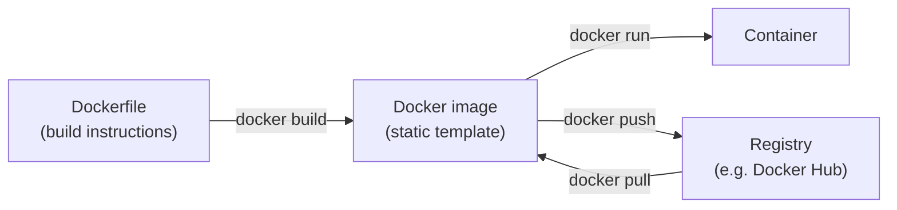
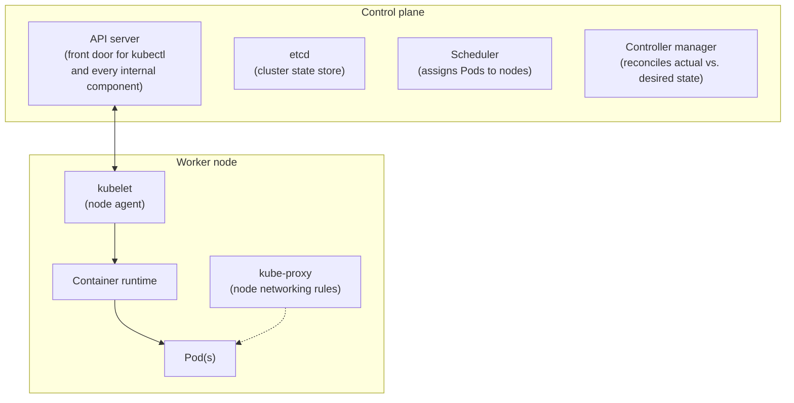

# Module 5: Docker & Kubernetes Overview

Week 5

## Learning objectives

* Understand Docker fundamentals: images, containers, registries, networking, volumes
* Be able to containerize an ML application and orchestrate multi-container apps with Docker Compose
* Understand Kubernetes architecture and core resource types
* Be able to run a local Kubernetes cluster with Minikube

---

## 1. Why containers, and why now

Module 2, §3 named **containers** as one of the five things MLOps needs to version, alongside code,
data, models, and features; this module is where that claim gets made concrete. Pinning your Python
packages with `uv`/`conda` is not enough for true reproducibility: the operating system, system
libraries, GPU drivers, and their exact versions all affect whether a training run behaves identically
on your laptop and on a training cluster six months from now.

**Docker** solves this by packaging an application together with its entire runtime environment into
an isolated unit that runs identically anywhere Docker itself runs. The same property that makes it
good for reproducibility also makes it the basis for scale: once an environment is fully captured in an
image, it conceptually doesn't matter whether you start it once on a laptop or a thousand times across
a cluster, which is exactly the problem Kubernetes (§9-§11) exists to manage at scale.

## 2. Docker core concepts

Docker reduces to three ideas, each built from the one before it:



* A **Dockerfile** is a plain-text list of the commands needed to set up and run an application:
  install dependencies, copy code, specify the command that starts it.
* *Building* a Dockerfile produces a **Docker image**: a static, self-contained package with
  everything (OS libraries, dependencies, code) needed to run it.
* *Running* an image produces a **Docker container**: a live, isolated process. The same image can be
  run many times, producing many independent containers.

Images are built from **stacked, cached layers**: each instruction in a Dockerfile adds one layer, and
Docker only rebuilds the layers that changed. This is why, in practice, Dockerfiles deliberately install
dependencies *before* copying application code (§4): the slow dependency layer then stays cached
across every rebuild that only touches code.

## 3. The everyday Docker command set

| Command | What it does |
|---|---|
| `docker run <image>` | Starts a new container from an image (`--rm` auto-removes it on exit, `-it` for an interactive shell, `--name` to label it) |
| `docker ps` / `docker ps -a` | Lists running containers / all containers, including stopped ones |
| `docker images` | Lists locally available images |
| `docker build -f <file> . -t <tag>` | Builds an image from a Dockerfile (the trailing `.` is the *build context*: the directory Docker can see while building) |
| `docker exec -it <container> sh` | Opens an interactive shell inside an already-running container |
| `docker cp <container>:<path> <local_path>` | Copies a file out of (or into) a running container |
| `docker logs <container>` | Shows a container's stdout/stderr |
| `docker rm <container>` / `docker rmi <image>` | Removes a stopped container / an image |
| `docker pull <image>` / `docker push <image>` | Downloads an image from a registry / uploads one to it |

Stopped containers pile up disk space over time; `docker run --rm` auto-removes a container the
moment it exits, which is the right default for anything short-lived like a training job.

## 4. Building an ML training image

A real project Dockerfile splits into two deliberately ordered halves (dependencies, then code)
exactly to exploit the layer caching from §2:

```dockerfile
FROM python:3.12-slim

RUN apt update && \
    apt install --no-install-recommends -y build-essential gcc && \
    apt clean && rm -rf /var/lib/apt/lists/*

# 1. Dependencies first: this layer stays cached across every rebuild that only touches code
COPY uv.lock pyproject.toml README.md ./
RUN uv sync --locked --no-cache --no-install-project

# 2. Code last: the layer that actually changes on every commit
COPY src/ src/
ENTRYPOINT ["uv", "run", "src/train.py"]
```

```bash
docker build -f train.dockerfile . -t train:latest
docker run --rm --name experiment1 train:latest
```

On Apple Silicon, building an image meant for a different CPU architecture (e.g. an `amd64` cloud
runner) needs `--platform linux/amd64`, at the cost of a slower emulated build. Getting a trained model
back out of a finished container uses `docker cp`, or, for anything ongoing, a bind-mounted volume
(§5), which is also how a GPU training image would be run, given the Nvidia Container Toolkit
installed on the host and a CUDA-enabled base image.

## 5. Docker networking and volumes

Two things a container needs beyond its own filesystem: a way to talk to the outside world, and a way
to keep data alive after the container itself is gone.

**Network types** (set via `docker run --network <type>`):

| Network type | Behavior |
|---|---|
| `bridge` (default) | An isolated private network per host; containers on it can reach each other, and reach the outside world via NAT |
| `host` | The container shares the host machine's network stack directly: no isolation, fastest, rarely the right default |
| `none` | No networking at all, for a task with no need to reach anything |
| user-defined bridge | Like the default bridge, but containers can resolve each other **by name**: this is what Docker Compose (§7) sets up automatically for a multi-container app |

**Volumes.** A container's filesystem is deleted with the container by default, so anything that must
survive needs an explicit volume:

* A **bind mount** (`-v /host/path:/container/path`) maps a specific host directory straight into the
  container, the simplest option for local development.
* A **named volume** (`-v my_data:/container/path`) is managed by Docker itself rather than pointing at
  a specific host path, the better choice for anything meant to outlive a single machine's directory
  layout, including in production.

## 6. Sharing images and registries

A built image is only useful to others once it's shared, and there are two ways to do that:

* **Commit the Dockerfile itself** to the repository (it's just a text file) and let others build the
  image locally: simplest, but means everyone pays the build cost.
* **Push the built image to a registry**: [Docker Hub](https://hub.docker.com/) is the public default;
  most cloud providers also run their own (AWS ECR, GCP Artifact Registry from Module 4, §7, Azure
  Container Registry), so others can `docker pull` and run it immediately, no build step required.

Committing the Dockerfile is what CI (Module 4) actually does on every push: build the image fresh
inside the pipeline, run tests against it, and only push the image to a registry once it passes.

## 7. Docker Compose: multi-container applications

A real ML application is rarely one container: a training/inference service, a lightweight frontend,
and maybe a database each want their own image, wired together. **Docker Compose** describes that
whole stack declaratively in one `docker-compose.yml` instead of a sequence of manual `docker run`
commands:

```yaml
services:
  backend:
    build: ./backend
    ports:
      - "8000:8000"
  frontend:
    build: ./frontend
    ports:
      - "8501:8501"
    depends_on:
      - backend
```

```bash
docker compose up      # builds (if needed) and starts every service
docker compose down    # stops and removes them
```

Compose automatically creates a user-defined bridge network (§5) for the stack, so `frontend` can reach
`backend` by service name: no manual IP wiring, no port-hardcoding. This is the direct precursor to
Kubernetes' `Service` resource (§10): Compose gives you name-based networking on one machine; Kubernetes
gives you the same idea across a whole cluster.

## 8. Docker Swarm, briefly

**Docker Swarm** is Docker's own native clustering/orchestration mode, turning several Docker hosts
into one virtual host, with built-in service discovery and load balancing, activated with a single
`docker swarm init`. It is simpler to adopt than Kubernetes because it ships inside Docker itself with
no separate installation. In practice, the industry consolidated around Kubernetes as the dominant
orchestrator instead: broader ecosystem, every major cloud offers a managed version (Module 7); this
is why the rest of this module, and the rest of this course, goes deep on Kubernetes rather than Swarm.

## 9. Kubernetes architecture

**Kubernetes (K8s)** automates deploying, scaling, and healing containerized applications across a
cluster of machines: restarting a crashed container, spreading replicas across nodes, routing traffic
to whichever replicas are healthy. It follows a client-server split between a **control plane** that
makes decisions and **worker nodes** that run the actual containers:



* The **API server** is the single front door every request (from `kubectl`, from other control-plane
  components, from the kubelet on each node) goes through.
* **etcd** is the consistent key-value store holding the entire cluster's actual state.
* The **scheduler** decides which node a new Pod should run on; the **controller manager** continuously
  compares desired state (what you asked for) against actual state and corrects any drift; this
  reconciliation loop is the mechanism behind everything in §10.
* On each **worker node**, the **kubelet** is the agent that actually starts/stops containers as told,
  the **container runtime** runs them, and **kube-proxy** implements the networking rules that let
  Services (§10) route traffic to the right Pods.
* `kubectl` is the CLI every one of these interactions goes through, whether run by a human or a CI/CD
  pipeline.

## 10. Kubernetes core resources

Everything you deploy is expressed as one of a small set of resource types, each solving a distinct
problem a Docker Compose file (§7) doesn't have to, because it now spans an entire cluster rather than
one machine:

| Resource | Role |
|---|---|
| **Pod** | The smallest deployable unit: one or more tightly-coupled containers that share networking and storage |
| **Deployment** | Declaratively manages a set of identical Pod replicas: how many, which image, and how to roll out an update without downtime |
| **Service** | A stable network name/address that routes traffic to whichever Pods currently match it: Pods come and go, but the Service address doesn't |
| **Ingress** | Routes external HTTP(S) traffic into the cluster, to the right Service, based on hostname/path rules |
| **ConfigMap** | Non-secret configuration values, injected into Pods as environment variables or mounted files |
| **Secret** | The same idea as a ConfigMap, for sensitive values (API keys, credentials), access-controlled and encoded at rest |
| **StatefulSet** | Like a Deployment, but for Pods that need a stable identity and stable storage across restarts (databases, anything not safely interchangeable) |
| **DaemonSet** | Guarantees exactly one copy of a Pod runs on every node: the standard shape for log collectors and monitoring agents |
| **PersistentVolumeClaim (PVC)** | A Pod's request for durable storage that outlives the Pod itself, decoupling storage lifetime from container lifetime |

A `Deployment` + `Service` pair is the minimum needed to run an ML model behind a stable address that
survives a Pod crashing and being replaced, which is exactly the shape §11's project builds.

## 11. Running locally with Minikube

**Minikube** runs a real, single-node Kubernetes cluster inside a local VM/container, enough to learn
and test every resource in §10 without needing an actual multi-machine cluster or a cloud bill:

```bash
minikube start          # boots the local cluster
kubectl get nodes       # confirms kubectl can talk to it
kubectl apply -f deployment.yaml
kubectl get pods
```

Everything written against Minikube (the YAML manifests, the `kubectl` commands) is what you'd run
unchanged against a managed cluster in production (Module 7 covers AWS EKS, GCP GKE, and Azure AKS
specifically). For model-serving specifically, platforms like [BentoML's
Yatai](https://github.com/bentoml/Yatai) build on top of exactly this Deployment/Service pattern to
simplify packaging and scaling a served model on Kubernetes; it's worth knowing the name exists once you're
past the fundamentals here.

## 12. Projects for this module

Four projects, each building directly on the section before it:

1. **Deploy a Node.js app in a Docker container**: write a Dockerfile for a minimal Node.js app,
   build it, and run it with a published port (§2-§4).
2. **Deploy an ML model in a Docker container**: apply the training/serving Dockerfile pattern from
   §4 to a real model, including getting the trained artifact out via a volume (§5).
3. **Deploy a complete end-to-end ML model with Docker Compose**: wire a model-serving backend and a
   simple frontend together with `docker-compose.yml` (§7), talking to each other by service name.
4. **Deploy an ML model in a Kubernetes cluster**: take the image from project 2, run it on Minikube
   behind a `Deployment` + `Service` (§9-§11), and confirm it survives a Pod being deleted and
   recreated.

---

## Summary

Containers close the last gap in the reproducibility story from Module 2, §3: pinning code, data, and
model versions means little if the operating system underneath them can still drift. Docker (§1-§8)
solves that for one machine or one multi-container stack; Kubernetes (§9-§11) solves the same problem at
cluster scale, replacing Compose's single-host, name-based networking with a control plane that
continuously reconciles desired state against actual state across many machines. Module 7 picks this up
directly: every managed cloud ML platform ultimately runs your container on top of a Kubernetes-shaped
control plane, whether or not it calls itself that.

## Further reading

* See the [Course books](../README.md#course-books) for deeper dives on applied ML engineering and
  production reliability.

## References

Foundational sources this module's content draws on:

* SkafteNicki, Nicki, et al. [`dtu_mlops`](https://github.com/SkafteNicki/dtu_mlops),
  `s3_reproducibility/docker.md`. DTU course 02476, Apache 2.0 licensed. Primary source material
  this module's Docker concepts, Dockerfile pattern, and command walkthrough (§1-§6) are adapted from.
* Docker Docs. ["Docker overview"](https://docs.docker.com/get-started/docker-overview/) and
  ["Networking overview."](https://docs.docker.com/engine/network/). Source for the image/container
  model (§2) and network types (§5).
* Docker Docs. ["Compose file reference."](https://docs.docker.com/compose/compose-file/). Source for
  the Compose example in §7.
* Kubernetes Documentation. ["Kubernetes Components"](https://kubernetes.io/docs/concepts/overview/components/)
  and ["Workloads."](https://kubernetes.io/docs/concepts/workloads/). Source for the control
  plane/node architecture (§9) and the resource list (§10).
* [Minikube documentation](https://minikube.sigs.k8s.io/docs/). Source for the local-cluster workflow
  in §11.
