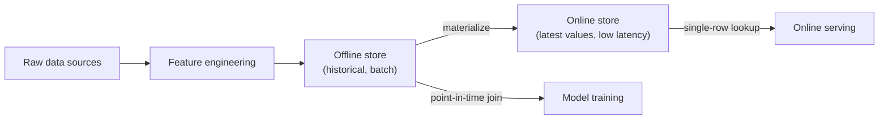

# Module 6 — Feature Store

Week 7

## Learning objectives

* Understand what a feature store is and the problem it solves
* Understand the difference between online and offline feature serving
* Be able to deploy and use a feature store (Feast) for a small ML pipeline
* Be able to monitor feature drift over time

---

## 1. What problem a feature store solves

Module 2, §3 named **features** as one of the five things an MLOps pipeline needs to version, alongside
code, data, models, and containers — this module is where that need becomes concrete. Two problems show
up the moment more than one model, or more than one team, needs the same engineered feature:

* **Training/serving skew.** A feature engineered one way in an offline training notebook and
  re-implemented slightly differently in the online serving path is one of the most common, hardest to
  detect sources of a model that performs well offline and poorly in production — the two code paths
  silently drift apart.
* **Duplicated work.** Without a shared place to define and reuse features, every team recomputes the
  same "average order value over the last 30 days" from scratch, each with its own subtly different
  definition.

A **feature store** is the piece of infrastructure that fixes both: one place where a feature is
defined once, computed once, and served consistently to both training and inference — the same
underlying idea as a package registry, applied to features instead of code.

## 2. Online vs. offline: the core split

Every feature store is organized around a split that mirrors the two moments a feature actually gets
used:



* The **offline store** holds the full historical record of every feature value over time — large
  volume, optimized for batch reads, typically backed by a data warehouse or object storage (BigQuery,
  S3 + Parquet, Snowflake). Training reads from it with a **point-in-time join**: for each training
  example's timestamp, pull the feature values *as they were at that moment*, not the latest values —
  getting this wrong (using future information) is a specific, common form of data leakage.
* The **online store** holds only the *current* value of each feature, indexed for millisecond-latency
  single-row lookups — optimized for read speed, typically backed by a key-value store (DynamoDB,
  Redis, Bigtable). A live prediction request reads from here.
* **Materialization** is the job that keeps the online store in sync with the offline store — computing
  the latest feature values and pushing them into the low-latency store on a schedule.

Getting the same feature definition to produce both a historical column in the offline store and a
current value in the online store, from one definition, is precisely what removes the training/serving
skew from §1.

## 3. The feature store landscape

| Feature store | Type | Notes |
|---|---|---|
| **Feast** | Open source | Framework- and cloud-agnostic; plugs into many offline/online backends rather than owning the storage itself (§4) |
| **Hopsworks** | Open source, with a managed option | A fuller MLOps platform with a feature store at its core, not just a standalone library |
| **Tecton** | Commercial, managed | Enterprise-focused, strong support for real-time streaming feature pipelines |
| **AWS SageMaker Feature Store** | Managed (AWS) | Offline store backed by S3, online store with single-digit-millisecond reads, integrated with the rest of SageMaker |
| **GCP Vertex AI Feature Store** | Managed (GCP) | Same online/offline split, integrated with Vertex AI Pipelines and BigQuery |
| **Databricks Feature Store** | Managed (Databricks) | Built directly on Delta Lake tables, integrated with Databricks' own training/serving stack |

This is the same open-source-vs-cloud-native trade-off from Module 2, §11: the managed options cost
less setup time and lock you into that cloud's ecosystem; Feast costs more setup but stays portable
across whichever offline/online backends a team already runs. This module goes hands-on with Feast
specifically because it's the one option usable identically on a laptop and on any cloud.

## 4. Feast: the open-source feature store

Feast organizes everything around three declared objects, defined once in Python and applied to a
registry:

* An **Entity** — the join key features are looked up by, e.g. `user_id` or `product_id`.
* A **data source** — where raw feature values already live (a Parquet file, a BigQuery table), with a
  timestamp column Feast uses for point-in-time correctness.
* A **FeatureView** — which columns from a data source count as features, grouped together with a
  freshness TTL.

```python
from feast import Entity, FeatureView, Field, FileSource
from feast.types import Float32

user = Entity(name="user_id", join_keys=["user_id"])

orders_source = FileSource(
    path="data/orders.parquet",
    timestamp_field="event_timestamp",
)

user_features = FeatureView(
    name="user_order_stats",
    entities=[user],
    source=orders_source,
    schema=[Field(name="avg_order_value_30d", dtype=Float32)],
)
```

```bash
feast apply     # registers the objects above
```

Reading features back looks different depending on which side of the online/offline split (§2) you're
on:

```python
from feast import FeatureStore

store = FeatureStore(repo_path=".")

# Training — point-in-time correct historical values, joined against your own labeled examples
training_df = store.get_historical_features(
    entity_df=entity_df,  # has user_id + event_timestamp columns
    features=["user_order_stats:avg_order_value_30d"],
).to_df()

# Serving — the current value for one specific user, in milliseconds
online_features = store.get_online_features(
    features=["user_order_stats:avg_order_value_30d"],
    entity_rows=[{"user_id": 123}],
).to_dict()
```

## 5. Feast on the cloud

The same three Python objects from §4 stay identical; what changes is the `feature_store.yaml` backend
configuration. Locally, Feast defaults to a file-based offline store and a local SQLite online store —
enough to develop and test against. Pointed at a cloud:

```yaml
project: my_project
registry: data/registry.db
provider: local
offline_store:
  type: bigquery       # or: snowflake, redshift, file
online_store:
  type: dynamodb        # or: redis, datastore, sqlite
```

only the `offline_store`/`online_store` blocks change — a BigQuery/Snowflake/Redshift offline store
paired with a DynamoDB/Redis/Datastore online store, run on whichever cloud a team's other
infrastructure already lives on (Module 7 covers the managed ML platforms — SageMaker, Vertex AI, Azure
ML — those backends plug into).

## 6. Monitoring features programmatically, and visualizing drift over time

Module 2, §8 named model/data monitoring as the category with no equivalent in traditional software.
A feature store is exactly where that monitoring should attach, because it's the one place every
feature's history — training-time and serving-time — already lives.

**What to compute.** The question is always the same: has the *distribution* of a feature's values in
current online traffic diverged from the distribution it had at training time? Three standard
statistical tests answer this:

| Method | What it measures |
|---|---|
| **Population Stability Index (PSI)** | A single score summarizing how much a distribution has shifted between two time windows — the standard industry threshold is PSI > 0.25 signaling a real shift worth investigating |
| **Kolmogorov–Smirnov (KS) test** | A statistical test for whether two samples come from the same continuous distribution |
| **KL divergence** | An information-theoretic measure of how one distribution diverges from a reference distribution |

**Where to run it.** In practice, nobody hand-rolls PSI/KS/KL every day — tools like [Evidently
AI](https://docs.evidentlyai.com/) or WhyLabs (both already named in Module 2, §12's tool ecosystem
table) compute these automatically over a reference window (e.g. the training set) versus a current
window (e.g. the last day of served traffic), and can render them as a drift report or a time series of
drift scores per feature — the visualization half of this section's learning objective. Module 9 covers
wiring that report into a production alerting pipeline; this module's job is knowing which numbers feed
into it and why they're computed against the feature store specifically, rather than against raw logs.

## 7. Project: Deploy Feast online/offline feature store

Stand up a small end-to-end Feast deployment against a real (if small) dataset:

1. Define at least one `Entity` and one `FeatureView` (§4) against a local Parquet data source.
2. Run `feast apply`, then materialize features into a local online store.
3. Pull a training dataframe with `get_historical_features` and confirm the point-in-time join is
   correct — no feature value should reflect information from *after* its row's timestamp.
4. Pull the same feature for a single entity with `get_online_features` and confirm it matches the most
   recent materialized value.
5. Compute a PSI or KS score (§6) comparing the feature's distribution in the training data against a
   held-out "current" slice, and report whether it crosses the drift threshold.

---

## Summary

A feature store turns "the training script and the serving code compute this feature slightly
differently" from a routine, hard-to-catch bug into an impossible one, by making every feature's
definition, its historical values, and its current value all trace back to one registered source
(§1-§4). The online/offline split (§2) is the entire idea; everything else — which backend, which cloud,
which drift metric (§5-§6) — is an implementation detail on top of it.

## Further reading

* See the [Course books](../README.md#course-books) for deeper dives on applied ML engineering and
  production reliability.

## References

Foundational sources this module's content draws on:

* [Feast documentation](https://docs.feast.dev/) — source for the core object model, point-in-time
  join semantics, and the `feature_store.yaml` configuration in §4-§5.
* AWS Documentation. ["Amazon SageMaker Feature Store."](https://docs.aws.amazon.com/sagemaker/latest/dg/feature-store.html)
  — source for the SageMaker Feature Store entry in §3.
* Google Cloud Documentation. ["Vertex AI Feature Store overview."](https://cloud.google.com/vertex-ai/docs/featurestore/overview)
  — source for the Vertex AI Feature Store entry in §3.
* Databricks Documentation. ["Databricks Feature Store."](https://docs.databricks.com/en/machine-learning/feature-store/index.html)
  — source for the Databricks Feature Store entry in §3.
* [Evidently AI documentation](https://docs.evidentlyai.com/) — source for the PSI/KS/KL drift
  detection methodology and reporting workflow in §6.
