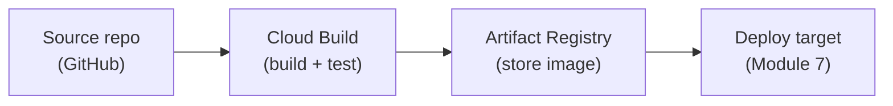

# Module 6: The Cloud

Week 7

## Learning objectives

* Set up a Google Cloud project, understand IAM roles, and know why service accounts matter
* Be able to provision compute, store data, and build/store containers on GCP
* Understand the escalation path from a manual VM to a managed training job
* Know how to keep secrets out of config files using Secret Manager

---

## 1. Why the cloud, and why GCP

Near-infinite, on-demand compute is the core selling point of any cloud provider: many modern deep
learning workloads simply are not feasible to run on a laptop. This course uses Google Cloud
Platform (GCP) specifically, both because it is what the rest of this module's exercises are built
against and because its concepts (projects, IAM, managed compute, managed storage) transfer directly
to AWS or Azure if a future job happens to use one of those instead: the names differ, the shape of the
problem does not.

## 2. Account and project setup

Before touching any GCP service, claim whatever free credits are available (an institutional grant, or
GCP's own free-trial credit), and watch the billing dashboard throughout the course: a credit card is
typically required to activate a free trial even though it will not be charged automatically.

Create a dedicated project for this course (rather than reusing a personal one) to keep resources
organized and easy to tear down at the end of the semester. If signing up with a university-managed
account, create that project under "No organization" where possible: organization-managed accounts
often enforce policies that block creating the service-account keys needed later (for example, so
GitHub Actions can authenticate to the cloud).

```bash
gcloud auth login
gcloud auth application-default login
gcloud config set project <project-id>
```

Every GCP service also needs explicit enablement before use:

```bash
gcloud services enable apigateway.googleapis.com
gcloud services list   # check what's already enabled
```

## 3. IAM, quotas, and service accounts

**IAM** (Identity and Access Management) governs who, or what, can do what inside a project. Sharing a
project with teammates means granting `Viewer`/`Editor`/`Owner` access via email; granting a specific
service narrower access means attaching one of GCP's many predefined roles instead.

**Quotas** cap resource consumption per project, most visibly GPU count: free and education accounts
typically default to 0-1 GPUs, and a quota increase request can take anywhere from a few minutes to a
day to process, with requests sometimes rejected within the first 24 hours of a new account's life.

**Service accounts** are non-human identities used for machine-to-machine authentication, such as
GitHub Actions authenticating to GCP to trigger a build. Always grant the lowest permission that gets
the job done rather than a broad role:

| Role | Grants |
|---|---|
| `Storage Object Viewer` | List/download objects from a bucket |
| `Cloud Build Builder` | Run Cloud Build jobs |
| `Secret Manager Secret Accessor` | Read secrets (§6) |
| `Cloud Run Developer` | Deploy Cloud Run services (Module 7) |
| `AI Platform Developer` | Use Vertex AI training/prediction |
| `Artifact Registry Writer` | Push container images |

A service account key is a downloadable JSON credential: treat it exactly like a password, and never
commit it to a repository.

## 4. Compute

Virtual machines let you scale horizontally, access hardware you do not own locally (a specific GPU
configuration), and run long background jobs without tying up a laptop.

```bash
gcloud compute instances create-with-container instance-1 \
    --container-image=gcr.io/<project-id>/gcp_vm_tester \
    --zone=europe-west1-b
```

A bare VM has no ML software pre-installed. GCP offers ready-made deep-learning VM images with
Python/PyTorch/TensorFlow already baked in:

```bash
gcloud compute instances create my-training-vm \
    --image-family=pytorch-latest-gpu \
    --image-project=deeplearning-platform-release \
    --accelerator=type=nvidia-tesla-t4,count=1
```

SSH in via the CLI or a browser-based terminal, and stop the VM the moment it is not in use: GCP bills
by the minute regardless of whether the machine is doing anything.

## 5. Data storage

Cloud object storage (Cloud Storage) is cheap, durable through multi-location replication, and,
critically for a team using DVC (Module 2, §4), accessible via API without repeated interactive login,
unlike a personal Google Drive remote:

```bash
dvc remote add -d remote_storage gs://<bucket-name>
dvc remote modify remote_storage version_aware true
dvc push --no-run-cache
```

A container or VM reading from a bucket authenticates either by making the bucket public (simple but
insecure) or via a service account, with the credential path exposed through the
`GOOGLE_APPLICATION_CREDENTIALS` environment variable.

## 6. Building and storing containers in the cloud

Building Docker images locally (Module 3) is slow, and the resulting images are large: moving both the
build and the storage into the cloud fixes both problems.



**Artifact Registry** holds the built Docker-format image, with an optional cleanup policy to keep only
the last N versions and control storage cost. **Cloud Build** runs a YAML pipeline of build/test steps,
the GCP equivalent of a GitHub Actions workflow file:

```yaml
# cloudbuild.yaml
steps:
- name: "gcr.io/cloud-builders/docker"
  id: "Build container image"
  args: ["build", ".", "-t", "<region>-docker.pkg.dev/$PROJECT_ID/<repo>/<image>", "-f", "<dockerfile>"]
- name: "gcr.io/cloud-builders/docker"
  id: "Push container image"
  args: ["push", "<region>-docker.pkg.dev/$PROJECT_ID/<repo>/<image>"]
```

Trigger it manually (`gcloud builds submit . --config=cloudbuild.yaml`), or automatically on push via a
connected repository trigger. Steps can depend on each other (`waitFor: ["step_id"]`) or run
concurrently (`waitFor: ["-"]`), the direct parallel to GitHub Actions' `needs:` keyword. Calling Cloud
Build from inside a GitHub Actions workflow, rather than a native repo trigger, lets the build depend on
other CI steps first, such as only building once tests pass on every OS in the matrix (Module 5, §3):

```yaml
jobs:
  test: ...
  build:
    needs: test
    if: ${{ github.event_name == 'push' && github.ref == 'refs/heads/main' }}
    steps:
      - uses: actions/checkout@v5
      - uses: google-github-actions/auth@v2
        with:
          credentials_json: ${{ secrets.GCLOUD_SERVICE_KEY }}
      - uses: google-github-actions/setup-gcloud@v2
      - run: gcloud builds submit . --config cloudbuild_containers.yaml
```

**Substitutions** parametrize a single `cloudbuild.yaml` for multiple image names or tags, via
`substitutions:` in the file or `--substitutions=` on the CLI.

## 7. Training in the cloud

Two escalating ways to run a training job:

1. **A manual Compute Engine VM** (§4): simple, but one VM per experiment, managed entirely by hand.
2. **A managed training job** (`gcloud ai custom-jobs create`): provisions the VM, pulls a specified
   container image, runs the job, and tears the VM down automatically when it finishes.

```bash
gcloud ai custom-jobs create \
    --region=europe-west1 \
    --display-name=test-run \
    --config=config.yaml \
    --command 'python src/my_project/train.py' \
    --args=--epochs=10 --args=--batch-size=128
```

`config.yaml` specifies the machine type and, optionally, an accelerator type/count; GPU quota approval
is separate from CPU quota. A training job can mount cloud storage as a filesystem
(`/gcs/<bucket>/...`) rather than downloading the data first, often faster than a `dvc pull` inside the
job itself.

## 8. Secrets management

Injecting an environment variable such as a Weights & Biases API key (Module 4, §3) directly into a job
config file turns that file itself into a secret-management problem. **Secret Manager** avoids
hardcoding credentials into config files at all: a build pipeline substitutes the secret into a config
template right before submitting the training job, using `envsubst` together with Cloud Build's
`availableSecrets`/`secretEnv` fields.

## 9. Project: cloud project setup (required)

Create a GCP project for the group project, enable billing and the services the project will need,
create a service account scoped to the least privilege it actually requires, and store its key
somewhere outside version control. Push a Docker image (Module 3, §6) to Artifact Registry via a
`cloudbuild.yaml`, either triggered manually or from a GitHub Actions workflow (Module 5, §3).

---

## Summary

A cloud project is not one resource, it is an account boundary (§2), an access-control layer (§3), and
a set of building blocks (compute, storage, container build/storage, training, secrets, §4-§8) that
only becomes useful once IAM and service accounts are set up correctly. The manual-VM-to-managed-job
escalation in §7 is the same pattern that recurs everywhere in this module: start by doing it by hand,
then hand it to a managed service once the manual version works. Module 7 picks up directly from here:
what actually gets deployed from that Artifact Registry image is a running service.

## Further reading

* See the [Course books](../README.md#course-books) for deeper dives on applied ML engineering and
  production reliability.

## References

Foundational sources this module's content draws on:

* SkafteNicki, Nicki, et al. [`dtu_mlops`](https://github.com/SkafteNicki/dtu_mlops),
  `s6_the_cloud/cloud_setup.md` and `using_the_cloud.md`. DTU course 02476, Apache 2.0 licensed. Primary
  source material this module's account setup, IAM, and cloud-usage content is adapted from.
* Google Cloud Documentation. ["Cloud Build overview"](https://cloud.google.com/build/docs/overview),
  ["Artifact Registry overview,"](https://cloud.google.com/artifact-registry/docs/overview) and
  ["Secret Manager overview."](https://cloud.google.com/secret-manager/docs/overview) Source for §6 and
  §8.
* Google Cloud Documentation. ["Vertex AI custom training overview."](https://cloud.google.com/vertex-ai/docs/training/overview)
  Source for the managed training job pattern in §7.
