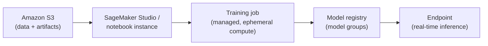
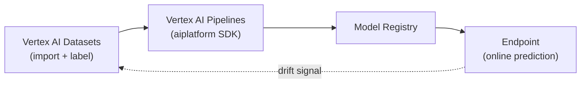
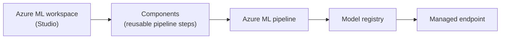

# Module 7: Deep Dive into MLOps Cloud Services (AWS, Azure & GCP)

Week 8

## Learning objectives

* Be able to build, train and deploy a model end-to-end on Azure Machine Learning
* Understand the equivalent build/train/deploy workflow on AWS SageMaker and GCP Vertex AI
* Understand each platform's pipeline/registry concepts and how they compare

---

## 1. From generic cloud primitives to a managed ML platform

Module 4 covered generic CI/CD services (CodePipeline, Cloud Build, Azure Pipelines), and Module 5
covered generic containers and Kubernetes. A **managed ML platform** (SageMaker, Vertex AI, Azure
Machine Learning) is what each cloud builds *on top of* those same primitives, specifically for the ML
lifecycle: a managed notebook environment, managed training jobs that provision and tear down their own
compute, a model registry, and a one-command inference endpoint, all wired together rather than
assembled by hand from EC2 instances and S3 buckets.

The cross-cloud service names differ; the concepts underneath are close enough that learning one
platform well makes the other two mostly a vocabulary exercise:

| Role | GCP | AWS | Azure |
|---|---|---|---|
| Compute (VMs) | Compute Engine | EC2 | Virtual Machines |
| Object storage | Cloud Storage | S3 | Blob Storage |
| Serverless functions | Cloud Functions | Lambda | Functions |
| Container hosting | Cloud Run | App Runner / Fargate | Container Apps |
| CI/CD (Module 4) | Cloud Build | CodePipeline/CodeBuild | Azure DevOps / Pipelines |
| **Managed ML platform** | **Vertex AI** | **SageMaker** | **Azure Machine Learning** |
| Feature store (Module 6) | Vertex AI Feature Store | SageMaker Feature Store | *(no direct native equivalent)* |

**This course's required hands-on platform is Azure Machine Learning (§4).** See the [Setup
page](../pages/before.md#setup) for why. §2-§3 cover SageMaker and Vertex AI in full so you recognize
the equivalent concepts on either platform, but they're conceptual here rather than a required project.

## 2. AWS SageMaker

SageMaker organizes the ML lifecycle around a chain of managed, ephemeral steps rather than one
long-lived server you maintain yourself:



| Concept | What it is |
|---|---|
| **Notebook instance** | A managed Jupyter environment with a chosen instance type (CPU/GPU), an attached **IAM role** governing what it can access (e.g. which S3 buckets), and optionally placed inside a **VPC** for network isolation |
| **SageMaker Studio & domain** | The unified IDE (notebooks, pipelines, experiments, registry, and endpoints) in one interface, scoped under a **domain**: a shared workspace/permissions boundary for a team |
| **Training job** | A managed, ephemeral compute job: a container image + entry script + IAM role that trains a model, writes artifacts to S3, and shuts itself down automatically when finished; no VM to remember to stop |
| **SageMaker Pipelines** | A DAG of steps (process → train → evaluate → register), defined in Python, that runs as a repeatable, versioned pipeline |
| **SageMaker Projects & repositories** | A project scaffolds a linked Git repository plus a pre-wired CI/CD pipeline template for an ML workflow: the SageMaker-native equivalent of the repo templates from Module 3 |
| **Experiments** | Tracks and compares parameters/metrics across many training runs, the same job Module 2's tool ecosystem table assigned to MLflow/W&B, done natively inside SageMaker |
| **Model groups & registry** | Versioned model registration; a model can be gated behind manual approval before it's allowed onto an endpoint |
| **Endpoint & endpoint configuration** | The **endpoint configuration** declares instance type/count and which registered model version to serve; the **endpoint** itself is the live, callable inference service that configuration produces |

Generating an inference from a deployed endpoint is a single SDK call against the endpoint name:

```python
import boto3
runtime = boto3.client("sagemaker-runtime")
response = runtime.invoke_endpoint(
    EndpointName="my-model-endpoint",
    ContentType="application/json",
    Body=json_payload,
)
```

*Conceptual coverage only: this course's required hands-on pipeline project is the Azure ML one in
§4.* If you have your own AWS access, the equivalent exercise is: from a Studio domain, build a
SageMaker Pipeline (process → train → evaluate → conditionally register), promote the registered model
through the model registry, and deploy it to a real-time endpoint you can invoke.

## 3. GCP Vertex AI

Vertex AI's shape is the same idea with GCP's own names and an explicit "adapting to data changes"
loop built into the pipeline concept from the start:



* **Datasets**: Vertex AI can import and manage labeling for image, text, tabular, and video data
  directly, rather than requiring a separately built labeling pipeline.
* **Build, train & deploy**: either **AutoML** (no custom training code, Vertex AI searches
  architectures/hyperparameters itself) or a **custom training job** (your own container, the same
  managed-and-torn-down-automatically pattern as a SageMaker training job).
* **Model management**: every trained model is versioned in the Model Registry with its evaluation
  metrics attached, so "manage your models with confidence" means comparing versions before promoting
  one to an endpoint, not just overwriting the previous one.
* **Vertex AI Pipelines**: defined with the `google-cloud-aiplatform` Python SDK (built on Kubeflow
  Pipelines under the hood), the direct equivalent of SageMaker Pipelines:

  ```python
  from google.cloud import aiplatform

  aiplatform.init(project="my-project", location="europe-west1")

  job = aiplatform.PipelineJob(
      display_name="training-pipeline",
      template_path="pipeline.json",
      parameter_values={"epochs": 10},
  )
  job.run()
  ```

* **Adapting to changes in data**: this is Module 6's feature-drift monitoring and Module 9's
  production monitoring, closing the loop back into retraining: a pipeline like the one above is
  typically re-triggered by exactly the kind of drift signal those modules define, not run purely on a
  fixed schedule.

*Conceptual coverage only: this course's required hands-on pipeline project is the Azure ML one in
§4.* If you have your own GCP access, the equivalent exercise is: import a labeled dataset, run a
custom training job through a Vertex AI Pipeline defined via the `aiplatform` SDK, register the
resulting model, and deploy it to an endpoint that serves online predictions.

## 4. Azure Machine Learning

Azure ML is organized around a workspace (Studio) containing reusable **components**, which is the one
structurally distinct idea worth calling out relative to §2-§3:



* **Azure Machine Learning Studio**: the browser-based workspace: notebooks, compute, pipelines,
  registered models, and endpoints, scoped to a workspace the same way SageMaker scopes things to a
  domain.
* **Azure ML components**: a component is a self-contained, versioned, reusable pipeline *step*
  (inputs, outputs, a command to run), defined once and composed into many different pipelines, closer
  in spirit to a well-factored function library than to SageMaker's or Vertex AI's more monolithic
  pipeline-step definitions.
* **Azure MLOps + DevOps**: Azure ML pipelines are triggered from Azure Pipelines (Module 4, §8)
  exactly like any other build/release stage, so a model retraining run can sit in the same YAML
  pipeline as the application's own CI/CD, gated by the same approvals.
* **MLOps v2**, Microsoft's own reference architecture and accelerator for **"fully automated
  end-to-end CI/CD ML pipelines"**: a template project wiring together Azure ML pipelines, model
  registration, and Azure DevOps/GitHub Actions releases into one opinionated, production-ready
  starting point, rather than something built from scratch every time.

**Project: end-to-end MLOps v2 pipeline using Azure Machine Learning (required).** Starting from the
MLOps v2 accelerator's structure, define at least one Azure ML component, chain it into a pipeline,
register the trained model, and wire a deploy stage triggered from an Azure Pipelines YAML file.

## 5. Comparing the three platforms

| Aspect | SageMaker (AWS) | Vertex AI (GCP) | Azure ML |
|---|---|---|---|
| Pipeline definition | Python SDK (SageMaker Pipelines) | Python SDK on Kubeflow Pipelines | YAML/Python components composed into a pipeline |
| No-code option | SageMaker Canvas / Autopilot | Vertex AI AutoML | Azure ML Designer / AutoML |
| Native CI/CD integration | SageMaker Projects (CodePipeline-backed) | Cloud Build triggers | Azure Pipelines (native, MLOps v2 accelerator) |
| Team workspace concept | Domain | Project | Workspace |
| Model registry | Model groups | Model Registry | Model registry |

As in Module 4, §10, none of these is objectively superior: the right one is almost always whichever
cloud a team's data and infrastructure already live on, since cross-cloud data egress and identity
friction usually outweighs any feature difference between the three registries above.

---

## Summary

SageMaker, Vertex AI, and Azure ML all wrap the same underlying idea (managed notebooks, managed
training, a versioned model registry, and a deployable endpoint) around the generic CI/CD (Module 4)
and container (Module 5) primitives each cloud already offers. The vocabulary differs (domain / project
/ workspace, model groups / registry / registry), but a pipeline built on any one of them answers the
same question: given new data, produce a new registered model version, and only promote it to serving
traffic once it clears whatever gate the pipeline defines.

## Further reading

* See the [Course books](../README.md#course-books) for deeper dives on applied ML engineering and
  production reliability.

## References

Foundational sources this module's content draws on:

* SkafteNicki, Nicki, et al. [`dtu_mlops`](https://github.com/SkafteNicki/dtu_mlops),
  `s6_the_cloud/cloud_setup.md` and `using_the_cloud.md`. DTU course 02476, Apache 2.0 licensed, the
  source for the cross-cloud service mapping table in §1.
* AWS Documentation. ["What is Amazon SageMaker?"](https://docs.aws.amazon.com/sagemaker/latest/dg/whatis.html)
  and ["SageMaker Pipelines."](https://docs.aws.amazon.com/sagemaker/latest/dg/pipelines.html), the source
  for the SageMaker concepts and pipeline shape in §2.
* Google Cloud Documentation. ["Vertex AI documentation"](https://cloud.google.com/vertex-ai/docs) and
  ["Vertex AI Pipelines."](https://cloud.google.com/vertex-ai/docs/pipelines/introduction), the source for
  the Vertex AI concepts and `aiplatform` SDK usage in §3.
* Microsoft Learn. ["What is Azure Machine Learning?"](https://learn.microsoft.com/en-us/azure/machine-learning/overview-what-is-azure-machine-learning)
  and the [MLOps v2 solution accelerator](https://github.com/Azure/mlops-v2), the source for the
  workspace/components model and MLOps v2 in §4.
