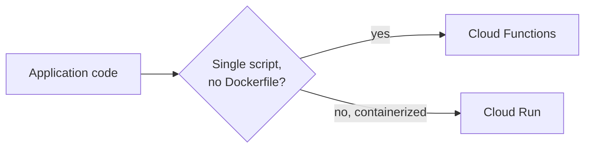

# Module 7: Deployment

Week 8

## Learning objectives

* Be able to wrap a trained model in a FastAPI service and containerize it
* Be able to deploy that service to Google Cloud (Cloud Functions or Cloud Run)
* Be able to functionally test and load-test a deployed API
* Understand what ONNX and ML-specific serving frameworks add on top of a general web framework
* Be able to build a simple frontend for a deployed model

---

## 1. From a trained model to a callable service

Everything before this module produces a trained model sitting on disk. Deployment is what turns that
into something another program, or another person, can actually call. Two prerequisite concepts sit
underneath it: a **request** is how a client talks to a server (a URL plus a method: `GET` to
retrieve, `POST`/`PUT` to send data, `DELETE` to remove); an **API** is the abstraction layer that lets
others use your application without reading its code. A REST API is **stateless**: every request is
self-contained, and the server never relies on memory of a previous one.

```python
import requests
response = requests.get("https://api.github.com")
print(response.status_code, response.json())
```

Always check `response.status_code` before assuming a failure is your own bug; unauthenticated API
calls are often rate-limited far below an authenticated request's limit.

## 2. :material-api: Building an API with FastAPI

[FastAPI](https://fastapi.tiangolo.com/) is the framework of choice here over Flask or Django, for its
balance of flexibility without excess boilerplate:

```python
from fastapi import FastAPI

app = FastAPI()

@app.get("/")
def read_root():
    return {"Hello": "World"}

@app.get("/items/{item_id}")
def read_item(item_id: int):
    return {"item_id": item_id}
```

```bash
uvicorn main:app --reload --port 8000
```

Type hints drive automatic request **validation** through [pydantic](https://docs.pydantic.dev/): a
malformed request, a string where an `int` is expected, is rejected before your function body ever
runs, which is exactly why every endpoint should be typed. `{item_id}` in the URL is a **path
parameter**; anything else in the query string is a **query parameter**; a JSON body (for `POST`) is
validated against a pydantic model. FastAPI also generates `/docs`, an interactive try-it-out UI, for
free from the same type hints.

**Lifespan events** run code once on startup and shutdown, the right place to load a model a single
time rather than on every request:

```python
from contextlib import asynccontextmanager

@asynccontextmanager
async def lifespan(app: FastAPI):
    model = load_model()   # runs once, at startup
    app.state.model = model
    yield
    # runs once, at shutdown

app = FastAPI(lifespan=lifespan)
```

Containerizing the app (Module 3) is a small Dockerfile:

```dockerfile
FROM python:3.11-slim
WORKDIR /code
COPY ./requirements.txt /code/requirements.txt
RUN pip install --no-cache-dir --upgrade -r /code/requirements.txt
COPY ./app /code/app
CMD ["uvicorn", "app.main:app", "--host", "0.0.0.0", "--port", "80"]
```

## 3. :material-cloud-upload: Deploying to Google Cloud

GCP offers two **serverless** deployment targets, meaning there's no infrastructure to manage
yourself:



* **Cloud Functions** is the simplest target: write one Python function decorated with
  `@functions_framework.http`, and GCP handles everything else. Good for small, single-file
  applications, e.g. a trained scikit-learn model loaded from a bucket that takes a list of numbers
  and returns a prediction:

  ```bash
  gcloud functions deploy <func-name> \
      --gen2 --runtime python311 --trigger-http --source <folder> --entry-point <function_name>
  ```

* **Cloud Run** scales beyond that single-script limitation: deploy any Docker container as a
  scalable, serverless service. Build the image, push it to Artifact Registry, then:

  ```bash
  gcloud run deploy <service-name> \
      --image <image-name>:<image-tag> --platform managed --region <region> --allow-unauthenticated
  ```

  The most common failure mode: the container must listen on the `$PORT` environment variable Cloud
  Run injects (default `8080`) and `EXPOSE` that same port in the Dockerfile; a container that
  hardcodes a different port fails to start. A Cloud Run service can also mount a storage bucket
  directly as a filesystem path (useful for reading a model checkpoint on startup) and pull secrets
  via `--update-secrets`, backed by the Secret Manager covered in Module 6.

Extending Module 5's CI pipeline with a third step that calls `gcloud run deploy` after the build/push
steps turns this into continuous deployment: every push to `main` automatically rebuilds and redeploys.

## 4. :material-test-tube: Testing a deployed API

Two distinct concerns, both worth testing separately:

* **Functional testing**, does the API return the expected output for a given input, using FastAPI's
  own `TestClient` alongside the unit tests from Module 5:

  ```python
  from fastapi.testclient import TestClient
  from my_project.api import app

  client = TestClient(app)

  def test_read_root():
      response = client.get("/")
      assert response.status_code == 200
  ```

  If the app uses `lifespan` events, wrap the client in `with TestClient(app) as client:` so those
  startup/shutdown hooks actually run during the test.

* **Load testing**, does the API survive realistic concurrent traffic, using
  [Locust](https://locust.io/):

  ```python
  from locust import HttpUser, task, between

  class MyUser(HttpUser):
      wait_time = between(1, 3)

      @task
      def predict(self):
          self.client.get("/predict?x=1.0")
  ```

  ```bash
  locust -f locustfile.py --headless --users 10 --spawn-rate 1 --run-time 1m --host $ENDPOINT
  ```

  The metric that matters most is the 99th-percentile response time, not the average, since it catches
  the small number of very slow requests an average quietly hides. A good pattern for CI: after a
  deploy step succeeds, extract the deployed service's URL and run Locust against it automatically as
  a follow-up step.

## 5. :material-package-variant: ML-specific serving: ONNX and BentoML

FastAPI is a *general* web framework; it wasn't built with ML serving in mind, so it lacks dynamic
batching, native async inference, and native GPU scheduling. Two tools fill that gap:

* **[ONNX](https://onnx.ai/)** standardizes a model's computation graph and weights so a model trained
  in one framework can run on a different backend or hardware without reimplementing it:

  ```python
  torch.onnx.export(
      model, dummy_input, "model.onnx",
      input_names=["input"], output_names=["output"],
      dynamic_axes={"input": {0: "batch_size"}, "output": {0: "batch_size"}},
  )
  ```

  `dynamic_axes` marks which input dimensions can vary at inference time; marking every axis dynamic
  hurts the runtime's ability to optimize the graph, so mark only what actually needs to vary. Always
  numerically verify an exported model against the original with `np.allclose`, since an opset
  mismatch can silently change results. The payoff is concrete: an equivalent PyTorch inference image
  measured at 5.5 GB (CUDA) shrank to 647 MB as ONNX, roughly an 8.5x reduction, and built noticeably
  faster too.

* **[BentoML](https://github.com/bentoml/BentoML)** adds serving features FastAPI doesn't have out of
  the box: adaptive batching (collect requests up to a max batch size or timeout, whichever triggers
  first, before sending them to the model together), GPU inference and multi-worker scaling declared
  as service options, and multi-model composition:

  ```python
  import bentoml

  @bentoml.service(resources={"cpu": "2"})
  class Summarization:
      def __init__(self):
          self.pipeline = pipeline("summarization")

      @bentoml.api
      def summarize(self, text: str) -> str:
          return self.pipeline(text)[0]["summary_text"]
  ```

## 6. :material-monitor-dashboard: Frontend

The deployed API is the **backend**, functional but not user-friendly. A **frontend** gives end users
a proper interface, and splitting the two also lets you scale the usually-heavier backend
independently, a basic instance of microservice architecture. **Streamlit** is the easiest Python-native
option to wire to a backend, even though it's less flexible than a full framework like Django:

```python
import streamlit as st
import requests

uploaded = st.file_uploader("Upload an image")
if uploaded and st.button("Predict"):
    response = requests.post(BACKEND_URL, files={"file": uploaded})
    st.write(response.json())
```

```bash
streamlit run frontend.py
```

Deploy the frontend and backend as **separate** Cloud Run services, each with its own Dockerfile and
its own requirements file. Keeping requirement files separate matters concretely: the frontend never
needs to bundle a heavy dependency like `torch` that it never imports, which keeps its image
dramatically smaller than the backend's.

## 7. Project: deploy a model behind a tested API (required)

Wrap a trained model in a FastAPI service, containerize it, and deploy it to Cloud Run. Write at least
one functional test with `TestClient` and one Locust load test against the live endpoint, reporting
the 99th-percentile response time. If time allows, add a Streamlit frontend as a second, separately
deployed Cloud Run service.

---

## Summary

Deployment is the point where a model stops being a file on your laptop and becomes something else can
call: FastAPI (§1-§2) gives it a typed, documented interface; Cloud Functions or Cloud Run (§3) give it
somewhere to run without you managing servers; functional and load tests (§4) confirm it actually works
under real traffic, not just in a notebook. ONNX and BentoML (§5) exist for the moment a general web
framework's serving limits become the bottleneck, and a frontend (§6) is the last mile between an API
and an actual user. Module 8 picks up directly from here: once something is deployed, staying deployed
correctly is a monitoring problem.

## Further reading

* See the [Course books](../README.md#course-books) for deeper dives on applied ML engineering and
  production reliability.

## References

Foundational sources this module's content draws on:

* SkafteNicki, Nicki, et al. [`dtu_mlops`](https://github.com/SkafteNicki/dtu_mlops),
  `s7_deployment/` (`apis.md`, `cloud_deployment.md`, `testing_apis.md`, `ml_deployment.md`,
  `frontend.md`). DTU course 02476, Apache 2.0 licensed. Primary source material this entire module is
  adapted from.
* [FastAPI documentation](https://fastapi.tiangolo.com/). Source for the API framework and lifespan
  events in §2.
* Google Cloud Documentation. ["Cloud Functions"](https://cloud.google.com/functions/docs) and
  ["Cloud Run."](https://cloud.google.com/run/docs) Source for the deployment targets in §3.
* [Locust documentation](https://docs.locust.io/). Source for the load-testing setup in §4.
* [ONNX documentation](https://onnx.ai/onnx/) and [BentoML documentation](https://docs.bentoml.com/).
  Source for the ML-specific serving content in §5.
* [Streamlit documentation](https://docs.streamlit.io/). Source for the frontend example in §6.
