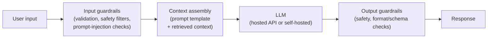
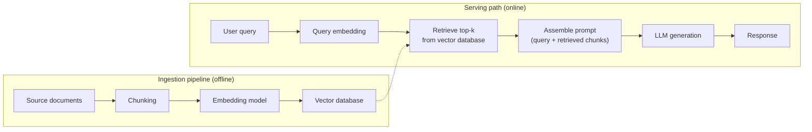

# Module 8 — MLOps for LLMs (LLMOps)

Week 9

## Learning objectives

* Understand what an LLM is and how operationalizing it differs from operationalizing a classical
  ML model
* Understand the FMOps/LLMOps framing for generative AI
* Be able to describe the high-level architecture of an LLM-driven application
* Understand the stages of an LLMOps pipeline

---

## 1. What is an LLM?

A **Large Language Model (LLM)** is a transformer-based neural network trained on massive amounts of
text to predict the next token in a sequence, at a scale (billions of parameters, trained on trillions
of tokens) where that simple objective produces broad, general-purpose language ability rather than a
model useful for only one narrow task. That generality is exactly what makes it a **foundation
model**: instead of training a new model per task, you *adapt* one pretrained model — through
prompting, retrieval, or fine-tuning — to many different downstream tasks.

This is the key operational difference from every model in Modules 1-7: a classical ML model is trained
by *you*, on *your* labeled data, for *one* task. An LLM is usually trained by someone else, on data you
don't control, and adapted rather than trained from scratch for whatever task you point it at.

## 2. Why LLMs need their own MLOps

The core MLOps challenges from Module 1, §1 — data changes system behavior, models decay silently,
reproducibility is multidimensional, the artifact is probabilistic — all still apply to an LLM. Three
things change enough to warrant a discipline of their own:

* **There's often no ground truth to test against.** A classification model has a correct label; an
  LLM's output is open-ended text, so "is this response correct" becomes a judgment call, not an
  assertion (§6 covers how teams approximate this anyway).
* **Cost and latency are now per-request, metered concerns**, not just infrastructure to amortize —
  every call to a hosted LLM API is billed by the token, and a slow response is a direct user-facing
  failure in a way a nightly batch job's runtime never was.
* **A new component enters the versioning story.** Beyond code, data, model, and features (Module 2,
  §3), an LLM application typically adds **prompts** and, for retrieval-augmented systems, a
  **retrieval index** — both of which change behavior just as much as the model weights do, and both
  now need the same versioning discipline.

## 3. FMOps/LLMOps: operationalizing generative AI

Module 1, §10 placed these terms on a map relative to DevOps/MLOps/AIOps/ModelOps/GitOps. Restated with
the operational specifics that matter day to day:

* **FMOps ("Foundation Model Ops")** is the broader frame — the operational concerns of adapting *any*
  large pretrained foundation model (text, vision, multimodal, audio) for downstream use.
* **LLMOps** is FMOps specialized to text-generation models specifically, and adds four concrete
  practices on top of classical MLOps:
  1. **Prompt/version management** — treating a prompt template as a versioned artifact with its own
     change history, the same seriousness Module 3 gives code.
  2. **Retrieval pipeline management** — for retrieval-augmented generation (RAG, §5), versioning the
     document chunks, the embedding model, and the vector index snapshot that produced a given answer.
  3. **Evaluation of open-ended output** — the ground-truth problem from §2, addressed with the
     techniques in §6.
  4. **Cost and latency management at inference time** — caching, model routing, and streaming
     responses, because unlike a classical model's fixed inference cost, an LLM's cost scales with
     both input and output token count.

## 4. LLM system design: the moving parts

Almost every production LLM application, regardless of what it does, shares the same shape around the
model call itself:

* **Input guardrails** catch malformed input, obviously unsafe requests, and prompt-injection attempts
  before they ever reach the model.
* **Context assembly** is where the prompt template from §3 gets filled in — with the user's input,
  any conversation history, and (for RAG systems) retrieved context from §5.
* **Output guardrails** validate the model's response before it reaches the user — checking it against
  a required output format/schema, or running a lighter-weight safety classifier over it.

Whether the LLM itself is called through a hosted API (OpenAI, Anthropic, Google) or is a self-hosted
open-weight model behind your own endpoint (Module 5, Module 7) is a deployment decision; the guardrail
shape around it stays the same either way.

## 5. High-level view of an LLM-driven application

The most common concrete architecture — **retrieval-augmented generation (RAG)** — splits into an
offline ingestion path and an online serving path, the same offline/online split Module 6 introduced
for feature stores, applied to unstructured documents instead of tabular features:

The ingestion pipeline runs whenever source documents change — new content chunked, embedded, and
written into the vector database — while the serving path runs on every user query, embedding it, using
that embedding to retrieve the most relevant chunks, and handing both the query and the retrieved
chunks to the LLM as context. This is exactly why the retrieval index counts as a versioned artifact in
§2 and §3: the *same* query against a *different* ingestion snapshot can produce a materially different
answer.

## 6. The LLMOps pipeline

Restating Module 2, §2's six MLOps stages with the LLM-specific twist each one picks up:

| Stage | LLM-specific twist |
|---|---|
| **Versioning** | Prompts, retrieval index snapshots, and any fine-tuning dataset are versioned alongside code and model, per §2-§3 |
| **Testing** | No single correct output to assert against — use a curated evaluation set scored by human rubric review, reference-based metrics (ROUGE/BLEU) where a reference answer exists, or an **LLM-as-judge**: a second model scoring the first model's output against a rubric. Regression-test prompt changes against the eval set the same way a code change gets regression-tested against unit tests |
| **Automation (CI/CD)** | A prompt or retrieval-index change goes through the same CI/CD gate as a code change (Module 4) — re-run the evaluation set before merge, not just unit tests |
| **Reproducibility** | Pin the exact model version/checkpoint being called, fix `temperature=0` (or log the sampling seed) for deterministic comparisons, and snapshot the retrieved context alongside the prompt that used it |
| **Deployment** | Add an API gateway for rate limiting and cost control, cache responses to repeated queries, and often route easy queries to a cheaper/smaller model while escalating only hard queries to a larger, more expensive one |
| **Monitoring** | Beyond the usual latency/error-rate telemetry: **cost per request** (token-metered billing), hallucination/guardrail-trigger rate, and drift in the *distribution of user queries themselves* — not just input-feature drift, but what people are actually asking for changing over time (Module 9 covers the monitoring infrastructure this plugs into) |

---

## Summary

An LLM is a foundation model adapted rather than trained from scratch, which is precisely what breaks
the classical MLOps assumption that you own the whole training process. LLMOps (§3) is what fills that
gap: version prompts and retrieval indexes the way Module 2 already versions code and data (§2, §6),
evaluate open-ended output with rubrics and LLM-judges instead of exact-match assertions (§6), and treat
cost and latency as first-class, per-request metrics rather than background infrastructure concerns.
The system shape in §4-§5 — guardrails around a model call, an offline ingestion path feeding an online
serving path — recurs across nearly every production LLM application regardless of what it's built to
do.

## Further reading

* See the [Course books](../README.md#course-books) for deeper dives on applied ML engineering and
  production reliability.

## References

Foundational sources this module's content draws on:

* Vaswani, Ashish, et al. ["Attention Is All You Need."](https://arxiv.org/abs/1706.03762) NeurIPS,
  2017. — source for the transformer architecture underlying every LLM (§1).
* Huyen, Chip. ["Designing Machine Learning Systems"](https://www.oreilly.com/library/view/designing-machine-learning/9781098107956/)
  and her essay ["Building LLM Applications for Production."](https://huyen.me/blog/2023/building-llm-applications-for-production/)
  — source for the LLM system design and RAG architecture framing (§4-§5).
* Lewis, Patrick, et al. ["Retrieval-Augmented Generation for Knowledge-Intensive NLP Tasks."](https://arxiv.org/abs/2005.11401)
  NeurIPS, 2020. — source for the retrieval-augmented generation pattern in §5.
* Google Cloud. ["MLOps: Continuous Delivery and Automation Pipelines in Machine Learning"](https://cloud.google.com/architecture/mlops-continuous-delivery-and-automation-pipelines-in-machine-learning)
  and the accompanying [generative AI operations discussion](https://cloud.google.com/architecture/gen-ai-development-and-mlops-disciplines-guide)
  — source for the FMOps/LLMOps framing extending the maturity model from Module 2 (§3, §6).
