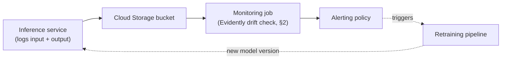

# Module 8: Monitoring

Week 9

## Learning objectives

* Understand why data drift causes production model accuracy to decay silently
* Be able to detect data drift with Evidently, comparing production requests against training data
* Understand the three kinds of telemetry, and be able to instrument custom metrics with Prometheus
* Be able to set up cloud-native monitoring and alerting on Google Cloud

---

## 1. Why a deployed model needs monitoring

A deployed model doesn't announce when it starts failing. Unlike a crashed service, a decaying model
usually keeps returning a valid-looking HTTP 200 the entire time it's quietly getting worse, because
the input data it now receives has drifted away from the distribution it was trained on. **Data drift**
is that change in input distribution, and it's one of the core reasons production accuracy decays over
time. The usual remedy is to retrain on newly received data and redeploy, a cycle that repeats for the
life of the application. The real question monitoring exists to answer is *when*: waiting until
performance visibly degrades means you've already been serving bad predictions for a while.

## 2. :material-chart-bell-curve: Detecting data drift with Evidently

The standard pattern, regardless of tool, is to log every production request's input and prediction
somewhere durable, then periodically compare that **current data** against the **reference data** the
model was trained on:

```python
import pandas as pd
from evidently.legacy.report import Report
from evidently.legacy.metric_preset import DataDriftPreset

reference_data = pd.read_csv("training_data.csv")
current_data = pd.read_csv("prediction_log.csv")

report = Report(metrics=[DataDriftPreset()])
snapshot = report.run(reference_data=reference_data, current_data=current_data)
snapshot.save_html("report.html")
```

[Evidently](https://github.com/evidentlyai/evidently) is one framework built for exactly this
(alternatives worth knowing: NannyML, WhyLogs, Deepchecks). Beyond `DataDriftPreset`,
`DataQualityPreset` flags missing values and quality issues, and `TargetDriftPreset` watches whether
the *predicted label distribution itself* has shifted, often the earliest visible symptom of an
upstream problem. For CI integration rather than a one-off HTML report, the same checks run as a
pass/fail `TestSuite` instead:

```python
from evidently.legacy.test_suite import TestSuite
from evidently.legacy.tests import TestNumberOfMissingValues

data_test = TestSuite(tests=[TestNumberOfMissingValues()])
data_test.run(reference_data=reference_data, current_data=current_data)
assert data_test.as_dict()["summary"]["all_passed"]
```

The structural pattern behind a full production setup: (1) the inference service logs input/output
data somewhere durable, a Cloud Storage bucket works well here, (2) a separate monitoring service or
job periodically compares that logged data against the training distribution, and (3) the result
should be a structured JSON/metrics output that feeds a dashboard, not just a one-off HTML report
someone has to remember to open.

Two caveats worth internalizing: there's no universal threshold for how much drift is "bad enough" to
act on, it's application-specific, and standard tooling only tests **marginal** (per-feature)
distributions. Data can drift in a way that preserves every individual feature's distribution while
the *joint* distribution has shifted; multivariate tests (e.g. Maximum Mean Discrepancy) exist for
this, and the practical habit worth building is looking at features together, not one at a time.
Unstructured data (images, text) needs an extra step first: extract structured features (brightness,
contrast, or embeddings from a model like CLIP) and run drift detection on those.

## 3. Telemetry: metrics, logs, and traces

| Kind | What it is | Example | Purpose |
|---|---|---|---|
| **Metrics** | Quantitative, aggregated numbers | Requests/minute | Dashboards, overview |
| **Logs** | Textual/structured event records | Error logs | Debugging, root-cause tracing |
| **Traces** | Per-transaction flow across components | Distributed tracing across microservices | Latency/bottleneck diagnosis |

This module focuses on metrics, the telemetry type most teams instrument first.

## 4. :material-fire: Instrumenting metrics with Prometheus

[Prometheus](https://prometheus.io/) defines four metric types: a **Counter** only increases (total
request count), a **Gauge** moves up and down (current memory usage), a **Histogram** buckets
observation counts plus a sum (request duration distribution), and a **Summary** computes sliding
quantiles instead of fixed buckets.

```python
from prometheus_client import Counter, Histogram, CollectorRegistry, make_asgi_app

registry = CollectorRegistry()
request_counter = Counter("requests_total", "Total requests", registry=registry)
inference_time = Histogram("inference_seconds", "Time to run inference", registry=registry)

app.mount("/metrics", make_asgi_app(registry=registry))
```

Using a dedicated `CollectorRegistry`, rather than the library's implicit default one, keeps the
`/metrics` endpoint scoped to your own application's metrics instead of cluttered with the client
library's own internal ones.

## 5. Cloud-native monitoring on Google Cloud

**Cloud Monitoring** instruments Google Cloud services out of the box with default metrics, but a
custom application metric like the Prometheus counter above typically needs a **sidecar container**
pattern to reach it: one container runs the app and exposes `/metrics`, a second collects from it and
forwards to the monitoring backend. Cloud Run (Module 7) offers a lighter-weight sidecar option to
achieve the same thing without managing a full cluster yourself.



A **Service Level Objective (SLO)**, for example "99% of requests under 200ms", is defined per service
in the monitoring console and gives an alerting policy a concrete target to check against. The typical
alert setup is a chain: a notification channel (email, say) is attached to an alerting condition (e.g.
"error rate exceeds 5% over 5 minutes"), which triggers and delivers to that channel.

The core tension in alerting is the **Goldilocks problem**: too many alerts and important ones get
lost in the noise; too few and real problems go unnoticed. Getting the threshold right is often as
much work as building the metric itself.

## 6. Project: monitor a deployed model (required)

Take the service deployed in Module 7, add request/response logging to a Cloud Storage bucket, and run
a data-drift check (§2) comparing captured production data against the training baseline on a
schedule. Instrument at least one custom Prometheus metric (§4) and confirm it reaches Cloud Monitoring
(§5). Configure one alerting policy with a concrete SLO-style threshold, and confirm it actually fires
when crossed.

---

## Summary

A model that decays silently is the central problem this module answers: data drift detection (§2)
catches the model-specific half, while infrastructure telemetry (§3-§4) catches the half every service
needs regardless of what it serves. Cloud Monitoring (§5) implements the same underlying loop, log,
compare against a baseline, alert, that any monitoring setup needs, and it's only useful if something
downstream, a human or an automated retraining pipeline, is actually listening for the signal it sends.

## Further reading

* See the [Course books](../README.md#course-books) for deeper dives on applied ML engineering and
  production reliability.

## References

Foundational sources this module's content draws on:

* SkafteNicki, Nicki, et al. [`dtu_mlops`](https://github.com/SkafteNicki/dtu_mlops),
  `s8_monitoring/` (`data_drifting.md`, `monitoring.md`). DTU course 02476, Apache 2.0 licensed.
  Primary source material this module's drift-detection and telemetry content is adapted from.
* [Evidently AI documentation](https://docs.evidentlyai.com/). Source for the drift/quality preset and
  `TestSuite` usage in §2.
* Gretton, Arthur, et al. ["A Kernel Two-Sample Test."](https://jmlr.org/papers/v13/gretton12a.html)
  JMLR, 2012. Source for the Maximum Mean Discrepancy multivariate-drift caveat in §2.
* [Prometheus documentation](https://prometheus.io/docs/introduction/overview/). Source for the metric
  types and instrumentation in §4.
* Google Cloud Documentation. ["Cloud Monitoring overview."](https://cloud.google.com/monitoring/docs)
  Source for the SLO and alerting workflow in §5.
