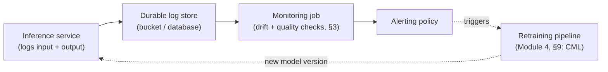

# Module 9: Understanding Model Monitoring (AWS, Azure & GCP)

Week 10

## Learning objectives

* Understand why model monitoring matters and the different types of monitoring
* Be able to monitor a deployed model and its infrastructure hands-on on Azure, and recognize the
  equivalent monitoring services on AWS and GCP
* Understand approaches to optimizing/managing models at the edge
* Understand the role of the feedback loop in an MLOps system

---

## 1. Why model monitoring matters

Module 1, §1 named it directly: **software that isn't touched keeps working; a model that isn't
touched quietly gets worse** as the world it was trained on drifts away from the world it now sees.
Unlike a crashed service, a decaying model usually keeps returning HTTP 200 the entire time: nothing
*fails* in the way traditional infrastructure monitoring is built to catch. Monitoring is what turns
that silent decay into a signal a team can act on *before* a business metric drops, rather than after.

The remaining question is never "should we monitor"; it's **when should retraining actually trigger**,
which is exactly what §2-§3's drift detection is built to answer, rather than waiting for a human to
notice something feels off.

## 2. Types of monitoring

Module 2, §8 split monitoring into two categories; this module is where each gets its concrete tooling:

* **Infrastructure monitoring**: the same telemetry any production service needs, regardless of
  whether it happens to serve a model: latency, error rate, throughput, resource usage.
* **Model/data monitoring**: signals with no traditional-software equivalent:
  * **Data drift**: has the *distribution of incoming inputs* shifted from what the model was trained
    on?
  * **Target/prediction drift**: has the *distribution of the model's own outputs* shifted (e.g. a
    previously balanced classifier suddenly predicting one class far more often), often the earliest
    visible symptom of an upstream problem?
  * **Data quality**: missing values, schema violations, out-of-range values in the incoming data
    itself.
  * **Model quality**: accuracy/precision/recall against ground truth, once ground truth eventually
    becomes available (frequently delayed, since a fraud label might not be confirmed for weeks).

Underneath both categories, telemetry itself comes in three flavors, and this module focuses on the
first:

| Kind | What it is | Example | Purpose |
|---|---|---|---|
| **Metrics** | Quantitative, aggregated numbers | Requests/minute | Dashboards, overview |
| **Logs** | Textual/structured event records | Error logs | Debugging, root-cause tracing |
| **Traces** | Per-transaction flow across components | Distributed tracing across microservices | Latency/bottleneck diagnosis |

## 3. Detecting data drift in practice

The standard pattern, regardless of tool: log every production request's input and prediction
somewhere durable, then periodically compare that **current data** against the **reference data** the
model was trained on:

```python
import pandas as pd
from evidently.legacy.report import Report
from evidently.legacy.metric_preset import DataDriftPreset

reference_data = pd.read_csv("training_data.csv")
current_data = pd.read_csv("prediction_log.csv")

report = Report(metrics=[DataDriftPreset()])
snapshot = report.run(reference_data=reference_data, current_data=current_data)
snapshot.save_html("report.html")
```

[Evidently](https://github.com/evidentlyai/evidently) is one of several frameworks built for exactly
this (alternatives: NannyML, WhyLogs, Deepchecks, the same tools named in Module 2, §12 and Module 6,
§6). Beyond `DataDriftPreset`, `DataQualityPreset` flags data-quality issues and `TargetDriftPreset`
watches the prediction distribution from §2. For CI integration (Module 4) rather than a one-off HTML
report, the same checks run as a pass/fail `TestSuite` instead:

```python
from evidently.legacy.test_suite import TestSuite
from evidently.legacy.tests import TestNumberOfMissingValues

data_test = TestSuite(tests=[TestNumberOfMissingValues()])
data_test.run(reference_data=reference_data, current_data=current_data)
assert data_test.as_dict()["summary"]["all_passed"]
```

Two caveats worth internalizing rather than just the mechanics above: there is no universal threshold
for "how much drift is too much" (it's application-specific), and standard tooling only tests
**marginal** (per-feature) distributions. Data can drift in a way that preserves every individual
feature's distribution while the *joint* distribution has shifted; multivariate tests (e.g. Maximum
Mean Discrepancy) exist for this, and the practical habit worth building is looking at features
together, not just one at a time. Unstructured data (images/text) needs an extra step first: extract
structured features (brightness/contrast, or embeddings from a model like CLIP) and run drift detection
on those, since most drift frameworks only natively support tabular data.

## 4. Instrumenting infrastructure metrics

[Prometheus](https://prometheus.io/) is the standard for the metrics half of §2's infrastructure
monitoring, with four metric types:

| Type | Behavior | Example |
|---|---|---|
| **Counter** | Monotonically increasing | Total request count |
| **Gauge** | Arbitrary up/down value | Current memory usage |
| **Histogram** | Bucketed observation counts + sum | Request duration distribution |
| **Summary** | Sliding-window quantiles instead of fixed buckets | Same, with running percentiles |

```python
from prometheus_client import Counter, Histogram, CollectorRegistry, make_asgi_app

registry = CollectorRegistry()
request_counter = Counter("requests_total", "Total requests", registry=registry)
inference_time = Histogram("inference_seconds", "Time to run inference", registry=registry)

app.mount("/metrics", make_asgi_app(registry=registry))
```

Using a dedicated `CollectorRegistry` (rather than the library's implicit default one) keeps the
`/metrics` endpoint scoped to your own application's metrics instead of cluttered with the client
library's internal ones.

## 5. The monitoring ecosystem across AWS, Azure, and GCP



A custom metric like §4's Prometheus counter typically needs a **sidecar container** to reach a cloud's
native monitoring backend: one container runs the app, a second collects `/metrics` and forwards it.
Kubernetes (Module 5) solves this natively; lighter managed services (Cloud Run, App Runner/Fargate,
Azure Container Apps) offer a lighter-weight sidecar option to the same end without a full cluster.

| Cloud | Native infra monitoring | Model-specific monitoring |
|---|---|---|
| **AWS** | CloudWatch (metrics, logs, alarms) | SageMaker Model Monitor (§6) |
| **GCP** | Cloud Monitoring (metrics, logs, alerting) | Vertex AI Model Monitoring (§8) |
| **Azure** | Azure Monitor + Application Insights | Azure ML model monitoring (§7) |

Every one of these lets you define a **Service Level Objective (SLO)**, e.g. "99% of requests under
200ms", and an alerting policy on top of it: notification channel → alerting condition → trigger.
The core tension is the **Goldilocks problem**: alert on too much and important signals drown in noise
that gets ignored; alert on too little and real problems go unnoticed. Getting the threshold right is
often as much work as building the metric itself.

## 6. AWS model monitoring

**SageMaker Model Monitor** schedules a recurring job that compares data captured from a live endpoint
(enabled via the endpoint's **Data Capture** configuration) against a baseline statistics file computed
from the training set, across four monitor types:

| Monitor | Detects |
|---|---|
| Data quality | Schema violations, missing values, type mismatches in live requests |
| Model quality | Accuracy/precision/recall drift, once ground-truth labels become available |
| Bias drift | Whether a fairness metric measured at training time has shifted in production |
| Feature attribution drift | Whether which features drive predictions (via SHAP values) has changed |

## 7. Azure model monitoring

Azure ML's **model monitoring** feature attaches to a managed online endpoint's **data collection**
configuration, which logs request/response payloads to Azure storage; a scheduled monitoring job then
computes drift signals against a reference dataset, the same shape as §3's Evidently workflow but
managed inside the Azure ML workspace (Module 7, §4). **Application Insights**, wired into the same
workspace, covers the infrastructure half from §2 (request rate, latency, and failures) as it would
for any web service, ML-specific or not.

## 8. GCP model monitoring

**Vertex AI Model Monitoring** attaches directly to a deployed Vertex AI endpoint (Module 7, §3) and
supports two detection modes: **skew** detection (current serving data vs. the original training
baseline) and **drift** detection (current data vs. a previous serving window). Configuration covers
sampling rate (monitoring every request is rarely necessary or cost-effective) and alerting thresholds
per feature, with the same email/notification-channel pattern as §5.

## 9. Optimizing and managing models at the edge

A model destined for a phone, a browser, or any resource-constrained device needs to be smaller and
faster than its training-time version, and the two standard techniques compress it without simply
retraining a smaller architecture from scratch:

* **Quantization** reduces the numeric precision of a model's weights (e.g. `float32` → `int8`), which
  shrinks it roughly proportionally to the bit-width reduction (an `int8` model is close to 4x smaller
  than its `float32` original). **Post-training quantization** quantizes an already-trained model; it's
  simpler, so use it when raw accuracy matters most and size is a secondary win. **Quantization-aware
  training** trains the model knowing it will be quantized; that takes more setup, but yields a
  better-performing quantized model when there's a hard size/speed constraint to hit.
* **Calibration** makes a model's confidence scores match its actual accuracy (via temperature scaling,
  label smoothing, or techniques like Mixup/CutMix during training). This connects directly back to
  monitoring: a well-calibrated model's confidence score is itself a usable signal for flagging a
  specific prediction for human review, rather than trusting an overconfident wrong answer.

Both techniques also matter beyond the edge: a smaller, well-calibrated model is cheaper and faster to
redeploy through the frequent retraining cycles §1's drift detection triggers.

## 10. Common issues in ML deployment, and the feedback loop

Beyond drift, a short list of failure modes recur across nearly every production ML system:

* **Training/serving skew** (Module 6, §1): a feature computed differently in training than at
  inference time, silently degrading predictions without any monitored metric technically failing.
* **Silent upstream data pipeline failures**: an upstream system changes a column's units or encoding
  without the model-serving code ever erroring, since the model happily scores whatever numbers arrive.
* **No rollback strategy**: a newly deployed model version underperforms and there's no fast, tested
  path back to the previous version. The gradual-rollout and automatic-rollback pattern from Module 1,
  §12 exists specifically to avoid this.

The **feedback loop** is what closes the whole system into the cycle shown in §5's diagram: production
outcomes (the eventual ground truth, or a confirmed bad prediction) become part of the next training
set, monitoring's drift/quality signals decide *when* that retraining should run, and Module 4, §9's
Continuous Machine Learning automation is what actually wires the trigger to the retraining pipeline
without a human having to notice the problem manually.

## 11. Project: Model & infrastructure monitoring using cloud tools (required, on Azure)

This course's required hands-on monitoring project uses Azure (§7), per the [Setup
page](../pages/before.md#setup); §6 and §8 (AWS, GCP) are conceptual coverage so you recognize the
equivalent monitor on either. Deploy a model behind an Azure ML managed endpoint, then:

1. Enable request/response data capture (§6-§8) on the endpoint.
2. Run a data-drift check (§3) comparing captured production data against the training baseline, on a
   schedule.
3. Instrument at least one custom infrastructure metric (§4) and confirm it reaches the cloud's native
   monitoring dashboard (§5).
4. Configure one alerting policy with a concrete SLO-style threshold, and confirm it actually fires and
   delivers a notification when crossed.

---

## Summary

Monitoring exists because a decaying model fails silently: the model in §1 that keeps returning valid
responses while quietly getting worse. Data/target/quality drift (§2-§3) is the model-specific half of
that problem; infrastructure telemetry (§4) is the half every service needs regardless of what it
serves. All three clouds (§6-§8) implement the same underlying loop (log, compare against a baseline,
alert), differing mainly in what they call each piece. What makes any of it worth building is the
feedback loop it feeds (§10): a monitoring signal is only useful if something downstream (a human, or
Module 4's CML automation) is actually listening for it.

## Further reading

* See the [Course books](../README.md#course-books) for deeper dives on applied ML engineering and
  production reliability.

## References

Foundational sources this module's content draws on:

* SkafteNicki, Nicki, et al. [`dtu_mlops`](https://github.com/SkafteNicki/dtu_mlops),
  `s8_monitoring/data_drifting.md` and `monitoring.md`, plus `s10_extra/quantization.md` and
  `calibration.md`. DTU course 02476, Apache 2.0 licensed. This module's drift-detection workflow (§3),
  Prometheus instrumentation (§4), and edge optimization section (§9) are adapted from this primary
  source material.
* [Evidently AI documentation](https://docs.evidentlyai.com/): source for the drift/quality preset
  and `TestSuite` usage in §3.
* Gretton, Arthur, et al. ["A Kernel Two-Sample Test."](https://jmlr.org/papers/v13/gretton12a.html)
  JMLR, 2012. Source for the Maximum Mean Discrepancy multivariate-drift caveat in §3.
* AWS Documentation. ["Amazon SageMaker Model Monitor."](https://docs.aws.amazon.com/sagemaker/latest/dg/model-monitor.html)
  Source for the four monitor types in §6.
* Microsoft Learn. ["Monitor performance of models deployed to production."](https://learn.microsoft.com/en-us/azure/machine-learning/how-to-monitor-model-performance)
  Source for the Azure ML model monitoring workflow in §7.
* Google Cloud Documentation. ["Introduction to Vertex AI Model Monitoring."](https://cloud.google.com/vertex-ai/docs/model-monitoring/overview)
  Source for the skew/drift detection modes in §8.
