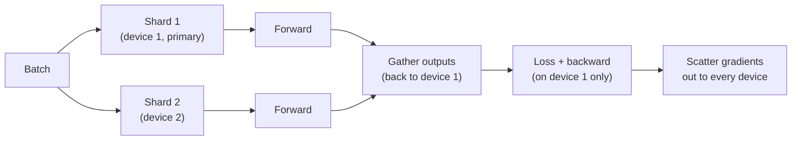
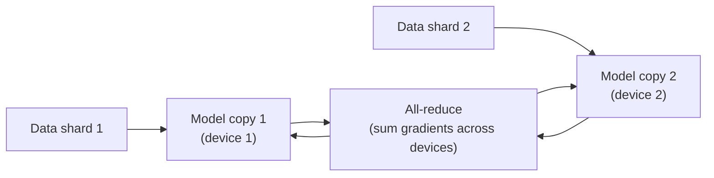

# Module 9: Scalable Applications

Week 10

## Learning objectives

* Understand why data loading can become the bottleneck in a deep learning pipeline, and how to
  parallelize it
* Understand the difference between Data Parallel (DP) and Distributed Data Parallel (DDP) training
* Be able to reason about inference-time scaling: architecture choice, quantization, pruning, and
  knowledge distillation

---

## 1. Why scaling is a different problem for deep learning

Deep learning is unusual among machine learning approaches: more data essentially always helps.
Classical methods like random forests or SVMs plateau well before that, but a deep model's capacity
keeps absorbing additional data almost indefinitely. That single fact turns the data pipeline itself
into a potential bottleneck: if a GPU sits idle waiting for the next batch, that idle time is wasted
compute, and in the cloud (Module 6), wasted money. Everything in this module is about keeping expensive
compute fed and used efficiently, at three different scales: loading data, training across devices, and
running inference once a model is deployed (Module 7).

## 2. :simple-pytorch: Distributed data loading

PyTorch parallelizes the data loading step itself across CPU worker threads:

```python
dataloader = DataLoader(dataset, batch_size=8, num_workers=4)
```

Mechanically, the main thread splits a requested batch's indices across `N` worker threads, each worker
calls `__getitem__` for its own share, and the results are collected back on the main thread. That
hand-off is a real communication cost, which means **multiprocessing only pays off when `__getitem__`
itself is expensive**, for example reading a raw file from disk on every call. For data that already
sits in memory as tensors, the parallelization overhead can exceed whatever it saves.

The practical way to see this: benchmark load time against `num_workers` on a dataset that reads raw
JPEGs from disk at runtime rather than pre-loaded tensors. The benefit of parallel workers only becomes
visible once the per-item work (I/O plus any augmentation) is heavy enough to amortize the hand-off
cost. Separately, `pin_memory=True` speeds up the CPU-to-GPU transfer specifically, which matters most
when the whole dataset comfortably fits in GPU memory.

**Project: data loading benchmark (required):** profile a training loop's data loading time across a
few different `num_workers` values on a disk-backed dataset, and identify the point past which adding
more workers stops helping.

## 3. :material-flash: Distributed training: from Data Parallel to Distributed Data Parallel

Training a frontier model is fundamentally impossible on a single device within a reasonable
timeframe: AlphaFold, for example, trained on the equivalent of 100 to 200 modern GPUs for weeks, a
job that would take a single GPU years. Two paradigms cover almost every practical multi-GPU setup, in
order of sophistication.

**Data Parallel (DP)**, the simplest approach, is now considered obsolete but is worth understanding
first because it makes DDP's improvement obvious. Each step: split the batch across `M` devices,
replicate the model onto each one, run the forward pass in parallel, then gather the outputs back to a
primary device. The backward pass computes the loss on the primary device, scatters gradients out,
runs the backward pass in parallel, and reduces (sums) the gradients back on the primary device.

```python
model = nn.DataParallel(model, device_ids=[0, 1])
preds = model(input)  # otherwise identical usage
```



The core problem: the model gets re-replicated on *every single step*, since it's destroyed after each
backward pass, so DP pays a large communication cost repeatedly (three times `M` communication calls
per step). That repeated cost is exactly why it fell out of favor.

**Distributed Data Parallel (DDP)** fixes this by replicating the model only once and parallelizing the
gradient update itself instead:



Each device holds its own model copy and its own non-overlapping shard of the data, runs the forward
pass in parallel, and then **all-reduces** the gradients: every device sends its gradient to every
other device and receives theirs back, so every copy ends up updating itself with the same, complete
gradient information and all copies stay in sync. That's a single communication call per step instead
of DP's `3×M`, which in practice runs two to three times faster than DP, though hand-rolling DDP is
considerably more involved than DP's one-line wrapper. In practice, most teams never write raw DDP:
PyTorch Lightning abstracts it almost entirely away behind two `Trainer` flags (`accelerator`,
`devices`), the same Lightning setup Module 4, §3's boilerplate section introduced.

One expectation worth setting explicitly: a 2x speedup from 2 GPUs is not actually achievable in
practice. Communication overhead means real-world scaling is always sub-linear, whichever paradigm is
used. Beyond DDP, **sharded training** is the newest approach, splitting the optimizer state and
gradients themselves across devices rather than replicating them everywhere; it can cut memory use by
roughly 60% and is worth knowing the name of even without going deep on it here.

## 4. Scalable inference: four independent levers

Inference scaling is a fundamentally different problem from training scaling. Requests usually arrive
one at a time, often on edge devices or the cheapest available cloud tier (Module 6), so throwing more
GPUs at the problem isn't an option. The lever instead is making the *model itself* smaller and faster,
and four techniques do this, independently and combinably rather than as a menu to pick exactly one
from.

**Architecture choice matters as much as parameter count.** Different base architectures at the *same*
parameter count have meaningfully different inference speed: convolutional architectures are generally
more throughput-efficient than transformer (ViT) architectures at an equal parameter budget. **FLOPs**
(floating point operations) is the standard hardware-independent way to quantify this, measurable via
the `ptflops` package. Benchmarking EfficientNet, ResNet, and Swin-Transformer variants at similar
parameter counts, and correlating wall-clock inference time with FLOP count and reported accuracy,
makes the real trade-off visible: it's a genuine three-way trade-off between accuracy, speed, and
FLOPs, not just "pick the most accurate model."

**Quantization** converts `float32` computation to a lower-precision integer type, commonly `int8`.
This helps for three reasons: integer operations are faster than float operations, modern hardware has
specialized integer-op silicon, and many models are memory-bandwidth-bound rather than compute-bound,
so 8-bit data moves roughly four times faster than 32-bit. Quantized checkpoints are also about 75%
smaller on disk, which directly shrinks a deployment container's image size (Module 7). The underlying
math is a linear affine transform, $x_{int} = \text{round}(x_{float}/s + z)$ for a scale $s$ and
zero-point $z$; rounding errors don't compound catastrophically in practice, since the central limit
theorem is the reason many small independent rounding errors tend to average out rather than
accumulate.

```python
q = torch.quantize_per_tensor(tensor, scale=..., zero_point=..., dtype=torch.qint8)
q.dequantize()  # back to float, for sanity-checking how much precision was lost
```

**Pruning** zeroes out weights below some importance threshold, most commonly by magnitude, since small
weights contribute small downstream activations. PyTorch's `torch.nn.utils.prune` module supports
**local** pruning (per layer, independently, which risks over-pruning some layers relative to others)
and **global** pruning (pruning the smallest X% of weights across the whole network at once, the more
sensible default):

```python
prune.global_unstructured(parameters_to_prune, pruning_method=prune.L1Unstructured, amount=0.2)
```

A caveat worth stating directly, since it's a common misconception: pruning alone does **not**
guarantee a smaller file or faster inference. PyTorch's dense tensor operations don't exploit sparsity
by default, so realizing any savings requires explicitly converting the pruned weights to a sparse
format (`.to_sparse()`) before saving, and even then, whether inference actually speeds up depends on
the *structure* of the sparsity, not just how much of it there is.

**Knowledge distillation** trains a smaller "student" model to mimic a larger "teacher" model's full
softmax output distribution, not just its hard labels, since that distribution encodes inter-class
relationships the student doesn't need the same capacity to learn from scratch. DistilBERT is the
canonical example: 97% of BERT's performance at 40% of the parameters and 60% faster inference.

```python
loss = cross_entropy(preds, target) + cross_entropy(preds, teacher_logits)
```

**Project: inference optimization report (required):** take a trained model from an earlier module's
exercises, apply at least one of quantization or pruning, and report the resulting change in model
size, inference latency, and accuracy, confirming whether the technique delivered the savings it
promises on paper.

---

## Summary

Scaling shows up at three different points in a deep learning system, each with its own bottleneck and
its own fix: a slow data pipeline is fixed by parallel loading (§2), a slow training run is fixed by
distributing the gradient computation across devices via DDP rather than DP (§3), and a slow or
oversized deployed model is fixed by shrinking the model itself through architecture choice,
quantization, pruning, or distillation (§4). None of these are exotic, one-off techniques: every one
of them is a lever a production team reaches for routinely once a model's cost or latency actually
matters.

## Further reading

* See the [Course books](../README.md#course-books) for deeper dives on applied ML engineering and
  production reliability.

## References

Foundational sources this module's content draws on:

* SkafteNicki, Nicki, et al. [`dtu_mlops`](https://github.com/SkafteNicki/dtu_mlops),
  `s9_scalable_applications/data_loading.md`, `distributed_training.md`, and `inference.md`. DTU course
  02476, Apache 2.0 licensed. Primary source material this module's data loading (§2), distributed
  training (§3), and inference optimization (§4) sections are adapted from.
* PyTorch Documentation. ["Distributed Data Parallel."](https://docs.pytorch.org/docs/stable/notes/ddp.html)
  Source for the all-reduce mechanics in §3.
* Jumper, John, et al. ["Highly accurate protein structure prediction with AlphaFold."](https://www.nature.com/articles/s41586-021-03819-2)
  Nature, 2021. Source for the AlphaFold training-scale example in §3.
* Sanh, Victor, et al. ["DistilBERT, a distilled version of BERT: smaller, faster, cheaper and lighter."](https://arxiv.org/abs/1910.01108)
  arXiv, 2019. Source for the knowledge distillation example in §4.
* PyTorch Documentation. ["Pruning Tutorial."](https://docs.pytorch.org/tutorials/intermediate/pruning_tutorial.html)
  and ["Quantization."](https://docs.pytorch.org/docs/stable/quantization.html) Source for the pruning
  and quantization code in §4.
