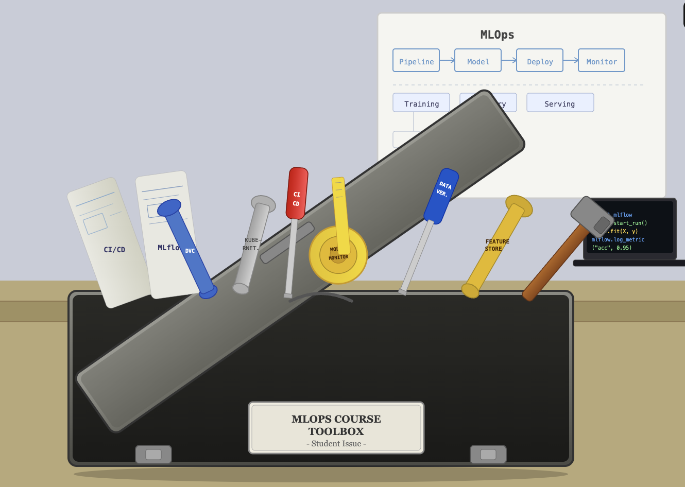

# Introduction

Welcome to **Machine Learning Operations (MLOps)**! This repository holds everything for the course,
including lecture notes, exercises, and further reading. I won't pretend you'll walk out an MLOps
expert twelve weeks from now, but I will promise something more useful: you'll leave knowing the core
concepts and a working set of tools the field actually runs on. Think of this course as a toolbox that
fills up module by module: not one you master cover to cover, but one you know well enough to reach
into whenever a real project calls for it.



This course is a toolbox. You will not become an expert in every tool presented here, but you will get
an overview of many of the tools that are used in MLOps, and you will be able to pick up new tools as
needed in the future.

## What is MLOps?

*Machine Learning Operations* (MLOps) is the set of practices, tools, and processes that take a machine
learning model from a one-off experiment to a robust, scalable, monitored system running in production.
It borrows heavily from DevOps (version control, CI/CD, containerization, infrastructure automation) and
extends those ideas to the parts of the ML lifecycle that are unique to machine learning: data
versioning, experiment tracking, reproducible configuration, and data/model drift monitoring.

The lifecycle a production ML system moves through is usually described in three phases:

1. **Design**: understand the problem, the requirements, and what data is available or needs sourcing.
2. **Model development**: data analysis, model architecture, training, validation.
3. **Operations**: the automated pipeline that takes code changes into production safely, and the
   ongoing monitoring that confirms the deployed system keeps behaving as expected.

These three phases are a *cycle*, not a line: a deployed model is never "done." New requirements, new
data, and new failure modes send you back through design, development, and operations again. This
course focuses on Operations because that's the part most ML curricula skip entirely.

## How this course is organized

The course runs across 12 weeks: 10 content modules (one per week) covering the tools and practices of
modern MLOps, plus two dedicated project sprints (Week 6 and Week 12) for applying everything to your
own group project. See the [time plan](timeplan.md) for the full week-by-week breakdown and the
[projects page](projects.md) for how the group project and grading work.

Think of this course as a toolbox, not a certification. You will not leave as an expert in every single
tool covered: Docker, Hydra, Google Cloud, distributed training. The goal is that you leave knowing
*what exists* and *when to reach for it*, so that when a real project calls for one of these tools you
know where to start.

## Prerequisites

To get the most out of this course, you should have prior experience with:

* General understanding of machine learning (datasets, probability, classifiers, overfitting,
  underfitting, etc.)
* Basic knowledge of deep learning (backpropagation, convolutional neural networks, autoencoders,
  etc.)
* Coding in PyTorch. Module 1 includes a PyTorch refresher to get everyone's skills up to date as fast
  as possible.
* At least 1 year of general programming experience

## Setup

Everything below is worth installing and setting up **before Week 1**, even though some of it (Docker,
the `gcloud` CLI) isn't touched until later modules. The goal is to remove "I couldn't install X" as a
reason to fall behind once the course actually needs it.

### Languages used in this course

* **Python 3.11+**, the primary language for essentially every exercise: training scripts, APIs,
  pipeline definitions, and the `google-cloud-aiplatform` SDK.
* **YAML**, configuration and pipeline definitions: GitHub Actions workflows (Module 5), Hydra config
  files (Module 3), and this site's own `mkdocs.yml`.
* **Bash/shell**: every CLI command in every module, plus `Dockerfile` `RUN` steps and CI scripts.
* **Dockerfile syntax** (Module 3): not a full programming language, but you'll read and write it.

You don't need to know all of these on day one. Python is the only one you should already be
comfortable with (see Prerequisites above); the rest are taught as they come up.

### Accounts to create

| Account | Needed from | Notes |
|---|---|---|
| **GitHub** | Module 2 | Free. Used for every module's exercises and the group project repo. |
| **Google Cloud (GCP)** | Module 6, 7, 8 | Claim your institution's education credits if available, or GCP's own free-trial credit otherwise. A credit card is typically required to activate a free trial even though it isn't charged automatically; watch the billing dashboard regardless. |
| **Weights & Biases** | Module 4 | Free for personal/academic use. |

If you're signing up for GCP with a university-managed account, create your course project under "No
organization" where possible: organization-managed accounts sometimes block creating the
service-account keys you'll need later (e.g. for GitHub Actions to authenticate to the cloud).

### Tools to install locally

| Tool | Needed from | Install |
|---|---|---|
| **Python 3.11+** | Module 1 | [python.org/downloads](https://www.python.org/downloads/) or a version manager like `pyenv` |
| **uv** | Module 1 | [docs.astral.sh/uv](https://docs.astral.sh/uv/getting-started/installation/): this repo's dependency manager; `uv sync` installs everything in `pyproject.toml` |
| **Git** | Module 2 | [git-scm.com/downloads](https://git-scm.com/downloads/) |
| **A code editor** | Module 1 | [VS Code](https://code.visualstudio.com/) is recommended: this repo ships a `.devcontainer/`, so opening it in VS Code (or GitHub Codespaces) can set up Python + `uv` for you automatically |
| **Docker Desktop** (or OrbStack on macOS) | Module 3 | [docs.docker.com/get-docker](https://docs.docker.com/get-docker/) |
| **Google Cloud CLI** (`gcloud`) | Module 6, 7, 8 | [cloud.google.com/sdk/docs/install](https://cloud.google.com/sdk/docs/install) |

Once Python, `uv`, and Git are installed, clone the course repository and run:

```bash
git clone https://github.com/aligunesgit/MlOps.git
cd MlOps
uv sync
```

This installs every dependency listed in `pyproject.toml`, including the per-module exercise
dependencies (Hydra, FastAPI, the Google Cloud SDK, Evidently, Optuna, W&B, and the rest) tracked under
`[dependency-groups.exercises]`. Check that file if you want to see exactly which package a given
module's exercises will need.

## Prescribed books

The following books are suggested reading for the course:

* Emmanuel Ameisen, *Building Machine Learning Powered Applications: Going from Idea to Product*
  (O'Reilly)
* Todd M. Chen, Niall Richard Murphy, and Kasey Parisa, *Reliable Machine Learning: Applying SRE
  Principles to ML in Production* (O'Reilly)
* Ben Wilson, *Machine Learning Engineering in Action* (O'Reilly)
* Martin Kleppmann, *Designing Data-Intensive Applications: The Big Ideas Behind Reliable, Scalable,
  and Maintainable Systems* (O'Reilly)

None are required to follow the course, but each is a good deeper dive on a theme that recurs across
several modules: applied ML product-building, production reliability practices for ML, hands-on ML
engineering, and the distributed-systems foundations underneath most cloud MLOps tooling.
